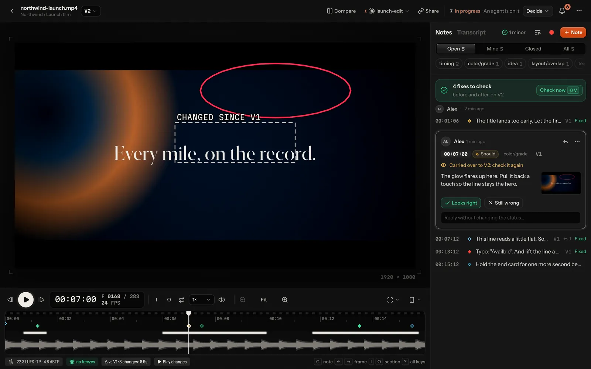
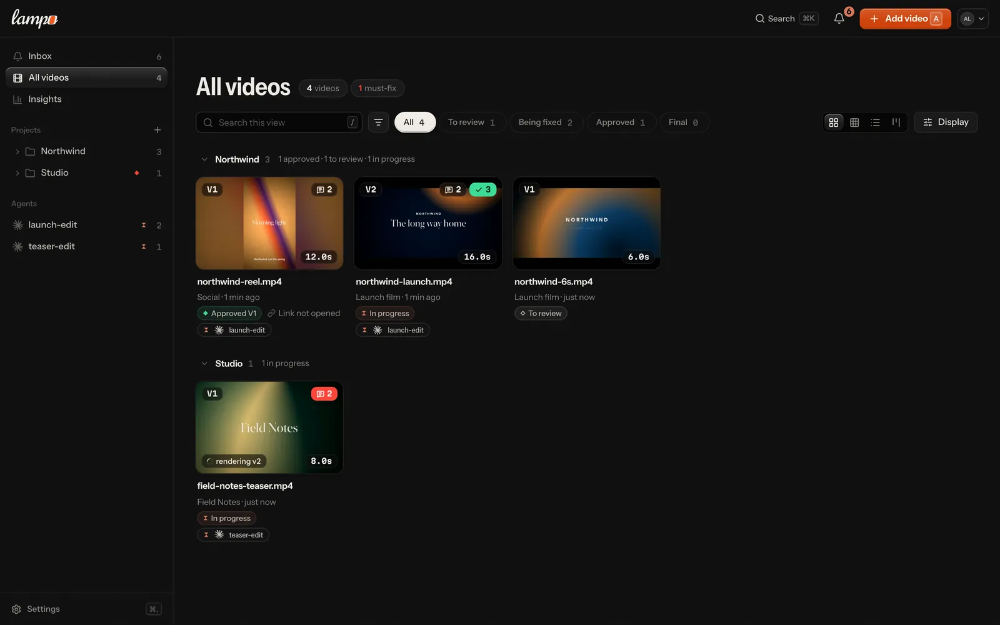
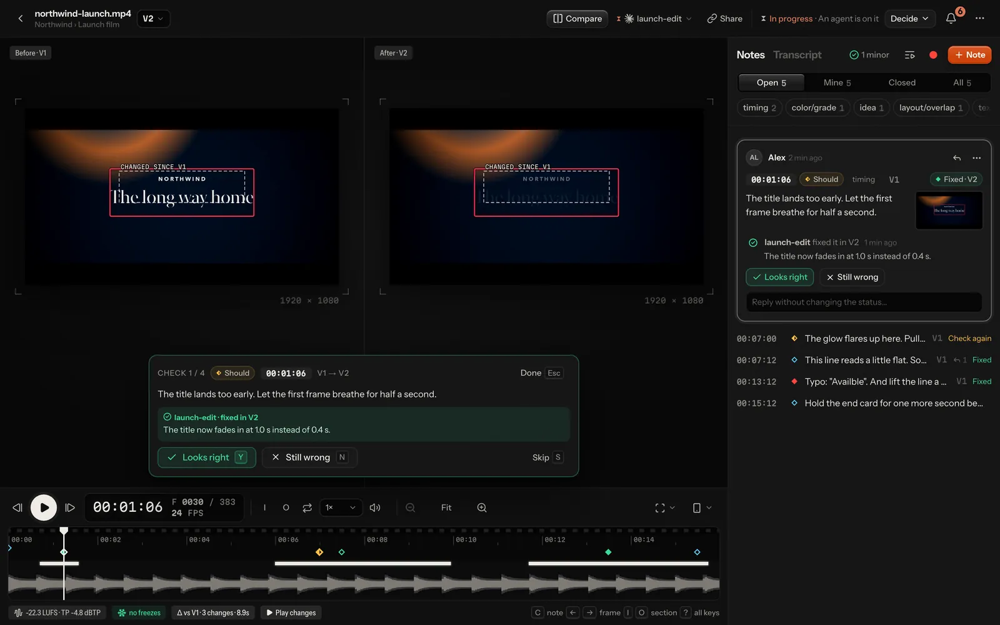
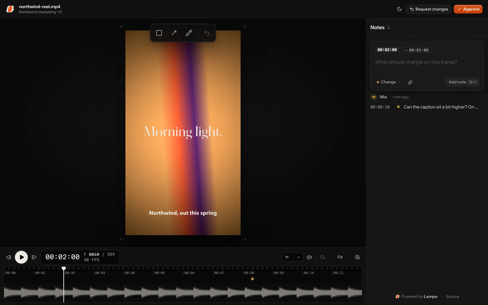
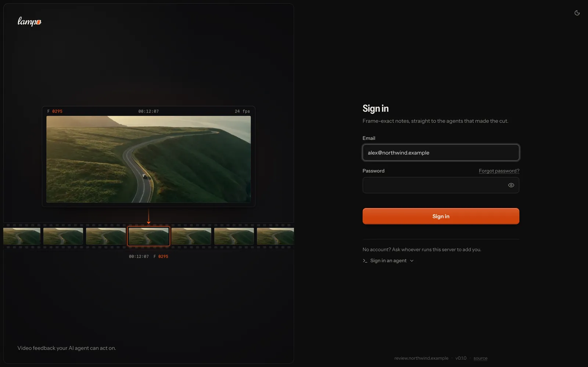
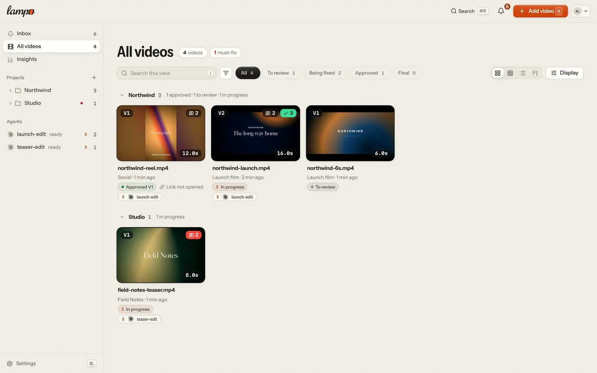
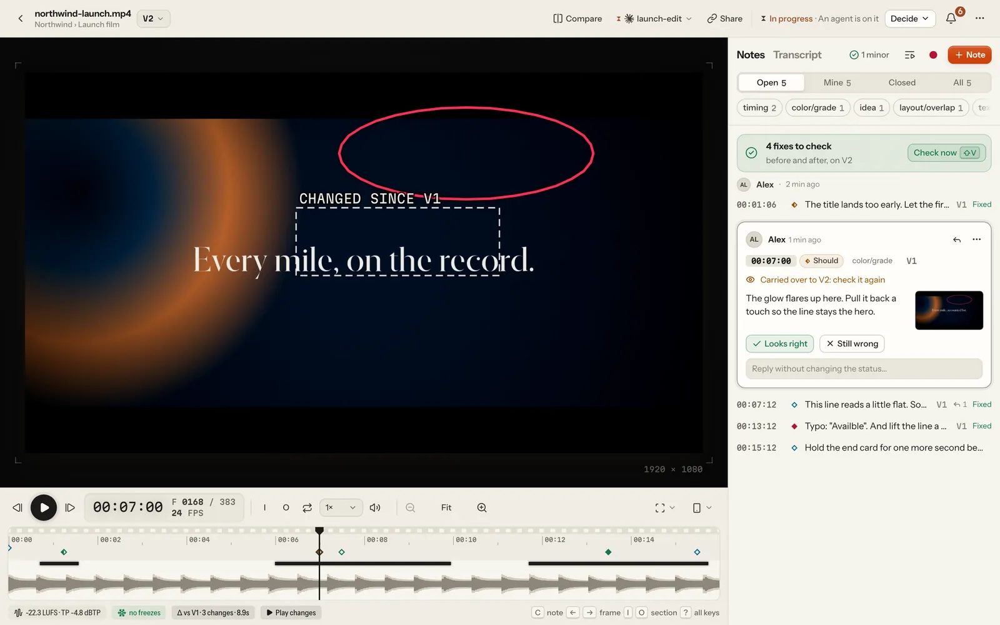

# Lampo

<picture>
  <source media="(prefers-color-scheme: dark)" srcset="docs/brand/lampo-logo-on-dark.svg" />
  
</picture>

[](https://github.com/lampo-vr/lampo/actions/workflows/ci.yml)
[](LICENSE)

**Frame-exact video review for AI video agents.** Watch a render, pin notes to exact frames: draw on the frame, tag
it, set a severity, or just talk. The agent that made the render (Claude Code, or anything that speaks MCP) gets the
notes as plain files with frame numbers, timecodes and the marked screenshot. It fixes, re-renders, and says what it
changed. You see exactly what changed on screen and check every fix before and after, one key each.



It runs on your machine (no sign-up, no telemetry) or as a server for a team and its clients. On your machine, nothing
leaves it unless a feature you use needs to: the speech model downloads once from Hugging Face, and so does footage
search's model (about 213 MB) when the first video is indexed (`VR_FOOTAGE=off` or `vr footage off` prevents it);
phone notifications travel end-to-end encrypted through Apple's, Google's, Mozilla's or Microsoft's push service, and
the public tunnel for review links goes through Cloudflare.

[AGPL-3.0](LICENSE) · Node ≥ 22.18 · ffmpeg · macOS and Linux (Windows through WSL2)

The product is called Lampo, and so is its repository (`lampo-vr/lampo`). Agents know its MCP server as `lampo`. The
npm package, the `vr` and `vr-mcp` commands, the `VR_*` settings, the MCP tool names, the `vr://` resources and the
data folders keep the technical name `video-review` (a setup made under the key `video-review` keeps working). The
logo and its rules are in [docs/brand/](docs/brand/).

## Why

AI agents now cut, grade and caption video. What they can't do is watch it the way you do. The usual feedback loop
("the title at around 0:12 feels early, and there's a typo near the end") loses the one thing an agent needs most:
the exact frame and what's on it. Lampo turns review into data an agent can act on without guessing:

- a note is a **frame number** (and a range, if you want) at the file's real frame rate, plus a **drawing in video
  pixels**, plus the **exact frame** as a clean and a marked PNG;
- every re-render becomes a **new version**, and open notes carry forward until someone checks them again;
- the agent answers per note (**fixed**, **won't fix**, or a question pinned to a frame), and you **check** the fix.

## Features

- **Frame-exact everything.** The frame the browser shows is the frame ffmpeg decodes, and screenshots come from
  ffmpeg too: tests compare both with ffmpeg's decoded frame (the player in Chrome and WebKit, screenshots at 23.976,
  25 and 30 fps). Formats the browser can't decode play through a proxy that keeps every frame's timestamp.
- **Instant scrubbing.** Renders with long keyframe intervals get a short-keyframe scrub copy in the background, so
  stepping and jumping take one display frame.
- **Notes that say exactly what you mean:** boxes, arrows and freehand drawings; tags (cut, timing, text/typo,
  layout/overlap, color/grade, audio/music, …); must / should / nice, and **idea** for optional suggestions that
  never count as work; frame ranges; pictures, clips, links and moments of other videos that show what you mean.
- **Talk instead of typing.** Hold <kbd>T</kbd> and talk while it plays: the note is pinned where you started, written
  down by a speech engine running where Lampo runs (transcribe.cpp) and auto-tagged. Or press <kbd>⇧R</kbd> and
  **record feedback** while you watch, point and draw: every thing you say becomes a draft note on the frame that was
  on screen ([speech-to-text](docs/speech.md)).
- **What is said, as a transcript.** Each version's voice-over and dialogue, line by line on its frames: select words
  and *Change the words* writes the note, and captions download as SRT or WebVTT.
- **What changed.** Each new render is compared with the previous one, frame by frame: changed regions are outlined
  on the frame, audio changes and moved cuts are marked on the timeline, and **Play changes** plays only those parts.
- **Check mode** (<kbd>⇧V</kbd>) walks through every fix side by side, V(N-1) and VN at the same frame: <kbd>Y</kbd>
  looks right, <kbd>N</kbd> still wrong.
- **Save, then send.** Keep notes as drafts only you see (<kbd>⌘S</kbd>), then send them together (<kbd>⌘↵</kbd>): the
  agent gets them as one batch, not one at a time while you are still writing.
- **Quick check.** A note can let the agent render only the shots it is about. The part plays as the whole video, its
  seams are checked, and it can't be final ([docs/workflow.md](docs/workflow.md#partial-renders)).
- **Auto-check.** Before you watch, every render is checked automatically. It reads burned-in text and flags probable
  typos, text under Instagram's Reels interface, flash frames and dips to black, freezes, clipping, silence gaps and
  off-target loudness, each with a marker on the timeline; one chip in the notes panel says where it stands and opens
  the findings. Every finding says what it is, where (a picture of the
  frame; a click plays the stretch), why it was flagged and whether it looks intended — a freeze inside a pause, motion
  easing to a rest or an end card — or like a problem: motion that stops dead or jumps ahead while the sound goes on. **Ask the agent** turns it into a note;
  **That's intended** puts it away on that video, in later versions too.
- **Safe zones, phone view, compare.** Overlays for Reels, TikTok, Shorts, Stories and title/action safe. A real-size
  phone (iPhone, SE, Pixel) showing the video full height or inside each app's interface. Compare any two versions (<kbd>B</kbd>) side by side, with a wipe, or one over the other as a
  difference or onion skin, locked to the frame.
- **Review mode** (<kbd>N</kbd>) steps through the open notes, each on its exact frame, for going through a cut with
  someone watching. Notes read as threads: replies with their authors, status changes as one line each.
- **Review links.** Share a video or a whole folder: clients, producers and colleagues review without an account, on
  any screen. They draw on the frame, reply, check fixes and approve; you decide what each link allows (watch only,
  versions, downloads, expiry, a password) and see who opened it and how far they watched. Their notes reach the agent
  tagged `guest:<name>`, your internal notes stay hidden, and webhooks tell Slack or Discord right away
  ([docs/sharing.md](docs/sharing.md)).
- **Where everything stands.** Every video is in one stage, from *To review* through *Check fixes*, *Approved* and
  *Approved via link* to *Final*. The library's cards, list and board and the player show the same one. Approvals
  are kept per version and per party (the team, and whoever decides through a review link); final locks a video for
  agents ([docs/workflow.md](docs/workflow.md)).
- **Publish the final.** Post a final version to YouTube, Instagram and Facebook with your own keys, or download the
  publish kit (each platform's encode, captions, cover, copy). Agents draft the posts; a person publishes
  ([docs/publishing.md](docs/publishing.md)). New: tested against stand-ins, not yet against the real services.
- **The inbox, also on your phone.** The **inbox** collects what waits for you across all videos: agents' questions
  (answer them right there), fixes to check, new versions to review, notes and approvals from review links, replies.
  It reads like a mail client (*Inbox* in the sidebar: the list beside a frame-exact preview of each item), and on
  every screen the bell opens it over the page, so you answer, check a fix or approve without leaving where you are.
  Lampo installs as an app, and **notifications** bring the inbox to the lock screen, bundled so a render with six
  fixes is one ping ([docs/mobile.md](docs/mobile.md)).
- **Light or dark.** Light · Dark · System, per device and per account. Light is paper and ink; the picture keeps its
  dark surround either way.
- **English, and German on request.** The UI is English; German can be chosen in Settings → Appearance (kept on your
  account, so your other devices follow). Clients on review links see English for now. Agents always get English
  ([docs/configuration.md](docs/configuration.md#language)).
- **Playbooks.** What the team decided before anyone watched a render — the brief, the rules, references and
  skills (the open SKILL.md format) — for the whole studio and per project and folder, inherited down the tree. Agents
  read it first and suggest changes; a person accepts or rejects them, and every render is stamped with the
  revisions it was made under ([docs/playbooks.md](docs/playbooks.md)).
- **The taste file.** Every note is a data point. Per project, Lampo distills them into one page the agent reads before
  it renders: what you keep asking for, what you love, decisions that stand ([docs/taste.md](docs/taste.md)).
- **One app, on your machine or hosted.** The same accounts, invites, API tokens, uploads and review links in both
  places ([docs/server-mode.md](docs/server-mode.md)). On your machine you're signed in automatically, renders can
  stay where they are, and Claude Code sessions, Apple's text recognition and plain files come on top. Hosted, renders
  live on disk, Bunny Storage + CDN or an S3-compatible bucket, and agents connect with `vr login` or OAuth.

| Library | Check mode |
|---|---|
|  |  |
| **Review link** | **Hosted sign-in** |
|  |  |
| **Light: library** | **Light: player** |
|  |  |

## Quick start

You need **Node ≥ 22.18** and **ffmpeg** with ffprobe on your PATH (macOS: `brew install ffmpeg node`).

```sh
git clone https://github.com/lampo-vr/lampo.git && cd lampo
npm install
npm start          # http://localhost:4747, signed in as you (builds the UI on first start)
npm run link       # puts vr in ~/.local/bin (and says if that is not on your PATH)
```

Press <kbd>A</kbd> (*Add video*) to add a render: drop or choose files to upload a copy, or *Link a file on this
machine* to review it where it lives (rendering again to the same path adds the next version), then pick its project
and the agent that should act on the notes. Nothing is scanned; the tool only reads the files you add. Your owner
account is created on first start; set an email and a password in Settings → Profile to sign in from your phone or
another computer.

**No footage at hand?** `npm run demo` renders synthetic clips and builds a review history on a throwaway store:
notes, an agent's fixes, a re-render with its diff, a review link and an approval. Ctrl+C deletes it again.

More ways to run it:

```sh
npm run dev        # the same with hot reload, for UI work
npm run lan        # also on your Wi-Fi (prints a link with an access token for your phone)
```

Where things live, and every setting: [docs/configuration.md](docs/configuration.md). In short, a fresh install keeps
its store in `~/.video-review/`:
- `data/` holds the reviews;
- `versions/` holds every render and can't be regenerated;
- `cache/` is rebuilt on demand and safe to delete while the app is stopped, except `cache/uploads/` (uploads in
  flight).

**Voice notes** are transcribed on your machine by [transcribe.cpp](https://github.com/handy-computer/transcribe.cpp)
(installed with `npm install`, no Python): Whisper large-v3-turbo when there is a GPU (Apple Silicon, CUDA, Vulkan),
Parakeet v3 on CPU-only machines. The model downloads once, on the first voice note. Details and an
OpenAI-compatible server option: [docs/speech.md](docs/speech.md).

## Run it as a server

A server is for a team, or for sharing reviews with clients without a tunnel. The maintainers run one as a hosted
service, **Lampo Cloud** ([app.lampo.video](https://app.lampo.video)), for those who'd rather not run their own;
self-hosting stays free and complete:

```sh
cp .env.example .env      # set VR_DOMAIN and VR_PUBLIC_URL (VR_TRUST_PROXY=uniquelocal is
                          # already set), and storage for Bunny or S3 (.env is gitignored)
docker compose up -d      # the app behind Caddy, with automatic HTTPS
docker compose logs       # the first start prints a one-time setup token
```

Open your URL, enter the token and create the owner account. Then invite people, upload renders (drop them on the
library, or `vr push`), and connect agents with an API token:

```sh
vr login https://review.example.com
vr push render.mp4 --folder "Acme/Reels"   # the same name again becomes v2, v3, …
```

[docs/docker.md](docs/docker.md) covers the image, volumes, upgrades and backups.
[docs/server-mode.md](docs/server-mode.md) covers configuration, the reverse proxy, accounts and workspaces, storage
(Bunny, S3) and the security model. Going live for real: [docs/go-live.md](docs/go-live.md), the runbook for one server
(DNS, TLS, backups with a restore drill, monitoring, updates), with `node scripts/smoke.ts https://review.example.com`
to check a running instance.

## Keys

| Key | |
|---|---|
| <kbd>Space</kbd> · <kbd>J</kbd> <kbd>K</kbd> <kbd>L</kbd> | play/pause · reverse, pause, play (press again: faster) |
| <kbd>←</kbd> <kbd>→</kbd> (⇧ ×10) · <kbd>Home</kbd> <kbd>End</kbd> | frame step · first/last frame |
| <kbd>I</kbd> <kbd>O</kbd> · <kbd>Esc</kbd> <kbd>X</kbd> · <kbd>R</kbd> · <kbd>M</kbd> | mark a section's start or end, also while playing (⇧ jumps there) · clear it · loop it · mute |
| drag | on the timeline's notes lane (⇧ anywhere on it): mark a section, and its note opens; drag its ends to adjust |
| <kbd>C</kbd> <kbd>↵</kbd> | note on this frame, or on the marked section; in the note, <kbd>⌘↵</kbd> sends and <kbd>⌘S</kbd> keeps it as a draft; <kbd>⇧⌘↵</kbd> sends every note not sent yet |
| hold <kbd>T</kbd> · <kbd>⇧R</kbd> | voice note · record feedback while you watch (<kbd>⇧R</kbd> again: done) |
| <kbd>D</kbd> · <kbd>⇧D</kbd> | next / previous change since the previous version |
| <kbd>⇧V</kbd> | check mode: every fix, before and after |
| <kbd>[</kbd> <kbd>]</kbd> · <kbd>N</kbd> <kbd>⇧N</kbd> | previous / next note · review mode (step through the open notes) |
| <kbd>G</kbd> · <kbd>V</kbd> · <kbd>B</kbd> | safe zones · phone view · compare (side by side, wipe, overlay; <kbd>Esc</kbd> closes) |
| <kbd>=</kbd> <kbd>−</kbd> <kbd>0</kbd> · <kbd>Z</kbd> <kbd>⇧Z</kbd> | timeline zoom (or ⌘ + scroll; far in, every frame is a cell) · to the section or around the playhead · the whole video |
| <kbd>⌘K</kbd> (<kbd>Ctrl K</kbd>) · <kbd>⌘,</kbd> | find a video, folder or note anywhere, or run an action · Settings |
| <kbd>A</kbd> · <kbd>1</kbd>–<kbd>4</kbd> · <kbd>/</kbd> · <kbd>F</kbd> | library: add video · grid, compact, list, board · search this view · filter |
| <kbd>?</kbd> | every key |

## For agents

Everything an agent needs is plain files and one CLI; the UI and the server don't have to run. The full reference is
[docs/agents.md](docs/agents.md) (every command, the MCP tools, the data format).

- **`vr`** (on your PATH via `npm run link`): every read command but `vr prompt` takes `--json`, and paths in the
  output are absolute, so screenshots open directly.
- **MCP, for any agent** (Claude Code, Codex, Cursor, VS Code, Antigravity, Windsurf, Gemini CLI, Zed, …): the same actions as
  tools, with the marked frames returned as images — over stdio (`bin/vr-mcp`) or Streamable HTTP at `/mcp` (the
  local app, or a hosted server by signing in or with an API token). `vr mcp config <client>` prints a ready config
  ([docs/mcp.md](docs/mcp.md)).

  ```sh
  claude mcp add lampo -- /path/to/lampo/bin/vr-mcp
  vr mcp config codex   # or claude, cursor, vscode, antigravity, windsurf, gemini, zed, json
  ```
- **Live feedback without polling:** the MCP tool `wait_for_feedback` returns new notes as they arrive (with a
  cursor), and clients that listen for change notifications (`subscriptions/listen`, and over stdio also
  `resources/subscribe`) hear when `vr://inbox` changes. `show_review` shows the review inline in hosts that render
  MCP Apps.
- **One command starts an agent:** an MCP client acts only when prompted, so it hears notes only while it waits.
  `/lampo:watch` in Claude Code (the server's `watch` prompt) has it work what is assigned to it and keep listening;
  the app shows whether each agent listens ([docs/mcp.md](docs/mcp.md#start-your-agent-it-hears-notes-only-while-it-listens)).
- **Few tokens:** pictures only for notes with a drawing, cropped to it; only what changed when an agent hands back
  what it was told (`since`, `known`); a lean tool set on request (`VR_MCP_TOOLS=lean`). Measured in
  [bench/tokens](bench/tokens/README.md).
- **An [Agent Skill](skills/lampo/SKILL.md)** teaches the whole loop to agents that load skills.
- **A hosted server:** `vr login <url>` once, then every `vr` command and the MCP server work against it. Screenshots
  are downloaded, so the printed paths still open like local files.

### The loop

1. The reviewer adds a render and assigns it to your session, or you put up your own:
   `vr track <file> --me [--folder "Project/Sub"]` (on a server: `vr push <file>`).
2. **Run `vr watch` under a Monitor** (or call the MCP tool `wait_for_feedback` in your loop). Inside a Claude Code
   session it shows only videos assigned to *your* session: one line per new note (clients' notes too), reply, status
   change, new render, approval, or `REQUEST` from the reviewer.
3. **Before rendering, read the playbook and the taste file:** `vr playbook <video|folder>`, `vr taste <video|folder>`.
4. `vr open <video>` lists the open notes, required work first. Look at the `marked` PNG first; `clean` is the
   untouched frame. `IDEA` notes are the reviewer's optional suggestions: your call.
5. Optional, for a long step: `vr status <video> "rendering v4" [--eta 90]` shows on the card. It clears when the
   render lands.
6. Re-render **to the same path** (or `vr push` it). It becomes the next version, and open notes carry forward with
   `check_again: true`. Through `vr render --to <video> --out <file> -- <your render command>` the person watches the
   render's progress in Lampo and you read two lines ([docs/agents.md](docs/agents.md#rendering-through-vr-render-the-person-sees-the-progress)). Render only a stretch when a note says `PART RENDER OK` (`vr push --part-at`; see
   [docs/agents.md](docs/agents.md#partial-renders-only-when-a-note-says-part-render-ok)), never otherwise.
7. `vr diff <video>` shows what actually changed on screen and whether cuts moved; compare it with what you intended.
   `vr qa <video>` runs the same Auto-check the reviewer sees.
8. `vr fix <id> --note "what changed, where"`. **Never set `verified`**: that is the reviewer's call. Questions go on
   the frame: `vr add <video> --frame N --text "…" [--box x,y,w,h]` (a question by default; `--kind info` to say what
   you changed). The answer arrives as `ANSWERED` in `vr watch`. Never file your own notes as must/should/nice.
9. Working in a project (After Effects, Premiere, Resolve…)? Show fixes before rendering: `vr source <video> --app
   "After Effects" --comp Main` once, then per note `vr preview <id> <still.png> --fixed --note "…"`, and render once
   when the batch is done; the new render is compared with each preview. See [docs/agents.md](docs/agents.md).

On your machine, `data/INBOX.md` is the one file for "what did the reviewer say since last time": the newest 150
events from people, newest first, tagged `→ <session>`. `vr inbox --mine [--since <iso>]` gives the same as lines,
also against a hosted server.

### The data contract

```
data/
  INBOX.md                  newest human feedback across all videos
  events.jsonl              append-only log of every event (what `vr watch` tails)
  <slug>/review.json        source of truth for one video: versions, notes, replies, approvals
  <slug>/review.md          the same, readable
  <slug>/<id>_clean.png     the exact frame, full resolution
  <slug>/<id>_marked.png    the same frame with the drawing burned in
versions/<slug>/vN.<ext>    the bytes of every registered render
```

`slug` is the video's absolute path with every `/` replaced by `__` (shortened with a hash when that would exceed
255 bytes, see [data-format.md](docs/data-format.md)). Frames are 0-based at the render's fps,
timecodes `mm:ss:ff`, drawings in video pixels. `vr` and the MCP server lock and write atomically, so don't
hand-edit `review.json`, and never move or modify the renders under review: the tool only reads them. Field by
field: [docs/data-format.md](docs/data-format.md).

## How it works


One TypeScript codebase that Node runs directly: `lib/` is the store and the domain (versions, notes, diffs,
Auto-check, taste), `server/` exposes it over HTTP, `web/` is the React UI, and `bin/vr` / `mcp/` are the agent
interfaces. [docs/architecture.md](docs/architecture.md) goes deeper: modes, storage, job priorities, and how frame
accuracy is kept end to end. The HTTP API is in [docs/api.md](docs/api.md).

## Documentation

| | |
|---|---|
| [docs/agents.md](docs/agents.md) | CLI reference, the review loop, remote agents |
| [docs/mcp.md](docs/mcp.md) | MCP server setup and tools |
| [docs/data-format.md](docs/data-format.md) | `review.json`, `events.jsonl`, the files in `data/` |
| [docs/playbooks.md](docs/playbooks.md) | playbooks: brief, rules, references and skills per studio and folder; agents' suggestions; trust |
| [docs/taste.md](docs/taste.md) | the taste file: what the notes taught, for agents to read before they render |
| [docs/sharing.md](docs/sharing.md) | review links for clients and colleagues, what they record, webhooks |
| [docs/workflow.md](docs/workflow.md) | where a video stands: stages, approvals per party, final, who can do what |
| [docs/publishing.md](docs/publishing.md) | posting a final video to YouTube, Instagram and Facebook; the publish kit; what to set up first |
| [docs/mobile.md](docs/mobile.md) | the inbox, the app on your phone, notifications |
| [docs/configuration.md](docs/configuration.md) | every setting and environment variable, where data lives |
| [docs/server-mode.md](docs/server-mode.md) | hosting: accounts and workspaces, uploads, storage, reverse proxy, security model |
| [docs/docker.md](docs/docker.md) | the Docker image and compose setup |
| [docs/go-live.md](docs/go-live.md) | the first production deploy on one server: DNS, TLS, env, backups and restore, monitoring, updates |
| [docs/moving.md](docs/moving.md) | moving your machine's reviews to a server: `vr export`, `vr admin import`, what moves and what stays |
| [docs/email.md](docs/email.md) | the emails a hosted server sends (invites, confirmations, password resets, notices), sign-up, the mail relay |
| [docs/onboarding.md](docs/onboarding.md) | the first run: what someone new sees, the steps per role, the sample video |
| [docs/speech.md](docs/speech.md) | speech-to-text: voice notes, recorded feedback, transcripts |
| [docs/footage.md](docs/footage.md) | footage search: B-roll from your videos as shots with exact in and out frames |
| [docs/architecture.md](docs/architecture.md) | how the pieces fit together |
| [docs/api.md](docs/api.md) | the HTTP API |
| [docs/brand/](docs/brand/README.md) | the Lampo logo, the icons and how to use them |
| [bench/stt/RESULTS.md](bench/stt/RESULTS.md) | how the speech engines were chosen |

## Contributing

Issues and pull requests are welcome. Please read [CONTRIBUTING.md](CONTRIBUTING.md) (setup, tests, the data
contract) first. Contributions are accepted under a [Contributor License Agreement](CLA.md), and everyone involved
follows the [Code of Conduct](CODE_OF_CONDUCT.md). Found a security problem? See [SECURITY.md](SECURITY.md) and
please don't open a public issue.

## License

Copyright © 2026 nprompt UG (haftungsbeschränkt), Stuttgart, Germany.

Lampo is free software under the [GNU Affero General Public License v3.0 only](LICENSE). You may use,
study, modify and self-host it. If you run a modified version as a network service, you must offer its users the
source of your changes under the same license (set `VR_SOURCE_URL` to your fork; the app links to it). If the AGPL
doesn't work for your organisation, a commercial license is available from the maintainers: hello@lampo.video.

To be plain about what the [CLA](CLA.md) means: contributors keep their copyright and grant the maintainers the right
to license their contributions under other terms too, including proprietary ones (Harmony CLA, "any license"
option). That is what makes the commercial license possible. In return, every contribution stays available under
the AGPL-3.0 as well.

Third-party components and model licenses are listed in [NOTICE.md](NOTICE.md). The name and logo are not covered by
the code license; see [TRADEMARKS.md](TRADEMARKS.md).
