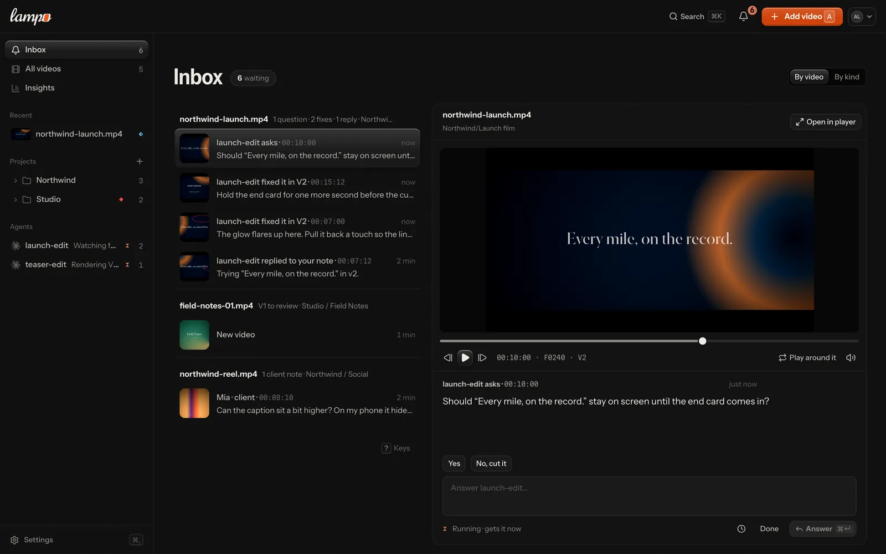
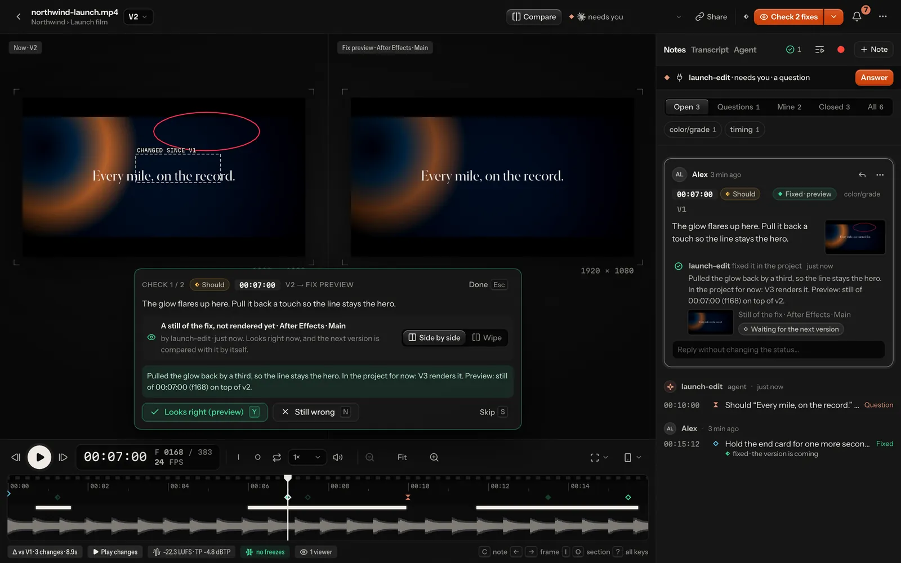
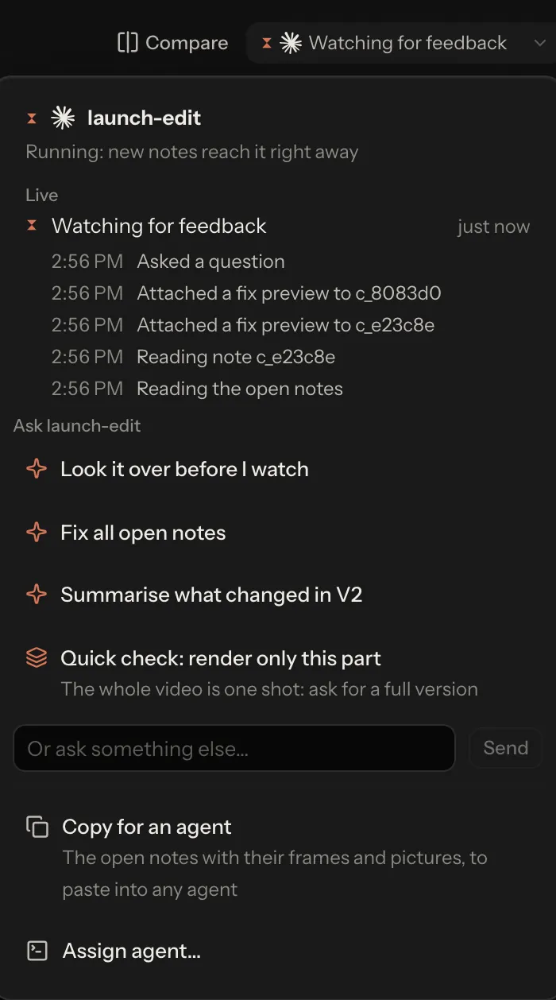

# For agents: the full reference

This page is for the agent's side: how Claude Code, Codex, a script or any other MCP client gets the notes people pin
to frames, fixes them and answers. The README's [For agents](../README.md#for-agents) section is the short version.

There are three ways in. All of them read and write the same notes, and every write is locked and atomic, so the app,
several agents and the CLI can work at the same time.

| Way in | Use it when | How to start |
|---|---|---|
| **The `vr` command** | the agent has a shell (Claude Code, Codex, scripts) | `npm run link` links `vr` into `~/.local/bin` (it makes the folder, and says when your shell needs it on its PATH) |
| **MCP** | the agent speaks MCP (Claude Code, Codex, Cursor, VS Code, …) | Settings → Connect an agent, or `vr mcp config <client>` ([mcp.md](mcp.md)) |
| **Files** | reading only, on the machine the notes live on | the `data/` folder ([data-format.md](data-format.md)) |

On your own machine, `vr` and the MCP server work on the files directly, so the app doesn't have to run. After
`vr login` they work against a hosted server instead ([below](#working-against-a-hosted-server)).

## The loop

1. **Get the render under review.** The reviewer adds it in the app and assigns it to your agent, or you put it up
   yourself:

   ```sh
   vr track out/film.mp4 --me --folder "Acme/Launch"   # the file where it is (this machine)
   vr push out/film.mp4 --folder "Acme/Launch"         # an uploaded copy (hosted servers)
   ```

   Both end with one line on how to hear the person's notes now: `Now listen with vr watch (keep it running): the
   person's notes arrive together when they press Send.` `vr fix` and `vr wontfix` end the same once none of the
   video's notes is open, and say how many are until then (`2 notes still open on this video.`). Over MCP the same
   answers say to call `wait_for_feedback` now, with a cursor from that moment ([MCP](#mcp)).

2. **Wait for feedback.** Run `vr watch` under a Monitor (or any long-running process whose output you read). Every
   new note, reply or request is one line (shown here without the file paths each line ends with):

   ```
   [14:02:11] NEW MUST [text/typo] c_7f3a9b 00:13:12 f324 v1 launch.mp4 →launch-edit — "Typo"
   [14:05:40] REQUEST launch.mp4 →launch-edit v1 from alex — "Work through all open notes"
   ```

   Inside a Claude Code session it shows only the videos assigned to that session. Over MCP, call `wait_for_feedback`
   instead, and again after every answer: you hear new notes only while you wait, and the app shows the person whether
   you listen. The person starts you with the server's `watch` prompt (`/lampo:watch` in Claude Code); when you connect,
   offer to start listening. Don't poll `vr open` or `vr ls` in a loop: a watcher costs nothing until something
   happens.

3. **Read the playbook and the taste before you render.** The playbook is what the team decided on purpose, the taste
   is what the notes taught so far ([Playbook and taste](#playbook-and-taste)).

4. **Read the notes:** `vr open <video>`. Required work comes first (must, should, nice), then ideas, then your own
   questions that wait for an answer. Look at each note's marked frame first; the clean frame is the same moment
   without the drawing. An **idea** is the reviewer's optional suggestion: consider it, but it isn't required work.

5. **Fix it and re-render to the same path.** The new file becomes the next version, and the open notes carry over to
   it, marked to be checked again. With uploads, push the new file under the same name into the same folder, or name
   the video with `vr push <file> --to <video>`.

6. **Check your own work.**
   - `vr diff <video>` shows what changed from the version before: picture changes with their place on screen, audio
     changes, cuts that moved. Compare it with what you meant to change.
   - `vr qa <video>` runs the same Auto-check the reviewer sees: typos in burned-in text, safe-zone overlaps, flash and
     black frames, loudness, clipping, silence, freezes. A freeze is frames where nothing moves, not even a
     cursor. Each says what it looks like: "… while the sound goes on" is a stall — copies of one frame where the
     motion stops dead or jumps ahead after it ("then jumps ahead: frames look missing"), likely dropped or stalled
     frames; "… while the sound pauses" a beat, "… as the motion eases into it" an animation settling. What the
     reviewer marked *That's intended* is left out, on the same stretch in later renders too.

7. **Answer every note.**

   ```sh
   vr fix c_7f3a9b --note "title typo fixed, caption moved to y 1392"
   vr wontfix c_8e21d0 --note "the logo timing follows the brand guide"
   vr reply c_8e21d0 --note "See page 4 of the guide"
   ```

   Say what you changed and where. A note a client left on a review link carries
   `CLIENT: they read your replies and fix note as written` in its head line (`vr open`, `vr show`, the MCP notes):
   what you write on it reaches the client, so leave file paths, tools and remarks for the team out. Never mark a note
   verified: checking a fix is the reviewer's call. When only the reviewer can decide something, ask on the frame:
   `vr add <video> --frame 363 --text "Keep this cut?"` ([Asking the reviewer](#asking-the-reviewer)).

A long step can show on the video's card with `vr status <video> "rendering v4" --eta 90`; it clears itself when the new
version arrives. Most loops don't need it: people see your notes, fixes and renders as they happen
([Lampo sees what you do](#lampo-sees-what-you-do-status-calls-are-optional)).

### Playbook and taste

**The playbook** is what the team decided before anyone watched: the brief, the rules, references and skills. It is
merged from the House playbook down to the video's folder, the deepest one first, and each part says where it comes
from ([playbooks.md](playbooks.md)).

```sh
vr playbook launch.mp4                             # what applies to this video
vr playbook skill color-grade launch.mp4           # one skill that applies to it
vr playbook export launch.mp4 --to .claude/skills  # the skills that apply, as SKILL.md folders
```

Name the video (or its folder) every time: without one, `vr playbook skill` and `vr playbook export` read only the
House playbook, so a folder's skills aren't found. You never edit a playbook. Suggest a change with
`vr playbook propose` and a person accepts or rejects it.

**The taste** (`vr taste <video|folder>`) is what the notes taught so far: what this reviewer keeps asking for, what
they love, the decisions that stand, and fixes that worked before ([taste.md](taste.md)).

Over MCP the same are `get_playbook`, `get_skill`, `propose_playbook_change` and `get_taste`.

## What `vr watch` prints

One line per event: the time, what happened, then the details. For a note those are its id, timecode, frame and
version, the video, the agent it is assigned to (after `→`) and the text.

| The line says | What happened |
|---|---|
| `NEW MUST`, `NEW SHOULD`, `NEW NICE`, `NEW IDEA` | a new note (`NEW QUESTION` and `NEW INFO` for those kinds) |
| `REPLY` | a reply on a note; the note's own text follows `on:` |
| `ANSWERED` | the reviewer answered your question, which closes it |
| `VERIFIED`, `REOPENED`, `WONTFIX`, `FIXED` | a note's status changed |
| `EDITED`, `DELETED` | a note was changed or removed |
| `EDITED REPLY`, `DELETED REPLY` | a person changed the words of their reply (`now:` says them), or took it back; the note stays |
| `REFERENCE` | an image, clip, link or moment was added to a note |
| `REQUEST` | someone asked the agent for something in the app |
| `VERSION`, `ASSIGNED` | a new version arrived; the video was assigned to an agent |
| `APPROVED v3 (client: Mia)`, `CHANGES REQUESTED v3 (team)`, `FINAL v3`, `REOPENED v3 (was final)` | a decision about a version |
| `PREVIEW CONFIRMED`, `CHECK AGAIN` | a new render matched, or didn't match, a fix preview ([below](#fixing-in-the-project-without-rendering-after-effects-premiere-resolve-)) |
| `AGENT RUN` | a run Lampo started for you began or ended ([below](#when-youre-not-running-the-machine-can-start-you)) |
| `AGENT RUN OPENED`, `WORKING`, `NEEDS YOU`, `ENDED` | with `--all` only: an agent's run on a video opened, began, waits for the person, or ended ([below](#your-work-as-the-person-sees-it-runs)) |

Good to know:

- Notes and replies from a review link come in the same way; their author is `guest:<name>`. A `NEW` line doesn't
  name its author (`vr show <id>` or `--json` does).
- A person can keep notes as drafts while they watch. You get none of them until they send them; then they arrive
  together, as one batch of `NEW` lines. On a video with an agent that is the default: the app keeps each note and
  sends them all with one "Send 3 to <agent>", so you start once, on the whole batch. Replies and answers to your
  questions still come at once.
- A note or request that allows a partial render carries its `PART RENDER OK` line
  ([Partial renders](#partial-renders-only-when-a-note-says-part-render-ok)).
- Agents' events don't show, neither other agents' nor yours. `--all` shows agents' events and every other event
  type (`ADDED`, `MOVED`, `REMOVED`, `DOWNLOAD`, `POST`). Inside a Claude Code session your own writes never show, even with
  `--all`.
- Without `--brief`, a line ends with its files: `· marked: …_marked.png` (and `· range frames: …` for a stretch)
  `· video: …`. `--brief` leaves them out, which costs about a quarter of the tokens; `vr show <id>` has them when you
  need a file.
- A line break in what someone wrote (a note, a folder or file name, a caption) shows as ` ↵ `, so a line that looks
  like a note always is one. The same holds in INBOX.md, review.md, `vr prompt`, `vr open` and every MCP answer. Only
  `\n` ends a line in what Lampo prints: any other line terminator still in a stored name (CR, VT, FF, NEL, U+2028,
  U+2029) shows as its `\uXXXX` escape.
- `data/INBOX.md` keeps the newest 150 events from people, newest first: notes, replies, status changes, edits,
  references, assignments, decisions, requests and new videos (`ADDED`). It has no `VERSION`, `DELETED`,
  `PREVIEW CONFIRMED` or `AGENT RUN` lines, and is written on your machine only (against a server: `vr inbox`).

## CLI reference

Read commands take `--json` (all but `vr prompt`), and paths in the output are absolute, so screenshots open
directly. `<video>` can be a path, a slug, or any unique part of a video's path (e.g. `ep02.mp4`).

Your writes are signed `agent:<your Claude Code session's name>`, or `agent:vr` outside a named session. `--by <name>`
or the environment variable `VR_BY=agent:<name>` changes that.

### Reading

| Command | Does |
|---|---|
| `vr ls [--open] [--mine \| --session <name>] [--folder <f>] [--archived]` | the videos under review, with their counts and stage. Archived videos and archived projects' videos only with `--archived`, marked `(archived)` |
| `vr folders [--archived]` | the project and folder tree, with counts; archived projects only with `--archived`, marked `(archived)` |
| `vr open <video> [--all] [--brief]` | one video's open notes, required work first. `--all`: every status. `--brief`: the screenshots' folder once, not three paths per note |
| `vr show <id>` | one note in full: every reply, its files and references |
| `vr inbox [--mine \| --session <name>] [--since <iso>] [--limit N]` | the newest feedback from people, across videos (50 lines unless `--limit`) |
| `vr watch [--mine \| --session <name> \| --everyone] [--all] [--brief]` | one line per new event, for a Monitor. `--everyone`: every video, also inside a session |
| `vr prompt <video>` | the text the app's Copy for an agent gives |
| `vr diff <video> [--v N]` | what changed from version N−1 to N |
| `vr qa <video> [--v N] [--rerun]` | the Auto-check of a version: what it found, each with its frame and place on screen |
| `vr transcript <video> [--v N] [--words \| --srt \| --vtt] [--rerun]` | what is said, line by line on its frames ([below](#changing-the-words-the-transcript)) |
| `vr footage find "<request>" [--aspect 9:16] [--min 2] [--motion push-in] [--no-text] [--sheet] [--json]` | B-roll from the workspace's videos: shots with exact in and out frames ([below](#finding-b-roll-footage-search)) |
| `vr taste <video\|folder>` | the reviewer's taste for that project (also saved in `data/taste/`) |
| `vr playbook [<video\|folder>]` | the playbook that applies; the House playbook without an argument |
| `vr playbook skill <name> [<video\|folder>] [--files]` | one skill's SKILL.md; `--files` downloads its files here. Without a video or folder: the House's skills only |
| `vr playbook export [<video\|folder>] [--to <dir>]` | the playbook and every skill that applies as files (default `.lampo/playbook`). Without a video or folder: the House's only |
| `vr playbook propose <video\|folder> --section brief\|rules\|skill (--file f.md \| --text "…") --reason "…" [--evidence c_1,c_2]` | suggest a change; a person decides |
| `vr playbook status <pp_…>` | where a suggestion stands |
| `vr sessions [--for <video>]` | the agents you can assign (on this machine: running Claude Code sessions), ranked for a video |

### Acting

| Command | Does |
|---|---|
| `vr fix <id> --note "…" [--v N] [--preview p_…]` | mark a note fixed, saying what changed. The newest version unless `--v`; a render that was just written is picked up first |
| `vr wontfix <id> --note "reason"` | close a note as a deliberate choice; it becomes a "decision that stands" in the taste |
| `vr reply <id> --note "…"` | reply without changing the status |
| `vr add <video> --frame N --text "…"` | pin a question for the reviewer to a frame, with both screenshots (options below) |
| `vr ref <id> <file\|url> [--caption "…"] [--note "…"]` | a reference on a note: an image, a clip (60 s at most) or a link |
| `vr ref <id> --video <video> (--frame N \| --at mm:ss:ff) [--to N] [--v N]` | a moment (or stretch) of another video in the library as a reference |
| `vr preview <id> <file> [--fixed --note "…"] [--frame N \| --at mm:ss:ff \| --t <s>] [--clip]` | a still or a clip of a fix before rendering, on the note's frame unless you name another ([below](#fixing-in-the-project-without-rendering-after-effects-premiere-resolve-)). `--app … --project … --comp … --time <s>`: where in the project it was exported from |
| `vr source <video> --app "After Effects" [--project p.aep] [--comp Main] [--start-frame N] [--fps F] [--v N]` | where a version was rendered from; `--clear` removes it |
| `vr status <video> "text" [--eta S]` | optional: what you're doing, on the video's card; `--clear` removes it |
| `vr track <video> [--me \| --session <name> \| --none] [--folder "A/B"]` | put a file on this machine under review, optionally assigned and filed |
| `vr push <file> [--folder "A/B"] [--to <video>] [--name n.mp4] [--elements map.json]` | upload a render: a new video, or the next version of `--to`. Against a server it resumes where an interrupted upload stopped. `--elements`: where its named elements are ([below](#notes-that-point-at-elements-the-elements-map)), checked before the upload |
| `vr elements <video> <map.json> [--v N]` | attach an elements map to a version (the newest unless `--v`), replacing the one it had |
| `vr push <part> --to <video> --part-at <frame> [--handles 12]` | only where a note says PART RENDER OK: a stretch with its handles, spliced into the newest version ([below](#partial-renders-only-when-a-note-says-part-render-ok)) |
| `vr assign <video> (--me \| --session <name> \| --none)` | change which agent the video is assigned to |
| `vr move <video> "A/B"` | file a video into a project or folder (created if new; at most 12 levels and 400 characters, as for `--folder` everywhere); `--none` takes it out |
| `vr sync <video>` | register a re-render now (`vr fix` and the running app pick it up by themselves) |
| `vr render [--to <video> --out <file>] [--detach] [--verbose] -- <command> [args…]` | run your render command with its progress shown in Lampo, then put `--out` up as the next version of `--to`; two lines back instead of the render's output ([below](#rendering-through-vr-render-the-person-sees-the-progress)) |
| `vr render wait <id>` | wait (9 minutes at most) for a render started with `--detach`: how far it is, or how it ended |

**Options of `vr add`**

| Option | Means |
|---|---|
| `--frame N`, `--at mm:ss:ff` or `--t <seconds>` | where; `--overall` instead: about the whole video, no frame |
| `--to mm:ss:ff` or `--range IN-OUT` | about a stretch, from the position to that end, both frames included ([Ranges](#ranges-from-012-to-014-the-music-is-too-loud)). `--to` reads like `--at`: a timecode, seconds or `fN`; a bare number is seconds, so write `--to f360` for frame 360. `--range` takes frame numbers |
| `--kind question\|info\|feedback` | what the note is; `question` is the default for agents ([Asking the reviewer](#asking-the-reviewer)) |
| `--choice "Yes" --choice "No, cut it"` | a question's likely answers, 2 to 4: the reviewer answers with one click |
| `--box x,y,w,h`, `--arrow x1,y1,x2,y2` | drawings, in video pixels; repeat them for more |
| `--tags a,b`, `--severity must\|should\|nice\|idea`, `--v N` | tags; a severity (feedback only); an older version |

### Hosted server

| Command | Does |
|---|---|
| `vr login <url> [--expires 90d]` | sign in through your browser: it opens the server, you sign in there if you aren't and press Allow on a page that names this machine and the API token it gets (`vr on <machine>`, in the workspace you work in there). Over SSH it prints the address to open on any device; after Allow, paste the address that browser ends on. `--expires`: the token stops working after that many days. Ctrl-C cancels; it gives up after 5 minutes |
| `vr login <url> --email you@example.com [--expires 90d] [--workspace <id>]` | sign in with your password (asked for, hidden), where no browser can reach (CI, scripts); the same token. `--workspace`: on a server with several workspaces, the one the token acts in (else your first) |
| `vr login <url> --token -` | sign in with an API token from Settings → API tokens, pasted at a hidden prompt or piped in (`vr login <url> --token - < token-file`) |
| `vr logout` | back to the local store: a token `vr login` made is revoked, one you pasted is only forgotten (revoke it in Settings → API tokens) |
| `vr whoami` | which store or server this `vr` uses, and as whom |

Accounts are managed on the server itself, with its data folder (these commands don't go through `vr login`):

| Command | Does |
|---|---|
| `vr admin invite [--role reviewer\|member\|admin\|owner] [--email e] [--name n] [--days 7] [--workspace <id>]` | a one-time sign-up link (a member for 7 days by default); it only prints the link, and on a store with several workspaces it names the one the link is for |
| `vr admin create-user --email e --name n [--role r] [--password p] [--workspace <id>]` | an account; without `--password` it is asked for (or read from `VR_PASSWORD`) |
| `vr admin invites [--all]` · `revoke-invite <id>` | the invites of one workspace and where each stands (`--all`: every workspace's, each named); taking a pending one of that workspace back |
| `vr admin list-users` · `reset-password --email e [--password p]` | every account with its role in the workspace (`–` when it isn't a member there) and, on a store with several, its role in the others; a new password, which signs the account's sessions out and turns a disabled account back on |
| `vr admin workspaces [list]` · `workspaces create --name n --owner e` · `workspaces migrate` | every workspace with how many members it has; a new one owned by an existing account; moving the store to workspaces (once, with a backup) |
| `vr admin repair-folders [--write] [--take-back <link id,…>] [--workspace <id>]` | a damaged `folders.json` rebuilt from what it still says, the videos' folders and the review links' ids; a dry run without `--write`, and the damaged file is kept beside the new one. Each review link whose id the damage took is named: given back, ended, or a person's call (`--take-back`) ([data-format.md](data-format.md#foldersjson-and-sharesjson)) |
| `vr admin mail-test <to> [--lang de]` | one test email, sent now through the server's mail settings ([email.md](email.md)) |

The workspace a command works in is `--workspace <id>` (on `invite`, `invites`, `revoke-invite`, `create-user`,
`list-users` and `repair-folders`), else `VR_WORKSPACE`, else #1.

A token written on the command line (`--token vr_…`) works too, with a warning: other users of the machine can see a
running program's arguments, and the shell keeps them in its history. A password given as `--password` is seen the
same way: leave it out and type it at the prompt.

### MCP setup

| Command | Does |
|---|---|
| `vr mcp config <client> [--stdio \| --http] [--url <server>] [--token-env NAME] [--with-token] [--name lampo] [--json]` | a ready config for `claude`, `codex`, `cursor`, `vscode`, `antigravity`, `windsurf`, `gemini`, `zed` or `json` ([mcp.md](mcp.md#the-quick-way)) |

## Asking the reviewer

Your own notes are never feedback by default: a severity is the reviewer's priority, and your notes don't compete with
theirs. Pick the kind that says what the note is:

| Kind | Use it for | The reviewer sees |
|---|---|---|
| `question` (the default for agents) | what only the reviewer can decide: "Should the claim stay until the end?" | a question with an answer box; it waits for them, it is never open work |
| `info` | what you changed or decided, so they know where to look: "Matched the grade of shot 2 to shot 1" | a short note they acknowledge with **Got it** |
| `feedback` with `--severity` | only when you review footage yourself, e.g. a problem in someone else's render | an ordinary note with that severity |

When a question has a few likely answers, offer them: `--choice "Yes" --choice "No, cut it"`. The reviewer picks one
with a click, and the pick arrives like a typed answer.

The answer comes as an `ANSWERED` line in `vr watch`, with your question after `on:`; the question is then closed. A
reply that doesn't close it comes as `REPLY`.



## Options before you render: let the person pick

A render costs time; a voice, a music bed or a look is quicker to choose before one. Offer options, and render once the
person has picked:

```sh
vr ask launch.mp4 --text "Which narrator and which music?" --options options.json
vr ask --folder "Acme/Launch film" --text "Which narrator?" --options options.json
```

The first asks on a video (a question about all of it), the second on a folder before any video exists.

`options.json` is a list of groups, each one pick (`"pick": "many"` for several), each item with an id, a label and,
optionally, what to audition: a sound, a picture or a clip (`path`, read from where the file is), or a link (`url`):

```json
[
  {"id": "voice", "label": "Narrator", "items": [
    {"id": "v1", "label": "Calm", "path": "takes/v1.wav"},
    {"id": "v2", "label": "Warm", "path": "takes/v2.wav"}]},
  {"id": "music", "label": "Music", "items": [
    {"id": "m1", "label": "Piano"}, {"id": "m2", "label": "Strings"}]}
]
```

MCP: `ask_options({video | folder, text, groups, prompt?})`, each item's file as `path` (the machine's own agent only),
`data` (base64: ≤ 8 MB over stdio, ≤ 700 KB over HTTP, where `/mcp` takes 1 MB a request), `url`, `video` + `frame` (a
moment of a render), `upload: true` — over HTTP its answer then names a one-time upload URL for it (`curl -fT take.wav
"<url>"`) — or nothing (the label alone). Ids are letters, digits, `-` and `_` (≤ 24); 2–9 items a group, ≤ 8 groups,
≤ 8 moments. Sounds (a WAV, MP3, M4A, OGG or WebM file with PCM, MP3, AAC, ALAC, FLAC, Vorbis, Opus or AC-3 in it;
≤ 180 s, ≤ 192 kHz, ≤ 8 channels) are re-encoded to AAC and measured once (EBU R128): the person hears every take of a
group at the same loudness — the gain is applied while it plays, your files stay as sent. A project or folder named for
the first time is made when you may organize.

The person auditions in Lampo (the inbox, the note card, or the project or folder, whose page your question leads with
*Compare and pick*; pictures and clips open large there), picks and writes what else matters. The answer
is an ordinary answer, so `wait_for_feedback` / `vr watch` wake at once, one line:

```
[14:02:11] ANSWERED c_1a2b3c folder Acme/Launch by Mia — PICKED voice=v2 music=- · note: "warm"
```

`group=item` for each group in the question's order, `a+b` for several, `-` for a group left open, then the person's
words (`· note: "…"`) and, at the end, the question it answers (`· on: "…"`, left out above). Picking again later
arrives as a `REPLY` with the new `PICKED …`. `get_note` / `vr show` print the options (one
`options …` line per group) and every answer; `get_open_notes`, `vr open` and review.md keep a question on a video
listed under "Picked since the last render" until a render arrives after the picks.

### Three directions before one render

Agents given the same brief tend to make the same film. A pattern that worked: before the first render, run three
agents, each with the brief and a **different direction** (bold type and hard cuts; a slow warm push-in; hand-drawn and
playful …). Each renders only a **4-second motion test of the key moment**, not the film. Post the three clips as one
question, and render the film once the person has picked:

```sh
vr ask --folder "Acme/Launch film" --text "Which direction?" --options directions.json
```

```json
[{"id": "direction", "label": "Direction", "items": [
  {"id": "bold", "label": "Bold type, hard cuts", "path": "tests/bold.mp4"},
  {"id": "warm", "label": "Slow push-in, warm", "path": "tests/warm.mp4"},
  {"id": "drawn", "label": "Hand-drawn, playful", "path": "tests/drawn.mp4"}]}]
```

The person plays the three side by side in Compare and pick; the answer arrives as `PICKED direction=warm · note: "…"`,
and the film is made in that direction. The directions differ on purpose, and three short tests cost less than one
render that misses.

## Ranges: "from 0:12 to 0:14 the music is too loud"

Some notes are about a stretch of the video, not one frame. The reviewer drags across the timeline (or sets an end),
and a client can do the same on a review link. Such a note has a range: its first and last frame, both included. Its
frame lies inside the range (the first one, unless the drawing is on another).

```
c_ee36b4  OPEN     SHOULD 00:12:03  f303 range 303-360  v1  [audio/music]
    The music is too loud here
    range: 00:12:03 → 00:14:10 (f303–f360, 2.3 s)
    marked: /…/c_ee36b4_marked.png
    range frames (first … last): /…/c_ee36b4_range.jpg
    clean:  /…/c_ee36b4_clean.png
```

- **Range frames** is one JPEG with up to six frames across the range, first to last, left to right and row by row,
  each one frame-exact. MCP `get_note` returns it as a picture with the frame numbers.
- **Fix the whole stretch** (a level, a timing, a move), not only the pinned frame. `vr diff` shows whether it changed.
- **Ask about a stretch** the same way: `vr add <video> --at 00:12:03 --to 00:14:10 --text "…"` (or
  `--range 303-360`), or MCP `add_note` with `to_timecode`. A range past the version's last frame is refused.

In `vr watch` a range note keeps `(303-360)` after the frame and adds `· range 00:12:03 → 00:14:10 (f303–f360, 2.3 s)`;
INBOX.md writes it on the note's `- at:` line.

## Recorded notes: said while watching

A reviewer can record feedback (⇧R): they talk, point and draw while the video plays, and everything they said becomes
an ordinary note. Each note sits on the frame that was on screen when they said it, on a range when the video played
meanwhile, with a ring where they pointed and their drawing. Read them like any other note. Two things are extra:

- `vr show` and MCP `get_note` add `recorded: said while watching · voice clip: <path>`: the clip of their voice for
  that note. When the words as heard differ from the note's (edited) text, they are on a `voice:` line.
- In the JSON, `recording: {id, t0, t1}`: notes with the same `id` were said in one go; `t0` and `t1` put them in
  order.

## Changing the words: the transcript

Every version's voice-over and dialogue can be read as a transcript. The speech engine hears it once per version (the
same engine voice notes use; there is no transcript when speech is turned off), and each word sits on the frames it is
heard on. Read it with `vr transcript <video>` or MCP `get_transcript`. `get_transcript` answers like this:

```
spot.mp4 · v2 · 25 fps · en · word timings from the engine
00:00:05–00:01:17 (f5–f42)  Every morning we start the day.
00:02:10–00:03:20 (f60–f95)  Coffee first, then the plan.
```

`vr transcript` prints the same lines a little differently:

```
v2 · en · word timings
  00:00:05–00:01:17  f5–f42  Every morning we start the day.
  00:02:10–00:03:20  f60–f95  Coffee first, then the plan.
```

When the reviewer selects words in the player's Transcript tab and writes what they should say, the note is an ordinary
note with a range (the frames those words are heard on) and one extra line: the words as heard and as wanted. An empty
"to" means: cut them.

```
c_4b1d9e  OPEN     SHOULD 00:00:11  f11 range 11-24  v1  [-]
    Warmer, it airs at night
    CHANGE WORDS "morning we" → "evening we" at 00:00:11–00:00:24 (f11–f24, 0.56 s)
    range: 00:00:11 → 00:00:24 (f11–f24, 0.56 s)
```

`vr watch` and `wait_for_feedback` add `· CHANGE WORDS "morning we" → "evening we"` to the note's line; INBOX.md puts a
`- CHANGE WORDS …` line under its text.

- Change the words where they are made (the voice-over script, the text-to-speech input, the subtitle file) and
  re-render. The timing of the rest can move, so check the neighbouring lines in the new version's transcript.
- The transcript of the new version (`get_transcript` with `v`, or the player's "Since V…") shows what it says
  differently.
- The transcript is what an engine heard, not the script: a word it misheard is not a change request. Only notes ask
  for changes.

## References: what "like this" means

A reviewer often shows rather than says: an image of the look they want, a clip of the timing, a link, or a moment of
another video ("the transition like in V3 at 0:12"). These come as **references** on a note, at most 8 per note.

- `vr show <id>` lists each one on a line, followed by where its file is (a path on this machine, or a URL on a hosted
  server):

  ```
  ref r_1a2b3c4d5e image 1920×1080 — "this grade" (by alex)
  ref r_6f7a8b9c0d frame of other.mp4 v3 at 00:00:12 (f12) to 00:00:20 (f20) (by alex)
  ```

  Clips read `clip 4.2 s 1920×1080`, links `link https://…`.
- MCP `get_note` returns them as pictures: an image or a moment as its still (a stretch: its first and last frame), a
  clip as six moments in one picture (play the file for the motion). Links stay text.
- `vr watch` prints a `REFERENCE` line when one is added to a note, and `REPLY … + 2 references` when they came with a
  reply.
- A note about the whole video has no moment: `vr watch` says `overall: about the whole video, not frame 0` (its
  timecode and frame are 0 only because every note has one).

You can show things too: `vr ref <id> <file|url>` or MCP `attach_reference` ("is this the look you mean?"). On someone
else's note, say why with `--note`; it comes as a reply.

A reference is what they mean, not the fix: match its look or timing in *this* video, and ask (a question) when a
reference and the note disagree.

## Fixing in the project without rendering (After Effects, Premiere, Resolve, …)

A render takes minutes; most notes are about one frame. When you work in a project through a tool that can drive it
(an After Effects, Premiere or Resolve MCP server, ExtendScript, a Remotion project, …), show each fix before you
render, and render once when a batch is done:

1. **Say where the version came from**, once per version:

   ```sh
   vr source launch.mp4 --app "After Effects" --project spot.aep \
     --comp "Main 9x16" --start-frame 0
   ```

   `--start-frame` is the project frame that the version's frame 0 shows (the work area's start); add `--fps` when the
   project's frame rate differs from the render's. From then on every note shows where it sits on the project's
   timeline, e.g. `project: 12.400 s · frame 310 in After Effects · spot.aep · Main 9x16 (v3)`. Only the project's
   file name is kept, never its folder.
2. **Fix it in the project** at that time.
3. **Export what the fix looks like.** A still of that frame (After Effects: `comp.saveFrameToPng(time, file)` with the
   project time from step 1; Premiere and Resolve: export the frame at the playhead), or, for timing and motion, a clip
   of at most 10 s around it (a short render of the work area, e.g. `aerender -comp "Main 9x16" -s <first> -e <last>`).
   Keep the version's frame shape; a lower resolution is fine.
4. **Attach it to the note:**

   ```sh
   vr preview c_7f3a9b fix.png --fixed --note "logo now enters at 0:12"
   ```

   A file that isn't a PNG, JPEG or WebP is sent as a clip (`--clip` forces it). Add `--frame` when it shows another
   frame than the note's. Without `--fixed` the preview is added as a reply ("this is how it would look").
5. **The reviewer checks the fix on the preview** in check mode, and can say **Looks right** there. The note is then
   settled for them, but the video can't become final until a render contains the fix.
6. **Render once** and register it as usual (re-render to the path, `vr push`, or `request_upload`). The new render is
   compared with every preview a fix was checked on. A match confirms the fix (`PREVIEW CONFIRMED` in `vr watch`); a
   mismatch sends the note back to "check fixes" with the reason (`CHECK AGAIN … by system`). Then look for what
   differs between the project and the render: a layer left disabled, another output module, a proxy.

**Render fully instead** when a still can't show the fix: timing across a cut, motion blur, audio, a grade the output
module converts differently from the viewer, effects that only render at final quality. A preview never replaces the
render that ships; it saves the round trips before it.

Over MCP the same steps are `set_render_source` and `attach_preview`.



How the comparison works: both frames are reduced to 160 px grey and compared in 16 × 16 blocks, the same measure the
version diff uses. The worst block counts: an exact export differs by 0, a JPEG by about 2, and anything from 7 up
(a moved caption, a changed grade) is a mismatch.

## Partial renders: only when a note says PART RENDER OK

Rendering the whole video for one fix is slow, so a person may allow a **partial render**: only the shots a note is
about. In the app that is **Quick check: render only this part**, on a note or in the agent menu. It is never the
default: without the line below, render in full as always. A note or request that allows one carries this line
everywhere you read it (`vr open`, `vr watch`, `vr prompt`, INBOX.md, review.md and the MCP tools):

```
PART RENDER OK: frames 96–188 (shot 4), handles 12
```

The frames are snapped to the render's own cuts (the shots Auto-check finds). Then:

1. **Render that stretch plus its handles**: 12 frames before the first frame and 12 after the last (fewer where the
   video begins or ends), at the newest version's size and frame rate. Here that is frames 84–200, 117 frames.
2. **Send it as a part**, naming the frame the stretch starts at (a frame number or a timecode):

   ```sh
   vr push part.mp4 --to launch.mp4 --part-at 96 --handles 12
   ```

   Give `--handles` the number the line names (12 when you leave it out; at most 48, and with 0 the seams aren't
   checked). Over MCP: `track_video({path, part_of: <video>, part_at: 96, handles?})` on this machine, or
   `request_upload({filename, video, part_at: 96, handles?})` on a hosted server. These parameters are accepted but
   not listed with the tools.
3. **Lampo splices it into the newest version** for review: the whole video, every frame where it was, with the patched
   shots replaced. It compares your handles with the same frames of the newest version (the version diff's measure)
   and says:
   - `seams clean`: nothing to do;
   - `the motion doesn't match at 00:04:00 (f100): render the next shot too, or a full render`: your change spills past
     the stretch. Send the stretch with the next shot too (a part may end on any later cut), or render in full.
4. **Mark the note fixed** in that version as usual: the part is the newest version, so `vr fix <id> --note "…"`
   (or name it, `--v 8`).

A part is refused (`409`) when no note or request allows a part at that frame ("send a full render"), when its size
or frame rate differs, or when **its length changed**: a part never moves what follows it, so a shot that grew or
shrank needs a full render.

A part is **never final**. Once the person approves it, render the whole video. Lampo compares the approved parts with
the same frames of that render ("V9 matches the part approved in V8"); a note whose fix is missing there goes back to
"check fixes", with where it differs.

The stretch is also on the note's own line, ` · part f96–f188`, and in what tools read as data: `part_ok: {"from": 96,
"to": 188}` on the note in `vr open --json` / `vr show --json` and in `get_open_notes`' structured content. These are
frames of the newest version (where a part goes), the numbers `--part-at` is checked against; a note without them
allows no part.

## Notes that point at elements: the elements map

A reviewer draws a box around the price; without more, you get pixels. If your renderer knows what it put where, send
an **elements map** with the render: each named element's box, frame by frame. Then every note says which element its
drawing points at, and you fix the element, not a pixel:

```
c_1a2b3c  OPEN     MUST   00:01:00  f30  v2  [-] · on #card
```

The video's header names the elements its notes show, once: `elements: #card "Price card", #title "Launch day"`.

### The format (v1)

```json
{"v": 1, "fps": 30, "size": [1920, 1080], "elements": [
  {"id": "title", "name": "Launch day", "kind": "text",
   "keys": [[6, 120, 110, 520, 90], [18, 120, 80, 520, 90]], "runs": [[6, 119]]},
  {"id": "card", "name": "Price card", "kind": "group",
   "keys": [[0, 120, 400, 220, 130], [8, 600, 400, 220, 130], [15, 720, 400, 220, 130]]}
]}
```

- `v` is 1. `fps` is the render's frame rate (a map at another rate is refused). `size` is the `[width, height]` the
  boxes are measured in; a map of the same shape at another size is scaled to the version's pixels.
- `id` is what notes name (`#card`): 1–40 letters, digits, `_` or `-`, unique in the map. `name` is what a person calls
  it (one line, at most 80 characters); `kind` a free word of at most 20 (text, image, group, shape …).
- `keys` are `[frame, x, y, w, h]`: from that frame on, the box's top-left corner and size in pixels of `size` (`w`,
  `h` ≥ 0), sorted by frame, at most one per frame. **Between two keys the box moves in a straight line** (linear, not
  a step), so a key is needed only where the motion bends. You may also send a key on every frame: Lampo drops the
  keys a straight line between their neighbours already gives within 3 px.
- `runs` (optional) are `[from, to]`: the frames the element is on screen, both included, sorted and not overlapping.
  Outside every run it isn't there; inside one it moves between the keys around the frame. Without `runs` it is on
  screen from its first key to its last. Send runs whenever an element leaves and comes back: keys alone can't tell a
  gap from a straight move.
- At most 500 elements; per element 2000 runs, and 2000 keys or one per frame of the version where it has more; 1 MB in
  all. A map that breaks any of this is refused whole, saying what is wrong, and the version keeps the map it had.

### Sending it

```sh
vr push render.mp4 --to launch.mp4 --elements render.elements.json
vr elements launch.mp4 render.elements.json --v 3     # a version already up
```

`vr push` checks the map before the upload and attaches it to the version the push made (an unchanged render's too).
Over MCP: `track_video({path, elements: "/abs/render.elements.json"})`, the machine's own agent only (accepted, not
listed with the tool); no tool takes a map inline. Over HTTP: `PUT /api/review/<slug>/versions/<v>/elements` with the
map as the JSON body, for anyone who may upload (API tokens too). A map belongs to one version: each render brings its
own, and a part takes none. `vr push --help` lists `--elements`.

### What you read then

A note is read against the map of the version it was written on:

- a box (a freehand ring by its extent) names the elements under it, the closest match first (overlap over union, so
  a card inside a big panel beats the panel); the background, an element filling most of the frame, only under a box
  about as large;
- an arrow names what its tip is on, else what its tail starts on ("move this there"), else the background there;
- a range names what is under the drawing anywhere across it;
- a drawing over empty space ("put it here") names the element nearest it: ` · near #card`;
- a note without a drawing, or about the whole video, names none.

The note's line ends with ` · on #title, #card +2` (three at most, then how many more) in `vr open`, `vr show`,
`get_open_notes`, `get_note` and INBOX.md (on its `- at:` line, the names on a `- elements:` line of the entry). In
`vr open --json` / `vr show --json` every note has `elements: ["title", "card"]` (and `near` where it applies), and
`get_open_notes` carries the same in its structured content: `{notes: [{id, elements, near?, part_ok?}], as_of}`.

## Where a video stands

Every video has a stage: to review, changes requested, in progress, check fixes, approved, client reviewing, client
approved or final. What each one means: [workflow.md](workflow.md).

- `vr ls` prints it as `stage:<stage>` (with `--json`: `stage` and `stage_detail`).
- `vr open` prints it under the header: `stage: CHECK FIXES — 2 fixes to check in V2`.
- The MCP tools `get_open_notes` and `get_note` print it as `stage <stage> · <detail>`; `list_videos` ends each
  line with `· stage <stage> (<detail>)`.

**An archived project** is read only until a person restores it (agents can't: archiving and restoring are a
person's, in the app). `vr ls`, `vr folders`, `list_videos` and `list_folders` leave it out unless asked
(`--archived`, `archived: true`), the `vr://review` resources don't list it, and its videos still open by name. Any write into it — a note, a
reply, a fix, a reference, a render (`vr push`, `vr sync`, `track_video`, an upload URL), a move into it, a status, a
playbook suggestion, a post's draft — is refused before anything is begun, with one sentence: `the project "Acme" is
archived: it is read-only until a person restores it`. Taking a video out of it is a person's too, in the app: a
server refuses it to an API token.

Approving and marking final are people's decisions; agents never do either. Review links are people's too: an API
token lists a video's links without their tokens and can't make, change or revoke one (a link would let it approve as
the client), so there is no MCP tool or `vr` command for them. **Final means done.** On a final video,
`vr fix` and `vr wontfix` (MCP `mark_fixed` and `wont_fix`) are refused with "… is final (v3, by alex): nothing to fix
until the reviewer reopens it". A note you add is saved, with a warning that it waits until someone reopens the video.
A new render of a final video doesn't reopen it either (`Final V3 · V4 arrived since`), so ask before you render one.

## Drafting a post of a final video

Once a video is final you may write its post for YouTube, Instagram or Facebook — **a person publishes it, you can't**:
there is no tool or command that publishes, and the HTTP route refuses every API token. One post per platform per final
version; calling again changes it (fields you leave out stay as drafted). A post that failed or was cancelled waits for a
person, who changes it or tries again: your draft of it is refused.

```sh
# --at 2026-10-09T14:00:00+02:00 schedules it; --feed makes an Instagram post a feed post
vr post draft spot.mp4 --platform yt --title "Spring launch" --text "The new spot." \
  --tags launch,spring --cover 00:01:05 --ai no --kids no
# where its posts stand: drafted, published, scheduled, posted + link, failed + why
vr post spot.mp4
```

MCP: `draft_post({video, platform: youtube|instagram|facebook, title?, text?, tags?, cover_frame?, at?, ai?, kids?})`
(also accepted: `visibility`, `category` — YouTube's category id —, `reel`, `share_to_feed`) and `get_posts({video?})`.
The answer is one line: the post's id, where it stands, `to fix: …` (what blocks publishing) and `note: …` (limits it is
near, answers still missing), and its link for the person. Before final it says why and the video's next step. Two
answers are a person's to confirm, never yours to guess: *made for kids* and *realistic AI-generated or altered people,
places or events* — set them only when you know (you made the footage). Platform limits, the queue and the private lock
on unaudited YouTube projects: [publishing.md](publishing.md).

## Finding B-roll: footage search

Need a shot of something? Ask Lampo instead of looking through the footage: it has indexed the newest version of every
video in the workspace (shots, the camera's move, text in the picture, what is said, a picture embedding per keyframe).
Say what the picture shows and what it must be; the filters in your words are read.

```sh
vr footage find "product close-up on white, slow push-in, ≥ 2 s, 9:16, no text"
vr footage find "golden retriever on a beach" --sheet           # + one labelled contact sheet
vr footage find "city at night" --aspect 16:9 --min 3 --json    # for a tool: exact frames
```

Each line is one shot: `s148320 Footage/reel.mp4 00:20:14–00:23:13 3.0s 9:16 push-in fast · 3.3` (id, video,
first–last frame as timecodes, length, aspect, camera move, score). `--json` gives `in`/`out` (frames, both included),
`t0`/`t1` (seconds; cut `[t0, t1)`), the version and, on the machine, the render's `file`. MCP:
`find_footage({query, aspect?, min_s?, max_s?, motion?, text?, said?, limit?, sheet?})`. Look at a candidate up close
with `get_frame`, or several at once with `vr footage sheet <ids…>`. The contract and how the index is made:
[footage.md](footage.md).

## Lampo sees what you do; status calls are optional

The person sees what you're doing while you do it, without any extra work from you: in the agent menu's **Live** part
(the step you're on and the two actions before it with their times, the last ten on request), on the agent button, and
in the sidebar's **Agents** list. Lampo builds it from what it sees anyway:

- **Every call you make to it**, `vr` commands and MCP tools alike: "Reading the note at 00:13:12", "Looking at frame
  324", "Fixed “caption moved to y 1392”" (what your `mark_fixed` note says). People see a note by its moment or its
  words, never its id. A wait (`vr watch`, `wait_for_feedback`) shows as one line: "Waiting for your answer · since
  14:02".
- **Uploads and renders**: a render through [`vr render`](#rendering-through-vr-render-the-person-sees-the-progress)
  (its stage, percent and time left), an upload's progress (`vr push`, upload URLs), and a render file still growing
  next to its video ("Rendering… 340 MB, still growing").
- **A run Lampo started for you** ([below](#when-youre-not-running-the-machine-can-start-you)): the step it's on
  ("Editing src/Logo.tsx", "Running npm run render"), and the tokens and cost only when Claude Code reports them,
  never estimated. Files show relative to the session's folder; their contents never do.



None of it costs you a token or asks anything of you, and none of it is written into the review: it lives in the app's
memory and a small rolling file in the cache, and the spine of it is kept with the video as a run (below). So `vr status` and `set_status` are optional: use them for what Lampo
can't see ("waiting for the client's logo file", an estimate for a long render), not to narrate your steps.

How you're named there: by your Claude Code session, else by `VR_BY=agent:<name>`; an MCP client over HTTP by its name,
as it is listed under connected agents. Every such name is kept as one line of printable text, at most 80 characters:
line breaks become spaces, and control and invisible formatting characters are dropped. A person running `vr` by hand
records nothing.

Details: on the machine, `vr` and the stdio MCP server append a line per call to `cache/agent-activity.jsonl`
([data-format.md](data-format.md#live-agent-activity)); against a hosted server they send what they did in batches, at
most every 2 s (`POST /api/agents/activity`). A hosted server shows what an account sends as that account's
(`<name> · <account>`, like an MCP client connected with it) and at about the time it arrived, so nobody can make their
agent's lines look like someone else's.

## Rendering through `vr render`: the person sees the progress

Run your render command through `vr render`, and the person watches it in Lampo as it goes: "rendering V4 · 42 % ·
about 1 min left", then V4 itself. You read two lines instead of the render's output.

```sh
vr render --to launch.mp4 --out out/v4.mp4 -- npx remotion render src/index.ts Main out/v4.mp4
vr render --to launch.mp4 --out out/v4.mp4 -- ffmpeg -y -i edit.mov -c:v libx264 out/v4.mp4
vr render --to spot.mp4 --out spot.mov -- aerender -project spot.aep -comp Main -output spot.mov
```

```
V4 rendered in 3m12s and put up for review (900 frames). Now mark each note fixed.
3 notes still open on this video.
```

- **What runs:** your command, as an argument list after `--`, on your machine: never through a shell, never on a
  server. It runs in a process group of its own with stdin closed, so Ctrl-C (or a stop) reaches everything it
  started; a second Ctrl-C kills it.
- **What it reads:** Remotion (`npx remotion render`, `remotion render`): bundling, rendering and encoding, from the
  lines it prints when its output isn't a terminal. ffmpeg: `vr render` adds `-progress pipe:3 -nostats` (progress
  flags only; a command that names its own `-progress` keeps it) and measures against the length your arguments give
  (`-frames:v`, `-t`, `-to`) or, without one, the first input's (ffprobe). aerender: its `PROGRESS:` lines against the
  comp's duration. Blender: the frame it is on, against `-s`/`-e`/`-j` with `-a`, or `-f`. Any other command: the
  size of `--out` as it grows (a folder of frames counts all its files), with no percentage.
- **Stages:** bundling → rendering → encoding → uploading → checking; the percentage starts again at each. The time
  left comes from the rate over the last ten seconds, and is left out for the first 5 % of a stage and while the rate
  swings by more than half.
- **On success** with `--to`, `--out` becomes the next version: a video linked to its file on this machine is
  registered where it is (render to that file: another `--out` is refused before anything runs), anything else goes up
  as `vr push --to` does, against a server with the upload's progress. Then one line, and the line that says what to do
  next (mark the notes fixed, or listen with `vr watch`). Without `--to` it only reports and renders.
- **On failure** it exits with the tool's code and prints one line, `Render failed (exit 1): <what went wrong>. The
  person sees it in Lampo.` Lampo gets the tool's last meaningful lines, at most 300 characters, with anything that
  looks like a token, key or password taken out.
- **Quiet** is the default; `--verbose` shows the tool's own output on stderr.
- **Who it reports as:** like every `vr` command, your Claude Code session, `VR_BY=agent:<name>`, or the run Lampo
  started you for (`LAMPO_RUN`). Progress goes to Lampo at most every 500 ms on the machine and every 2 s to a server.
  A person running `vr render` by hand records nothing.

### Renders longer than about 8 minutes: `--detach` and `vr render wait`

A shell command an agent runs may have a time limit (Claude Code's Bash tool stops one after 10 minutes at most, and
`claude -p` ends background shells soon after its answer). For a render that takes longer, detach it:

```sh
vr render --detach --to launch.mp4 --out out/v4.mp4 -- npx remotion render src/index.ts Main \
  out/v4.mp4
# Rendering V4 (render r_3f9a0c1b2d): run vr render wait r_3f9a0c1b2d now.
vr render wait r_3f9a0c1b2d
# Still rendering V4: 62 %, about 4 min left. Run vr render wait r_3f9a0c1b2d again now.
```

`--detach` hands the render to a small `vr` process in a session of its own, which outlives your shell, and returns
at once. `vr render wait` blocks for 9 minutes at most and prints one line: still rendering (with the percent and the
time left), or the same lines a foreground render ends with, and its exit code. Ask again until it ends. Its state
lives in the cache (`<cache>/renders/`, readable only by you), never with the reviews; finished ones are cleared after a
week. Render in the foreground when it takes less than about 8 minutes.

## Your work as the person sees it: runs

The person doesn't see calls, they see work: when a team member sends notes to the video's agent (Send, Ask, a nudge,
an answer to your question, Try again), Lampo opens a **run** for that agent on that video, and everything you do there
joins it. Its plan is the notes they sent; its result is the version you put up. The app shows it as one line ("fixing
3 of 6 · editing Logo.tsx", "V4 is ready · 5 fixed · 1 asked · worked 9 min"). It asks nothing of you:

- **It begins** with your first call about the video, or the wait that hands you the notes (`wait_for_feedback`;
  with `vr watch`, your next command).
- **The plan moves** with what you do anyway: reading a note or looking at its frame puts it "in hand"; `mark_fixed`
  / `vr fix`, `wont_fix`, `reply` and a question (`add_note` kind question, `ask_options`) answer it. Nothing is
  guessed from time.
- **A question** (yours) makes it wait for the person; their answer sends it on. Time waiting for them isn't counted
  as your work.
- **It ends** when you hand back: you wait again after putting up the version or answering every note, or the version
  arrives with every note answered. A run Lampo started for you ends with your process.
- **If you go quiet** for 20 minutes (5 for a run Lampo started, 10 more while `vr render` reports), it shows as not
  heard from; your next call picks it up again. After another hour it closes without blame.
- **Your own write opens one** when none is open (an upload, a fix, a note): a person's reads and your reads never do.
- **One run per agent and video**: notes sent while you work join it. Your next Lampo answer then ends with one line,
  once: `2 new notes on launch.mp4 since you started: get_open_notes since "2026-10-07T10:00:00Z".` Read them
  and fold them into the same version.
- **The version you put up** while you're at the video names the run (`run` in review.json's versions).
- `vr watch --all` prints the runs too (`AGENT RUN OPENED`, `WORKING`, `NEEDS YOU`, `ENDED <state>`), beside the
  `AGENT RUN STARTED|FINISHED` lines of a run Lampo started; INBOX.md and `wait_for_feedback` never carry them.

Only a team member with the agents right opens a run (owners, admins, members): never a reviewer, a review link or an
API token. A run's history is kept in `data/<slug>/runs.jsonl` ([data-format.md](data-format.md#agent-runs)) and read
through `GET /api/runs` ([api.md](api.md#agent-runs)).

## Working against a hosted server

After `vr login`, every `vr` command and the stdio MCP server talk to the server with an API token:

- **Reading** (`ls`, `open`, `show`, `prompt`, `inbox`, `qa`, `diff`, `taste`) downloads the screenshots into
  `~/.cache/video-review/<host>/` (a folder only you can open) and prints those local paths, so you open them as
  before.
- **Writing** (`add`, `fix`, `reply`, `wontfix`, `move`, `assign`, `status`) goes through the server's API.
- **Renders** go up with `vr push`. It resumes: run it again after an interruption and it continues the upload.
- **`vr watch`** follows the server's live events. Inside a Claude Code session it also checks in every 30 s, so your
  session appears under Assign agent… in the app while it watches.

`vr login <url>` opens your browser at the server, the way `gh auth login` does: you allow it there, and the answer
comes back to a one-time port on this machine (`127.0.0.1`, with PKCE), so vr never sees your password and the token
never travels in an address. Its browser is the system's (`BROWSER` names another); over SSH it prints the address
instead. Tokens can also be made in the app under **Settings → API tokens**: each one is shown once and can be revoked
on its own. `vr login` keeps the server and token in `~/.config/video-review/credentials.json` (readable by you only). It refuses a
plain `http://` address on another machine, where your password, the token and every note would cross the network
unencrypted, unless you add `--insecure` for a network that is yours alone; `http://localhost` needs nothing.

For CI and containers, set `VR_SERVER` and `VR_TOKEN` in the environment instead: they do the same as `vr login`,
without a file, and take precedence over a login. `VR_REMOTE=0` keeps `vr` and the stdio MCP server on the local
store, whatever else is set. Run on a hosted server itself (its own store, like `vr admin`), they work in workspace
`w1` unless `VR_WORKSPACE=<id>` names another, one the store has (any other id is refused before anything is read or
written); after `vr login`, a token acts in its own workspace.

## When you're not running: the machine can start you

On the person's own machine, a request from the agent menu, a nudge from the inbox or an answer to your question can
start the Claude Code session the video is assigned to, when it isn't running. The person chooses what happens in
Settings → Connect an agent → **When an agent isn't running**: Ask each time, Start it, or Only send.

Lampo then resumes your session in its own folder:

```sh
claude --resume <session id> --print --output-format stream-json --verbose "<prompt>"
```

The prompt is one line, for example:

> Lampo: alex asks about launch.mp4 (…, V3): Work through all open notes, re-render to the same path, then mark each
> with vr fix. Read the open notes with vr (or the lampo MCP) and act on them.

- **No permission flags.** The run does what your Claude Code settings allow. Nobody is there to approve a prompt, so
  keep the tools the loop needs (`vr`, your render command) allowed for that project, and, if the session uses the
  MCP server, its tools: `mcp__lampo` allows them all, or name them (`mcp__lampo__get_open_notes`, …). A server
  added under the older key is `mcp__video-review__…`.
- **Limits:** one run per session at a time, stopped after 30 minutes without a sign of it (no output, no call to Lampo:
  `VR_AGENT_RUN_TIMEOUT`, in seconds) and after 3 hours in all; five starts per ten minutes. It carries
  `LAMPO_RUN=<run id>` in its environment, and `vr` and the stdio MCP server name that run with what they report. The person sees the run working in the agent menu, with **Stop** (it ends the run and everything it
  started) and **Log** (`cache/agent-runs/<run>.log`: the run's whole transcript, so readable by you only). A run ends
  when the app quits.
- **The request is still a `REQUEST` line**, as always: do the work the usual way and finish with the next render (or
  your answer). `vr watch` also prints the run's start and end:

  ```
  [14:05:41] AGENT RUN STARTED launch-edit launch.mp4 v3 by alex · run run_1a2b3c4d5e6f
  [14:19:02] AGENT RUN FINISHED launch-edit exit 0 launch.mp4 · run run_1a2b3c4d5e6f
  ```

  Each line ends with the video's path (`· video: …`). A run can also end `STOPPED`, `TIMEOUT` or `FAILED` (it
  couldn't start). These lines are only in `vr watch`, not in INBOX.md or `wait_for_feedback`: they are about the run,
  not feedback.
- **Only from the machine itself, only Claude Code** sessions with their id and folder: never on a hosted server, over
  the LAN link, with an API token or by an MCP client. On Linux "the machine itself" means your own OS account; on
  macOS and Windows any account on the machine counts as you, so don't run the local app on a machine others sign in to
  ([SECURITY.md](../SECURITY.md)).

### On a hosted server: start agents from a webhook

A hosted server never starts anything itself. Instead, a webhook tells your own tooling about each request, and that
starts the agent where it lives.

1. **Add a webhook** in Settings → Notifications: format **JSON**, and Send **Everything** (requests are part of it;
   skip the other events in your receiver). For requests only, set `VR_WEBHOOK_URL` and `VR_WEBHOOK_EVENTS=request`
   in the server's environment instead.
2. **Read the delivery.** The body is `{event, text, url}`. For a request, `event.type` is `request`, `event.session`
   and `event.session_id` name the assigned agent, `event.slug` the video and `event.text` the request. With a secret,
   the body is signed (`X-VR-Signature`, see [sharing.md](sharing.md#webhooks)).
3. **Start the agent** on the machine it runs on, with `VR_SERVER` and `VR_TOKEN` set so its `vr` talks to the server.

For example:

- **n8n:** a Webhook node, then a check of the signature, then an Execute Command (or SSH) node on the agent's machine:

  ```sh
  claude --resume "$SESSION_ID" --print \
    "Lampo: $TEXT. Read the open notes with vr and act on them."
  ```

- **GitHub Actions:** a small relay turns the webhook into a `repository_dispatch`; the job runs the agent in the
  project's repository with `VR_SERVER` and a `VR_TOKEN` secret.

## MCP

The MCP server offers the same actions as tools, and returns the marked frames of notes with a drawing as pictures,
cropped to the drawing, so the model sees exactly what was drawn. It runs over stdio (`bin/vr-mcp`) or over HTTP at
`/mcp` on the app.

- For live feedback, call `wait_for_feedback`: it waits until a person says something new, and returns only that plus a
  cursor for the next call. Call it again after every answer: an MCP client acts only when prompted, so you hear notes
  only while you wait. The first call without a cursor hands over at once what was assigned to you and came in while
  you didn't listen.
- Wait right after you hand something over: `track_video`, `mark_fixed` and `wont_fix` (once none of the video's notes
  is open) end with `Now call wait_for_feedback with since "<cursor>": the person's notes arrive together when they
  press Send.`, and `request_upload`'s `PUT` answers with `cursor` and `next` (that line). The cursor is from that
  moment: a note written before your next call is still heard.
- A wait that ends with nothing new says so, then why and what to do: `The person's notes arrive together when they
  press Send: call wait_for_feedback again now with this cursor.` After 30 minutes of nothing else it says to stop
  instead (`structuredContent.stop`): tell the person you stopped listening; the `watch` prompt starts you again
  ([mcp.md](mcp.md#wait-right-after-handing-over)).
- `list_videos({session: "me"})` lists the videos assigned to you, over stdio and over HTTP alike.
- Over HTTP, `request_upload` hands out a one-time URL to `PUT` a render to. A 403 from your own sandbox or network
  proxy means it never reached Lampo (a chat app's sandbox allows only some domains): ask the person to allow the URL's
  host in their client's network settings, or give them the app link the answer ends with, where they upload it
  themselves ([mcp.md](mcp.md#claude-and-chatgpt)).
- The `watch` prompt (`/lampo:watch` in Claude Code) is the person's one command for "work my notes and keep listening"
  ([mcp.md](mcp.md#start-your-agent-it-hears-notes-only-while-it-listens)).
- Hand back what an answer gave you (`get_open_notes` with `since`, `get_playbook` and `get_taste` with `known`) and
  you read only what changed.

How to connect each client, the tools, what they cost in tokens and who writes: [mcp.md](mcp.md). The
[Agent Skill](../skills/lampo/SKILL.md) teaches the loop to agents that load skills.

## What not to do

- Don't hand-edit the notes file (`review.json`): use `vr` or the MCP tools, which lock and write atomically.
- Don't move, rename or change the renders under review. Lampo only reads them, and re-rendering to the same path is
  how a new version is recognised.
- Don't mark notes verified, and don't delete notes you disagree with: answer them with `vr wontfix` and a reason.
