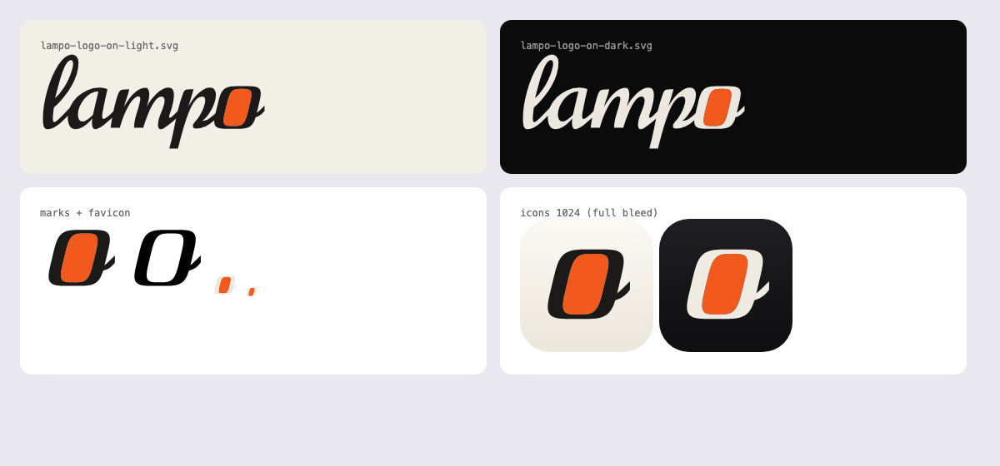

# Lampo: the brand files

The product is called **Lampo** (Italian "a flash", Greek "I shine"; said *lahm·po*). Agents know its MCP server as
`lampo`, and the repository is `lampo` too. The npm package, the `vr` and `vr-mcp` commands, the `VR_*` settings, the
MCP tool names, the `vr://` resources and the data folders keep the technical name `video-review` (a setup made under
the key `video-review` keeps working).

## The idea

- **The wordmark** is lowercase, `lampo`, set in the Norican brush script. Its last letter, the o, is redrawn as a
  frame with the same pen: the o's height and slant, thick slanted sides, thin top and bottom, and Norican's own exit
  stroke, so the word still ends like handwriting.
- **The window** inside the frame is the only colour in the logo, the brand orange `#f25a1d`: the frame you review,
  lit. Behind it is the animator's in-between: the o caught halfway between a circle and a frame.

## Files

| File | Use |
|---|---|
| `lampo-logo-on-light.svg` | ink letters `#1b1a18` with the orange window, for light backgrounds |
| `lampo-logo-on-dark.svg` | ivory letters `#ece8df` with the orange window, for dark backgrounds |
| `lampo-logo-one-colour.svg` | `currentColor` with a hollow window (print, embossing) |
| `lampo-mark-*.svg` | the mark alone (the frame o), optically centred in a square |
| `favicon.svg` | the mark as a favicon: the frame follows the browser's colour scheme, the window stays orange |
| `lampo-icon-light-1024.svg`, `lampo-icon-dark-1024.svg` | app icon masters, full bleed (the platform rounds the corners); flat layers, no gloss — macOS adds its own glass |
| `OFL-Norican.txt` | the licence of the font the lettering comes from |
| `preview.png` | all of the above at a glance |

In the app the geometry lives in `web/src/ui/brandMark.ts` (`BrandMark` = the frame o, `Wordmark` = the logo, both in
`currentColor` with the window in the `--brand` token). `node scripts/icons.ts` renders `web/public/icons/` from
these masters: the app icons on the light tile, maskable icons with the frame o at no more than half the width,
the apple-touch icon full bleed, a 32 px favicon, the one-colour notification badge, and the SVG favicon.

## Rules

- **Letters** take the text colour of their surface: ink on light, ivory on dark (`currentColor` in the app).
- **The window** is brand orange everywhere except one-colour use. The orange (`--brand`) is for the logo and brand
  moments — the review link's invitation and its way in — never for state, severity or selection. The one action a
  view is for, its primary button, wears it a shade deeper (`--brand-deep`) so its white label (`--on-brand`) passes
  contrast; text on the logo's exact orange uses `--brand-ink` (white fails contrast there).
- **Centre the mark by its optical centre** (`MARK_VIEWBOX` does this), never by its bounding box: the exit stroke
  pulls the box to the right.
- **Clear space**: at least the height of the frame o around the logo.
- **Minimum sizes**: the logo from 20 px high, the mark from 16 px.

## Licence

The lettering is derived from [Norican](https://github.com/googlefonts/NoricanFont) by The Norican Project Authors,
under the SIL Open Font License 1.1 (`OFL-Norican.txt`). The logo ships outlines only; the font itself is not
distributed. See also `NOTICE.md` and `TRADEMARKS.md` at the repository root.
