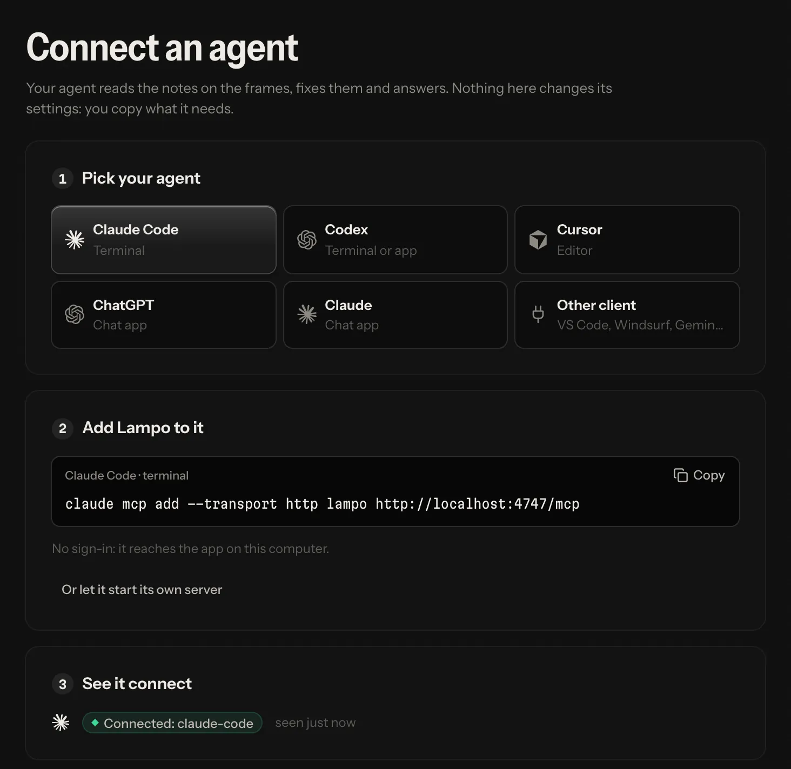
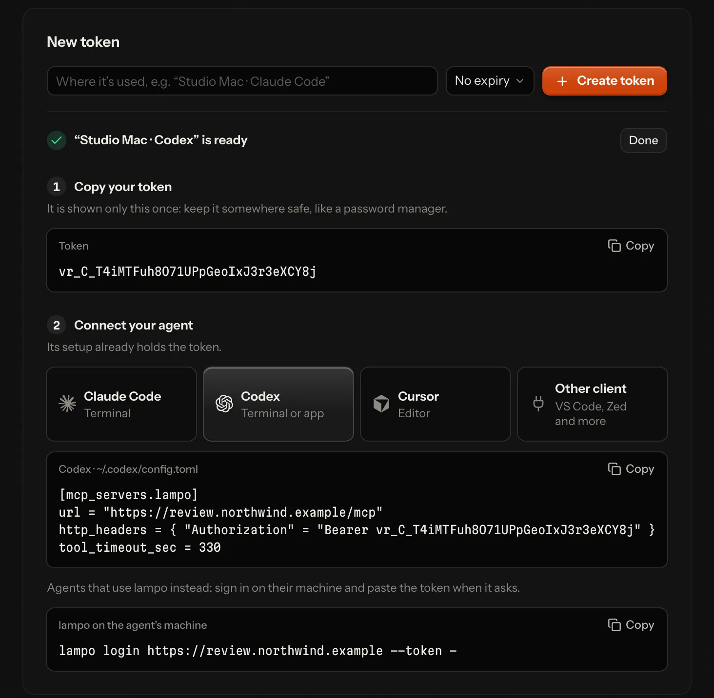
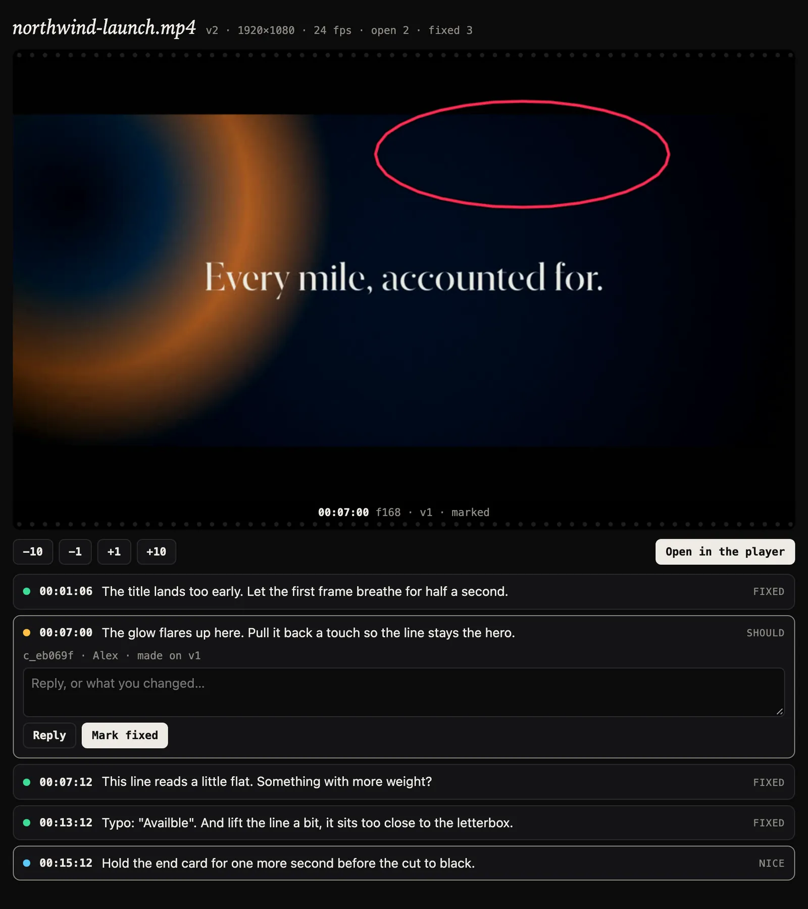

# Connect an agent (MCP)

Lampo is an MCP server. Any agent that speaks the Model Context Protocol can read the notes people pin to frames, look
at the marked frames as pictures, fix what they ask for and answer: Claude Code, Codex, Cursor, VS Code, Antigravity,
Windsurf, Gemini CLI, Zed, Claude, ChatGPT and any other MCP client.

## The quick way

**In the app**, open **Settings → Connect an agent**:

1. Pick your agent.
2. Copy the one snippet it needs (a command, or a few lines for its config file).
3. Watch it connect: the page shows the agent as soon as it calls.
4. Start it: in Claude Code, type `/lampo:watch`; any other agent, tell it to work on your Lampo notes and keep
   listening. An agent acts only when you tell it to, so until you do, new notes wait for it
   ([Start your agent](#start-your-agent-it-hears-notes-only-while-it-listens)).



**In a terminal**, `vr mcp config <client>` prints the same config. The clients are `claude`, `codex`, `cursor`,
`vscode`, `antigravity`, `windsurf`, `gemini`, `zed` and `json` (the common shape for any other client).

```sh
vr mcp config cursor                 # no vr login: the client starts its own server
vr mcp config cursor --http          # no vr login: through the app running on this machine
vr mcp config codex                  # after vr login: the server, with the token from $VR_TOKEN
vr mcp config codex --with-token     # the same, with this login's token written in
vr mcp config cursor --stdio         # its own server (stdio), even after a vr login
```

The config goes to standard output (so `> file` works); where it belongs goes to standard error. `--json` prints both
as one JSON object instead (`client`, `label`, `where`, `language`, `text` and, when there is one, `note`).
`--url <server>` names another server, `--token-env NAME` another variable, and `--name` another key than `lampo`. For
Claude Code, `--with-token` prints a command with the token in it, which your shell keeps in its history: `vr` warns
about it, and the default (`$VR_TOKEN`) avoids it. A config made before, with the key `video-review`, keeps working.

## Two ways to connect

| | Through the app (HTTP) | Its own server (stdio) |
|---|---|---|
| **How** | the client calls the app's address: `http://localhost:4747/mcp` on your machine, `https://review.example.com/mcp` on a server | the client starts `bin/vr-mcp` from this checkout |
| **Needs** | the app running; on a server, signing in or an API token | this checkout on the agent's machine (it uses `vr login`, if there is one) |
| **Good to know** | the app lists the agent among the connected agents, so a video can be assigned to it | works while the app is closed; it doesn't show up among the connected agents |

Both offer the same review tools, with one difference: putting up a render is `track_video` over stdio (and from the
machine itself) and `request_upload` over HTTP. The HTTP endpoint speaks the current MCP spec (2026-07-28) and still
serves clients on 2025-11-25, 2025-06-18 and older from the same address; the stdio server serves both eras too.

## Signing in on a hosted server

On your own machine there is nothing to sign in: the app trusts calls from the machine itself. On a hosted server the
agent needs one of two things:

- **Sign in (OAuth).** Give the client only the address. The first time, it opens the server's sign-in page in your
  browser; you sign in and allow it. No token to copy. Connected apps are listed in **Settings → API tokens** and can
  be disconnected there. Chat apps also need an https address the internet can reach
  ([how it works](server-mode.md#apps-that-sign-in-oauth)).
- **An API token.** Create one in **Settings → API tokens**, one per agent or machine, so you can revoke it alone.
  Right after you create it, the page shows the token once, the setup for the agent you pick with the token already
  in it, and the `vr login … --token -` line. To keep the token out of config files, see
  [With an API token](#with-an-api-token).



## Per client

The examples use `https://review.example.com/mcp`: put your server's address there. On your own machine use
`http://localhost:4747/mcp` instead (the app's port) and skip the sign-in.

### Claude Code

```sh
claude mcp add --transport http lampo https://review.example.com/mcp
```

Then sign in: run `/mcp` in Claude Code and follow the steps in your browser (or run `claude mcp login lampo`).
The server is added for the current project; add `--scope user` to have it in every project.

Then start it: type `/lampo:watch` (Claude Code lists Lampo's `watch` prompt as a command; `/mcp__lampo__watch` runs
it too). It works the notes on the videos assigned to it, then keeps waiting for new ones until you say stop.

### Codex

In `~/.codex/config.toml` (or `.codex/config.toml` in a trusted project):

```toml
[mcp_servers.lampo]
url = "https://review.example.com/mcp"
tool_timeout_sec = 330
```

Then sign in once: `codex mcp login lampo`. Codex stops a tool call after 60 s by default;
`tool_timeout_sec = 330` gives `wait_for_feedback` room for its longest wait.

### Cursor

In `~/.cursor/mcp.json` (or `.cursor/mcp.json` in a project):

```json
{
  "mcpServers": {
    "lampo": {
      "url": "https://review.example.com/mcp"
    }
  }
}
```

Cursor offers to connect: sign in when it asks.

### VS Code

In `.vscode/mcp.json` in a project, or in your user configuration (the command **MCP: Open User Configuration**):

```json
{
  "servers": {
    "lampo": {
      "type": "http",
      "url": "https://review.example.com/mcp"
    }
  }
}
```

VS Code asks you to sign in the first time.

### Antigravity

Antigravity is built on VS Code, but its MCP servers are in a file of its own: `~/.gemini/config/mcp_config.json`, or
`.agents/mcp_config.json` in a project (the MCP Servers panel: **⋯** → **Manage MCP Servers** → **View raw config**):

```json
{
  "mcpServers": {
    "lampo": {
      "serverUrl": "https://review.example.com/mcp"
    }
  }
}
```

`serverUrl` is the right key: Antigravity ignores `url` and `httpUrl` for a server it reaches over the network. It
signs in by itself the first time, as Lampo lets clients register on their own; in the Antigravity CLI, `/mcp` opens
its MCP manager.

### Windsurf (Devin Desktop)

Windsurf is called Devin Desktop since June 2026. Its MCP servers are in `~/.config/devin/mcp_config.json` (on
Windows `%APPDATA%\devin\mcp_config.json`); open it from the Cascade panel: **⋯** → **Open MCP config file**.

```json
{
  "mcpServers": {
    "lampo": {
      "url": "https://review.example.com/mcp"
    }
  }
}
```

Devin Desktop signs in the first time it uses the server; the Devin CLI, which reads the same file, signs in with
`devin mcp login lampo`. Windsurf builds from before the rename keep the file at `~/.codeium/windsurf/mcp_config.json`.

### Gemini CLI

In `~/.gemini/settings.json` (or `.gemini/settings.json` in a project):

```json
{
  "mcpServers": {
    "lampo": {
      "httpUrl": "https://review.example.com/mcp"
    }
  }
}
```

`httpUrl` is the right key: Gemini's `url` means the older SSE transport. Gemini CLI signs in by itself when the server
asks; `/mcp auth lampo` signs in again.

### Zed

In `~/.config/zed/settings.json` (or `.zed/settings.json` in a project):

```json
{
  "context_servers": {
    "lampo": {
      "url": "https://review.example.com/mcp",
      "timeout": 330
    }
  }
}
```

Zed asks you to sign in when the entry has no Authorization header. It stops a tool call after 60 s by default;
`"timeout": 330` (seconds) gives `wait_for_feedback` room for its longest wait.

### Claude and ChatGPT

The chat apps connect from their own servers, so this needs a hosted server with an https address that the internet
can reach.

- **Claude** (web and desktop): **Customize → Connectors → + Add → Add custom connector**. Give it a name and the
  address `https://review.example.com/mcp`, then sign in when asked. On Team and Enterprise plans an owner adds it for
  the organization first.
- **ChatGPT** (on the web, with Plus, Pro, Business, Enterprise or Education): turn on **Developer mode** under
  **Settings → Security and login**. Then open ChatGPT's plugins (chatgpt.com/plugins), select **+**, and create a
  developer-mode app with the address. It signs in through the server.

**Uploads from a chat app's sandbox.** A chat app runs the agent's code in a sandbox whose network reaches only the
domains it allows. `request_upload` hands out a URL on the server's media host (`VR_MEDIA_ORIGIN`; without one, the
app's own address), and a sandbox that may not reach it gets a 403 from its own proxy: the render never reaches Lampo.
Add that host to the app's allowed domains — in Claude under **Settings → Capabilities**, where on Team and Enterprise
plans the organization's owner adds it; **Settings → Connect an agent → Claude** shows the domain to copy. Or the person
uploads the file themselves: `request_upload`'s answer ends with the app's page for it, the folder in the library or,
for a next version, the video's page.

On your own machine, without a hosted server, Claude's desktop app can start the server itself: in the menu bar,
**Claude → Settings… → Developer → Edit Config**, add the entry below, and restart Claude.

```json
{
  "mcpServers": {
    "lampo": {
      "command": "/path/to/lampo/bin/vr-mcp"
    }
  }
}
```

### Any other client

- **Address:** `https://review.example.com/mcp` (Streamable HTTP), with `Authorization: Bearer <token>` or the sign-in.
- **Or its own server:** the command `/path/to/lampo/bin/vr-mcp`.
- `vr mcp config json` prints the common `mcpServers` shape.

### With an API token

Put the token in the environment as `VR_TOKEN`, and add a header in the client's own syntax. A client with a header
doesn't sign in.

| Client | Add |
|---|---|
| Claude Code | `--header "Authorization: Bearer $VR_TOKEN"` at the end of the command (your shell fills in the token) |
| Codex | `bearer_token_env_var = "VR_TOKEN"` |
| Cursor, Windsurf | `"headers": { "Authorization": "Bearer ${env:VR_TOKEN}" }` |
| Gemini CLI | `"headers": { "Authorization": "Bearer $VR_TOKEN" }` |
| VS Code | a header with `${input:vr-token}`: VS Code asks for the token once and keeps it in its secret storage (below) |
| Zed | `"headers": { "Authorization": "Bearer <your API token>" }`: Zed reads no variables there, so the token goes in as it is |
| Antigravity | `"headers": { "Authorization": "Bearer <your API token>" }`: Antigravity documents no variables there, so the token goes in as it is |
| Claude | under **Request headers** when you add the connector |

VS Code's version:

```json
{
  "servers": {
    "lampo": {
      "type": "http",
      "url": "https://review.example.com/mcp",
      "headers": { "Authorization": "Bearer ${input:vr-token}" }
    }
  },
  "inputs": [
    {
      "type": "promptString",
      "id": "vr-token",
      "description": "Lampo API token",
      "password": true
    }
  ]
}
```

After `vr login`, `vr mcp config <client>` prints these configs; with `--with-token` it writes the login's token in.

### Its own server (stdio)

Instead of an address, the client can start `bin/vr-mcp` itself:

| Client | The entry |
|---|---|
| Claude Code | `claude mcp add lampo -- /path/to/lampo/bin/vr-mcp` |
| Codex | `command = "/path/to/lampo/bin/vr-mcp"` in place of `url` |
| Cursor, Antigravity, Windsurf, Gemini CLI, Claude desktop | `"command": "/path/to/lampo/bin/vr-mcp"` in place of the address |
| VS Code | `"type": "stdio", "command": "/path/to/lampo/bin/vr-mcp"` |
| Zed | `"command": "/path/to/lampo/bin/vr-mcp", "args": []` in place of `url` |

- `bin/vr-mcp` finds a Node that can run it (22.18 or newer) even when your default Node is older; `VR_NODE` names
  one.
- After `vr login` it works against that server; `VR_SERVER` and `VR_TOKEN` in its environment do the same and take
  precedence over the login, and `VR_REMOTE=0` keeps it on the local store. On a hosted server's own store,
  `VR_WORKSPACE=<id>` picks the workspace (default `w1`); an id the store has no workspace for stops it at the start.
- Screenshots from a server are downloaded to `~/.cache/video-review/<host>/`, so paths in its answers open like local
  files.

## Typical loop

1. `get_playbook` and `get_taste` before rendering. Next time pass `known`: while nothing changed, the answer is one
   line.
2. `get_open_notes`, fix each note, re-render to the same path (or upload the new version), then `mark_fixed` with what
   changed: `mark_fixed({id, note: "caption moved to y 1392"})`. Working in a project (After Effects, …)? Call
   `set_render_source` once, then `attach_preview` with `fixed: true` per note, and render once when the batch is done.
3. `wait_for_feedback` with the last cursor, for what the reviewer says next. Never a loop of reads. Whatever hands
   work to the person tells you to, with a cursor from that moment ([Wait right after handing over](#wait-right-after-handing-over)).
4. Back to the notes with `get_open_notes` and `since`: only what changed.

People check the fixes; agents never mark a note verified. The [Agent Skill](../skills/lampo/SKILL.md) teaches
this loop to agents that load skills.

## Start your agent: it hears notes only while it listens

An MCP client acts only when someone prompts it. Lampo can't wake an idle Claude Code (or Codex, Cursor …) session:
the agent hears new notes while it sits in `wait_for_feedback`, and at no other time. Connecting it and assigning it a
video is not enough; tell it to start:

- **Claude Code:** type `/lampo:watch`. It is the server's `watch` prompt, which Claude Code lists among its commands
  (as `/<the key you gave the server>:watch`; `/mcp__lampo__watch` works too). `/lampo:watch launch.mp4` limits it to
  one video.
- **Any other agent:** say "Work on my Lampo notes, then keep calling wait_for_feedback until I say stop." Clients that
  show MCP prompts offer the same `watch` prompt.

The prompt has the agent call `list_videos({session: "me", open_only: true})` for the videos assigned to it, work
their notes, then call `wait_for_feedback` again after every answer, each time with the last cursor. The server's
instructions tell an agent the same and to offer it when it connects.

What waited while it didn't listen isn't lost: the first `wait_for_feedback` without a cursor answers at once with
what came in for it meanwhile (below), and `get_open_notes` always has every open note.

**The app shows whether an agent listens**, from the waits it holds open: in the agent menu of a video, on its card,
where you assign one, and in Settings → Connected agents.

| State | Means |
|---|---|
| listening | it waits for new notes now (or is about to call the next wait), or it follows them with `vr watch` |
| working | its last wait handed it notes a few minutes ago, and it is still calling: it listens again when it's done |
| not listening | connected, but nothing makes it look: new notes wait until you start it |
| not connected | an agent connected over MCP that hasn't called for over a minute: the same |

When a note goes to an agent that doesn't listen, the player says once how to start it (with the command to copy);
the agent menu says it as long as the agent doesn't listen. On your own machine, a Claude Code session that Lampo
sees (not one connected over MCP) can also be started by Lampo itself
([agents.md](agents.md#when-youre-not-running-the-machine-can-start-you)).

## Live feedback

An agent hears about new feedback without asking:

| How | For |
|---|---|
| **`wait_for_feedback`** | any MCP client: one call waits until a person says something new |
| **Change notifications** | clients that listen (`subscriptions/listen`; over stdio also `resources/subscribe`): `vr://inbox` and `vr://review/<slug>` changed |
| **`vr watch`** | terminal agents such as Claude Code: one line per new note, reply or request ([agents.md](agents.md#what-vr-watch-prints)) |
| **INBOX.md** | agents that read files on your own machine (a hosted server doesn't write it): rewritten on every event from a person ([agents.md](agents.md#what-vr-watch-prints)) |

**`wait_for_feedback`** waits until a person leaves new feedback (a note, a reply, an edit, a check or reopen, an
assignment, a decision, a request, or a reference on a note) or the time is up: 50 s by default, 300 s at most
(`timeout_s`). It returns only what is new:

- the events as one line each, the way `vr watch --brief` prints them, and each video's path once (`video: …`);
- the marked frames of new notes **with a drawing**, cropped to it (`images: "all"`: every new note's whole frame;
  `"none"`: no pictures), four at most;
- a `cursor`: pass it back as `since`, and nothing is missed or repeated.

Without a cursor (`since`), the agent has just started to listen, so the first call answers at once when something
waits for it already: the videos assigned to it with open notes or a request it hasn't been told of (by an earlier
wait, or by reading them with `get_open_notes`), one line each, and a cursor from now:

```
Waiting for you (assigned to you, came in while you weren't listening):
video: /@uploads/Reels/launch.mp4 · 12 open notes · 1 request
[14:05:40] REQUEST launch.mp4 →launch-edit v1 from alex — "Work through all open notes"
Read the notes with get_open_notes, work them, then wait again with this cursor.
cursor: 2026-10-05T12:50:07.000Z#0
```

Each thing is told once, so an agent that calls again without a cursor waits as usual. "Assigned to it" means the
video's agent is this connection (over HTTP: the agent the app lists for it; over stdio: the Claude Code session the
server runs in). With nothing waiting, it starts from now, as before.

A wait that ends with nothing new says so in two lines, then what is going on: the person keeps notes as drafts and
sends them together, so most waits end like this, and the next one should start at once.

```
No new feedback in 50 s.
cursor: 2026-10-05T12:51:00.000Z#0
```

and a third line: `The person's notes arrive together when they press Send: call wait_for_feedback again now with this cursor.`

After 30 minutes of nothing but that (waits that follow each other; a pause of more than two minutes starts the count
again, and any real answer does), the third line tells the agent to stop and say so instead, and `structuredContent`
carries `stop: true`: `30 min with nothing new: stop waiting now. Tell the person you stopped listening; the watch
prompt (/lampo:watch in Claude Code) starts you again.` The count is kept per agent (over HTTP: the connected agent,
else the token or app) in memory, bounded.

One answer holds at most 20 events, the oldest first. When more arrived it says so (`more: true`), and the next call
with its cursor returns the rest at once. The full events, with paths and screenshot URLs, are in
`structuredContent`. Don't poll `get_open_notes` or `list_videos` instead: every call costs tokens, a waiting call
costs none.

Details:

- **Over HTTP** a waiting call sleeps until an event of its workspace is written, which wakes it at once (no
  polling; the waiting calls share one read of the event log), and the app sends `notifications/resources/updated` to
  clients that listen (`subscriptions/listen`).
- **Over stdio** the server follows the store's event log (after `vr login`: the server's live events) and sends the
  same notifications to clients that subscribed (2026 clients with `subscriptions/listen`, 2025 clients with
  `resources/subscribe`). A waiting call re-reads the store's (cached) log once a second; after `vr login` it sleeps
  until the live stream says something happened, then asks the server only for what is new since its cursor (and
  every 20 s for safety).
- `notifications/resources/list_changed`: over stdio, a video arrived, was removed or moved; over HTTP, something in
  the library changed (re-list when you need the list). 2025 clients over HTTP (stateless) get the resources but no
  notifications: they use `wait_for_feedback`.
- A client that asked for progress gets a progress notification every 20 s while a call waits.

### Wait right after handing over

An agent hears notes only while it waits, so every answer that hands work to the person ends with one line saying to
wait now, with a cursor from that very moment: a note written before the agent's next call is still heard.

| Answer | Its last line |
|---|---|
| `track_video` (a render put up, a part too) | `Now call wait_for_feedback with since "<cursor>": the person's notes arrive together when they press Send.` |
| `mark_fixed`, `wont_fix` | the same once none of the video's notes is open (ideas and your questions don't count); before that `2 notes still open on this video.` |
| `request_upload`'s `PUT` (and the `GET` after it) | the JSON carries `cursor` and `next` (that line) |
| `vr track`, `vr push`, `vr fix`, `vr wontfix` | `Now listen with vr watch (keep it running): …` (`vr watch` takes no cursor; `vr push --json` has `next`) |

```
PUT → {"slug":"…","v":2,"created":false,"duplicate":false,"video":"…",
       "cursor":"2026-10-05T12:50:07.000Z#0","next":"Now call wait_for_feedback with since …"}
```

The person writes notes as drafts and sends them in one batch (on a video with an agent, that is the default:
the composer keeps each note, and "Send 3 to <agent>" sends them), so the agent gets them in one answer and starts
once. While it waits, the player says so beside Send: "<agent> is waiting · gets your notes when you send".

### Two lines an answer may end with

What an agent does on a video is one piece of work for the person, a run
([agents.md](agents.md#your-work-as-the-person-sees-it-runs)). Two things about it reach the agent as one line at the
end of its next answer from any tool, once:

- **Notes sent while it works** join the same run: `2 new notes on launch.mp4 since you started: get_open_notes since
  "<time>".` Read them and fold them into the same version.
- **The person stopped the work**: `The person stopped this work on launch.mp4: stop now, render nothing, mark
  nothing, and say you stopped.` Stop then. A wait (`wait_for_feedback`) never carries it: an agent that went back to
  waiting is done with the work anyway.

## The review card (MCP App)

`show_review` shows the person you work with a video's review. Hosts that show MCP Apps (Claude, ChatGPT, VS Code,
Goose, …) render an interactive card inline: the marked frame, the open notes, exact frame stepping, reply and mark
fixed, and Open in the player. Every other host gets the same as text and a picture. The card needs no network access
of its own: frames come through the host.



## Tools

`video` can be a path, a slug or any unique part of the path (e.g. `"ep02.mp4"`) of a video under review. Only the
machine itself (stdio, or the app on this machine) names a file that isn't under review yet: `add_note` on one tracks it
where it is. Anyone else names a video of the library ([No paths](#security-hosted)). Frames are 0-based at the
file's frame rate, timecodes `mm:ss:ff`, and drawings are in video pixels (the pictures are made smaller for the model;
the coordinates are not). Read tools are marked read-only, so clients can allow them without asking.

### Reading

| Tool | Does |
|---|---|
| `list_videos` | the videos under review: note counts, version, folder, assigned agent, agent status and stage ([workflow.md](workflow.md)) |
| `get_open_notes` | a video's open notes: required work (must to nice), then ideas (optional), then your questions that wait for an answer. Notes with a drawing come with their marked frame, cropped to the drawing |
| `get_note` | one note in full: every reply, its marked frame, a range as up to six frames across it, its references as pictures |
| `get_frame` | any exact frame as a picture, also of older versions |
| `get_transcript` | what is said in a version, line by line with timecodes and frames ([agents.md](agents.md#changing-the-words-the-transcript)) |
| `get_playbook` | the team's playbook: brief, rules, references and skills, from the House down to the folder ([playbooks.md](playbooks.md)) |
| `get_skill` | one playbook skill's SKILL.md and its files |
| `get_taste` | the reviewer's taste for the project ([taste.md](taste.md)) |
| `list_folders` | the project and folder tree, with counts |
| `wait_for_feedback` | waits until a person says something new ([Live feedback](#live-feedback)) |
| `show_review` | shows the person a video's review as a card ([above](#the-review-card-mcp-app)) |
| `get_posts` | where the posts of final videos stand: drafted, scheduled, posted with the link, failed with the platform's reason ([publishing.md](publishing.md)) |
| `find_footage` | B-roll from the workspace's videos: shots with exact in and out frames, one line each, and on request one labelled contact sheet ([footage.md](footage.md)) |

### Answering and acting

| Tool | Does |
|---|---|
| `mark_fixed` | marks a note fixed, saying what changed. Refused on a final video |
| `wont_fix` | closes a note as a deliberate choice, with the reason (a "decision that stands" in the taste) |
| `reply` | replies without changing the status |
| `add_note` | asks the reviewer about a frame, a stretch or the whole video, or tells them what you changed |
| `ask_options` | before a render: groups of options (voices, music, looks) for the person to audition and pick, on a video or, before any render, on a project or folder ([agents.md](agents.md#options-before-you-render-let-the-person-pick)) |
| `attach_preview` | shows a fix before rendering: a still or a clip of 10 s at most ([agents.md](agents.md#fixing-in-the-project-without-rendering-after-effects-premiere-resolve-)) |
| `attach_reference` | adds what "like this" means to a note: a link, a moment of a video, an image or a clip |
| `set_render_source` | says where a version was rendered from, so notes show their place on the project's timeline |
| `propose_playbook_change` | suggests a new brief, rules or skill; a person accepts or rejects it |
| `track_video` | puts a render under review, filed and assigned. Only where the file is: over stdio, or the app on this machine |
| `request_upload` | over HTTP: a one-time URL (15 minutes) that takes the render with one plain `PUT` |
| `move_video` | files a video into a folder (`""`: no project) |
| `set_status` | optional: a status on the video's card for a long step ("rendering v4") |
| `draft_post` | after Final: drafts the post of the final version for YouTube, Instagram or Facebook. A person publishes it; no tool does ([publishing.md](publishing.md)) |

### Parameters

- **`list_videos({open_only?, folder?, session?, archived?})`.** `folder` includes its subfolders; `session: "me"`: the videos
  assigned to you — over HTTP the agent the app lists for this connection, over stdio the Claude Code session the
  server runs in. Each video's line ends with `· stage <stage> (<detail>)`. Archived videos and the videos of an
  archived project only with `archived: true` (accepted, not announced: it costs the tool list nothing); their line
  then ends with ` · archived`.
- **`list_folders({archived?})`.** Archived projects (and their folders) only with `archived: true` (not announced
  either), a project's line ending with `  archived`. A write into an archived project answers `the project "<name>" is archived: it is
  read-only until a person restores it` ([agents.md](agents.md#where-a-video-stands)).
- **`get_open_notes({video, images?, max_images?, since?, all?})`.** `images`: `drawn` (the default) shows the marked
  frame of each note with a drawing, cropped to it (512 px at most; the label names the crop in video pixels; a
  drawing over most of the frame shows the whole frame). `all` shows every note's marked frame, range strip and
  references; `none` no pictures. `max_images` defaults to 6. The answer ends with `as of <time>`: pass that as
  `since` next time and you get only the notes that changed since (new, edited, answered, given a reference), the
  others by id, and the notes no longer open. `all: true` lists every status. Older clients' `include_images` still
  works (`true` = `all`, `false` = `none`).
- **`get_note({id, clean?})`.** `clean: true` adds the untouched frame. On the machine itself it names the screenshots'
  files; for anyone else it doesn't, and a clip reference plays from its URL.
- **`get_frame({video, frame | timecode | seconds, v?})`.** The frame comes straight from the file (ffmpeg,
  frame-exact).
- **`get_transcript({video, v?, format?})`.** `format`: `lines` (the default), `words`, `srt` or `vtt`. A version is
  heard once, so the first call can take a while.
- **`get_playbook({video | folder, known?})`** and **`get_taste({video | folder, known?})`.** `known`: what you read
  last time (the playbook's revisions, e.g. `House r2 · Acme r1` in any order; the taste's stamp, e.g.
  `taste 1a2b3c4d`). While nothing changed, the answer is one line, and for the playbook also where your suggestions
  stand.
- **`get_skill({name, video | folder})`.** Its files come as paths on the machine and as URLs from a server. Without
  `video` or `folder`: the House's skills only.
- **`wait_for_feedback({video?, since?, timeout_s?, images?})`.** `video`: only that video. Without `since`, it first
  hands over what waits for you already, else starts from now; `since` is the cursor of the last answer (a timestamp
  works too). On timeout the answer is `No new feedback in N s.` with a cursor and a line on what is going on; after
  30 minutes of only that, a line to stop ([Live feedback](#live-feedback)).
- **`show_review({video, note?, frame?})`.** Opens on `note`, on `frame`, else the first open note.
- **`propose_playbook_change({video | folder, section, content, reason, evidence?})`.** `section`: `brief`, `rules` or
  `skill`. `content` is the whole new section (for a skill, its whole SKILL.md). `evidence` lists note ids.
- **`mark_fixed({id, note, v?, preview?})`.** The newest version unless `v`; it waits for a render that is still being
  written. `preview`: the fix preview that shows it. The answer ends with how many notes are still open, or (none) to
  wait now ([Wait right after handing over](#wait-right-after-handing-over)).
- **`wont_fix({id, reason})`** and **`reply({id, note, references?})`.**
- **`add_note({video, frame | timecode | seconds, text, …})`.** `kind`: `question` (the default for agents: what only
  the reviewer can decide), `info` (what you changed or decided), or `feedback` with a `severity` (only when you
  review footage yourself). A stretch: `to_frame`, `to_timecode`, `to_seconds` or `range: {in, out}`, both ends
  included (past the version's end is refused). `overall: true`: about the whole video. `choices`: a question's likely
  answers, 2 to 4 short lines, which the reviewer picks with one click. Also `tags`, `box`, `arrow`, `v` and
  `references`. Both screenshots are written.
- **`ask_options({video | folder, text, groups, prompt?})`.** `groups: [{id, label, pick?: "one" | "many", items:
  [{id, label, path | data | upload | url | video + frame}]}]`, 2–9 items a group, 8 groups and 8 moments at most.
  `path` only where the server runs; `data` is base64, 8 MB at most over stdio and 700 KB over HTTP (where `/mcp` takes
  1 MB a request); over HTTP `upload: true` gets a one-time upload URL for the item instead. An item with none of them
  is its label alone. Sounds play at one loudness in the app. The answer arrives in `wait_for_feedback` as
  `ANSWERED … PICKED voice=v3 music=m1 · note: "…"`.
- **`attach_preview({id, path | data, kind?, frame | timecode | seconds?, fixed?, note?, app?, project?, comp?, time?})`.**
  A still (PNG, JPEG, WebP) or a clip (`kind: "clip"`, 10 s at most). `path` only where the server runs (stdio, the app
  on this machine); `data` is base64, 8 MB at most over stdio and about 700 KB over HTTP (where `/mcp` takes 1 MB a
  request); over HTTP without either, the answer is a one-time upload URL for `curl -fT`, the way for anything larger.
  `fixed: true` marks the note fixed with it. The next render is compared with it automatically.
- **`attach_reference({id, url | video + frame | path | data, caption?, note?})`.** A link (`url`); a moment of a
  video in the library (`video` with `frame`, `timecode` or `seconds`, and `v`; `to_frame` ends a stretch of 60 s at
  most); or an image or a clip of 60 s at most (`path` only where the server runs; `data` base64, 8 MB at most over
  stdio and about 700 KB over HTTP; neither over HTTP: an upload URL). At most 8 per note. On someone else's note,
  `note` says why, and it comes as a reply. `add_note` and `reply` take `references: [...]` of the same shape.
- **`set_render_source({video, v?, app, project?, comp?, start_frame?, fps?, clear?})`.** Only the project's file name
  is kept. `clear: true` removes it.
- **`track_video({path, folder?, session?})`.** `session: "me"`: this Claude Code session (over stdio). After
  `vr login` the stdio server uploads the file to the server; the same name again is its next version.
- **`request_upload({filename, folder?, video?})`.** A new video in `folder`, or the next version of `video`. The
  `PUT` answers the outcome (with `cursor` and `next`: wait now); a `GET` on the URL reports it later. It takes no `by`: the render is credited to the
  account that asked. The answer ends with the app's page where the person can upload the same file (the folder, or
  the video's page), for when the agent's own network refuses the `PUT`
  ([uploads from a chat app's sandbox](#claude-and-chatgpt)).
- **`move_video({video, folder})`** and **`set_status({video, text, eta_seconds?})`.** An empty `text` clears the
  status; so does the next version. Out of an archived project only the machine's own agent moves a video, as
  `vr move` there does; over HTTP that is a person's, in the app.
- **Partial renders**, only where a note says PART RENDER OK: `track_video` also takes `part_of` (the video),
  `part_at` (the frame the stretch starts at) and `handles`, and `request_upload` takes `part_at` and `handles` with
  `video`. They are accepted but not listed with the tools
  ([agents.md](agents.md#partial-renders-only-when-a-note-says-part-render-ok)).
- **`draft_post({video, platform, title?, text?, tags?, cover_frame?, at?, ai?, kids?})`.** `platform`: `youtube`,
  `instagram` or `facebook`; made the first time, changed after (`text` is the description or caption, `at` the go-live
  time, `ai` the answer on realistic AI-made content, `kids` YouTube's *made for kids*). Also accepted, not listed:
  `visibility`, `category`, `reel`, `share_to_feed`. The answer is one line: the post, `to fix: …`, `note: …` and its
  link. Not in the lean set.
- **`get_posts({video?})`.** One line per post: platform, version, state, link or the platform's reason.
- **`find_footage({query, aspect?, min_s?, max_s?, motion?, text?, said?, limit?, sheet?})`.** `query`: what the
  picture shows, filters in its words read as well ("9:16, slow push-in, ≥ 2 s, no text"); the other fields win over
  the words. One line per shot (`s412 Footage/take_031.mp4 00:20:03–00:23:02 3.0s 9:16 push-in slow · 3.3`), best
  first, six by default; `sheet: true` adds one contact sheet of them. Not in the lean set ([footage.md](footage.md)).
- **`review_frame`** is the card's own tool. Hosts that support tool visibility hide it from the model.

**Resources:** `vr://inbox` (the newest feedback from people, INBOX.md) and `vr://review/{slug}` (one video's
review.md). Both can be subscribed to. For anyone but the machine itself, they name the screenshots (and review.md its
data file) by URL instead of a path on the server's disk. `ui://video-review/review.html` is the review card's own
page (an MCP App resource; hosts load it for `show_review`).

**Prompts:** `watch` (one optional argument, `video`): work the notes on the videos assigned to you, then keep calling
`wait_for_feedback` until the person says stop. Clients show it as a command — Claude Code as `/lampo:watch`
([Start your agent](#start-your-agent-it-hears-notes-only-while-it-listens)). It is offered wherever
`wait_for_feedback` is, and costs nothing until someone uses it: no client sends prompts with every turn.

## What it costs an agent: tokens

Every token an agent spends talking to Lampo is a cost the person pays, so the server says what an agent needs to act,
and no more.

- **The tool list**, which a client sends with every turn, is short descriptions and lean schemas. `by` and
  `include_images` are accepted but not announced.
- **The lean set** offers only the review loop, for about half the tokens: `list_videos`, `get_open_notes`,
  `get_note`, `get_frame`, `get_playbook`, `get_skill`, `get_taste`, `get_transcript`, `wait_for_feedback`, `add_note`,
  `reply`, `mark_fixed`, `wont_fix`, `track_video` and `request_upload`. Ask for it with `VR_MCP_TOOLS=lean` in the
  server's environment, or with the address `https://review.example.com/mcp?tools=lean`. A list of tool names,
  separated by commas, works too. `ask_options` is a tool of its own outside the lean set (286 tokens
  more in the full list, none in the lean one); so are `draft_post` and `get_posts` (345 together) and `find_footage`
  (325).
- **Pictures on demand:** only notes with a drawing come with a picture, cropped to the drawing. `get_note` and
  `get_frame` show anything else in full.
- **Only what changed:** `wait_for_feedback` returns only new events, `get_open_notes` with `since` only changed notes,
  and `get_playbook` and `get_taste` with `known` say "unchanged" in one line.
- **No polling, no status chatter:** wait with `wait_for_feedback`; `set_status` is optional.

`bench/tokens/` measures this on a realistic review (`node bench/tokens/measure.ts`, numbers in its `README.md`), and
`test/unit/token-budget.test.ts` keeps it from growing back.

## Who writes

A write is signed with, in this order: the tool's `by` argument (accepted on every write except `request_upload`, not
announced: the default is right for one agent), `VR_BY` (stdio), `agent:<Claude Code session>` when the stdio server
runs inside a session, else `agent:<MCP client name>`.

On a hosted server every call acts as the token's (or the signed-in app's) account, with its role in the workspace the
token (or the app's sign-in) belongs to. An app whose person no longer works there gets `401`. `by` may only be
`agent:<name>` or your own account name, so an agent can't sign as another person. An account whose role doesn't work
with agents (a reviewer) writes as itself, and an `agent:…` name is refused for it.

## Security (hosted)

- **Credentials.** `/mcp` needs an API token (`Authorization: Bearer vr_…`), a signed-in session, or an access token
  from the server's sign-in (`vro_…`, valid only at `/mcp`). Without one the answer is `401`, with a
  `WWW-Authenticate: Bearer` challenge that names the OAuth metadata (`resource_metadata`) and the scopes. Tokens
  belong to one person, are stored hashed and can be revoked in Settings.
- **Scopes.** A connected app is capped by its scopes and its person's role. A call outside its scopes gets
  `403 insufficient_scope`.
- **What a tool writes.** The HTTP API's caps, from the same schemas (`lib/inputs.ts`): a note, reply or reason 20,000
  characters, a tag 60, a status 200, a caption 300, and so on. A call over them is refused; the tool list leaves the
  caps out to stay small. A reference or fix preview sent inline, or an upload URL for one, asks the workspace's plan
  like `POST /api/comments/:id/refs|previews`: a read-only workspace answers with its sentence.
- **Limits.** The same host and origin checks as the rest of the app apply (DNS rebinding, CSRF). A request body is
  1 MiB at most; each account may make 600 requests a minute in a workspace (an app connected through sign-in counts
  as its person), each workspace 6,000.
- **What stays open** — `wait_for_feedback` calls and `subscriptions/listen` streams — is capped (`WAIT_LIMITS`,
  `LISTEN_LIMITS` in `server/routes/mcp.ts`):
  - per connection (an API token, an app connected through sign-in, a browser session, a device with the LAN link):
    4 of each;
  - per person (the account, across all its tokens and apps and every workspace): 16 of each, so a person can run a
    dozen agents that each wait or listen, each with its own token or app;
  - per workspace: 64 waits and 256 listens, shared out by role so nobody takes the places the people who run its
    agents need. A reviewer (who may wait and listen but runs no agents) holds 4, reviewers together a quarter of the
    workspace's, members and reviewers together three quarters; the last quarter is kept for its owners and admins.

  One more wait is answered at once with an error that says whose cap it is (this connection's, your agents'
  together, a reviewer's, the reviewers', the places kept for owners and admins, or the workspace's); one more listen
  is `429`. The machine's own agents count only towards the workspace's whole.
- **Access, asked again.** An open response (a wait, a listen stream) asks whether its caller would still get in (the
  token or app not revoked, the account not disabled, still a member there) before an event of its workspace reaches
  it and every 15 s. A yes holds for 5 s (`RECHECK_MIN_MS`), and never past the moment the credential ends by itself (a
  token's expiry, an app's hour-long access token, a session's end). Asking again is no use of the token or app: its
  "last used" stays.
- **When access ends**, every open response asks at once: one that wouldn't get in is cut before the next event
  reaches it, and a wait hands out nothing more. That is access ended on the server itself (a token or app revoked, a
  member removed, an account disabled, signed out everywhere or given a new password), and any change of the files
  access is decided by (accounts and tokens, app connections, workspaces), whoever made it (`vr admin` in another
  process, a restore). Only what really ends access counts: revoking a token none of the client's connections holds
  (`/oauth/revoke` answers anyone, as RFC 7009 says) or a refresh token nobody was given ends nothing, writes nothing
  and makes no response ask.
- **No paths.** Only the machine itself names files on its disk. A hosted server never tracks or reads files by path
  for a client: `track_video` doesn't exist there, no tool looks at the server's disk for a name it is given
  (`add_note`, `get_frame` and every other tool that takes a `video` answer a path that is no video's name like any
  unknown name, never with whether a file exists), and paths in answers become `/data/…` URLs. The same holds for every
  caller of the app on your machine that isn't the machine itself (an API token, the LAN link).
- **Uploads.** Renders arrive as uploads: `request_upload` hands out a one-time URL bound to the account that asked and
  the video it names (only for roles that may upload). When the URL is used, that account is asked again whether it
  still gets in and may upload; if not, the `PUT` answers `403` and nothing is stored.
- **Connected agents.** A client whose account may work with agents (members and up) is listed among the connected
  agents while it talks to `/mcp`, named after the client and the account (e.g. "Codex · Olivia"; a long
  `wait_for_feedback` keeps it listed). A video can then be assigned to it, and the app shows whether it listens (an
  open `wait_for_feedback`), works on what a wait handed it, or doesn't listen
  ([Start your agent](#start-your-agent-it-hears-notes-only-while-it-listens)). Only an agent that listens or works
  counts as "an agent is on it".

## What the server logs

The app writes one line per tool call to `/mcp` (and two per `wait_for_feedback`: when it starts and when it ends), so
"my agent never got the notes" can be answered from the log. The review card's tools, `show_review` and
`review_frame`, write none:

```
mcp: w1 mcp-2755e61ea6ed wait_for_feedback start timeout_s=50 first
mcp: w1 mcp-2755e61ea6ed wait_for_feedback 3 events 12.31s
mcp: w1 mcp-2755e61ea6ed get_open_notes ok 0.21s
mcp: w1 mcp-2755e61ea6ed prompt watch
```

A line names the workspace, the agent's session id (as Settings → Connected agents and the video's assignment have
it; `-` for a client that isn't an agent), the tool, how long it took and how it ended (`ok`, `error`; a wait:
`N events`, `waiting N` for what it handed over at once, `timeout`, `cancelled`, `refused`, `access ended`). Never
what a tool was given or answered: no note text, no names, no file names, no tokens, no addresses. `VR_MCP_LOG=off`
turns it off. The stdio server logs nothing.

## Tests

```sh
node test/mcp-e2e.ts                           # stdio: every tool, a 2025 client
node --test test/unit/mcp-http.test.ts         # /mcp on the machine: 2026 and 2025 clients
node --test test/unit/mcp-stdio.test.ts        # stdio notifications
node --test test/unit/mcp-http-server.test.ts  # /mcp hosted: tokens, 401, no paths
node --test test/unit/mcp-agent-delivery.test.ts  # assign, note, hear it; listening; log
node --test test/unit/mcp-lean.test.ts         # the lean tool set
node --test test/unit/mcp-config.test.ts       # every client's config parses
node test/e2e/mcp-app.mjs                      # the review card in headless Chrome
```
