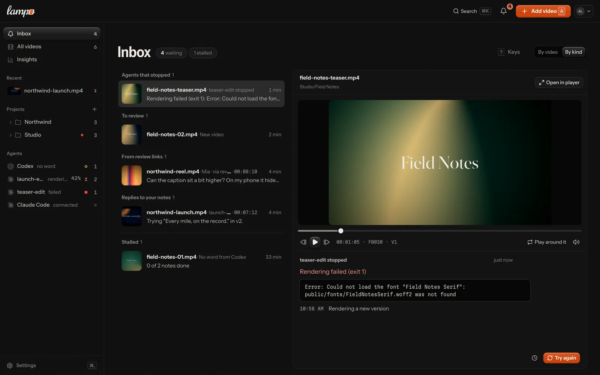
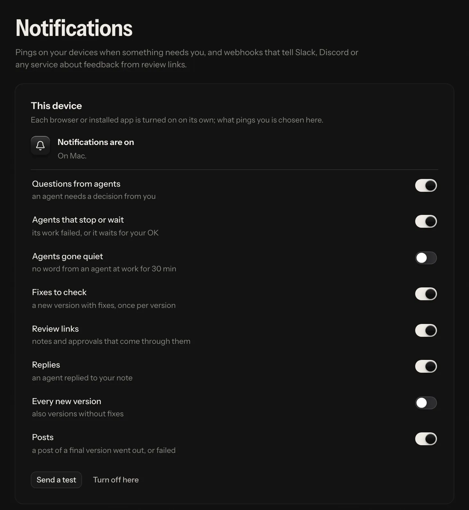

# The inbox and your phone

Everything that waits for you, across all videos, is in one list: the **inbox**. Answer an agent's question, check a
fix, approve a new version or wave a note from a review link through, right where it is. Lampo also installs as an app on a
phone, tablet or computer, and **notifications** bring the inbox to the lock screen.

## Getting it onto your phone

**A hosted server** is the way to review from anywhere (see [server-mode.md](server-mode.md) and
[docker.md](docker.md)): open its address on the phone and sign in with the same account as on your computer.

**Your own machine, on the same Wi-Fi.** `npm run lan` (or `LAMPO_LAN=1`) also serves the app on your network and prints
a link with an access token. Open it on the phone once; the phone stays signed in. This is meant for your desk, not for
on the go, and notifications don't work over it (see [where they work](#where-they-work)).

## Installing it as an app

| | |
|---|---|
| iPhone, iPad | Safari → Share → *Add to Home Screen*, then open the app from the Home Screen |
| Android | Chrome → ⋮ → *Install app* (or *Add to Home screen*) |
| Mac, Windows, Linux | Chrome or Edge: the install icon in the address bar |

The installed app opens on the inbox, full screen, with its own icon. It starts instantly and shows an "Out of reach"
screen when it can't reach the server. After an update, "A new version of the app is ready" offers a reload.

What stays on the device: the app's code, and a copy of the screens you saw last (the library, the inbox, the notes),
so the next start shows them at once while it catches up with the server. That copy is kept per account and deleted
when you sign out. Videos and pictures are never kept; they always come from the server.

## The inbox

*Inbox* is first in the library's sidebar (and in the phone's menu, and in ⌘K), with the number of things waiting. The
**bell** in every top bar shows the same number and opens the same list over the page you are on: a popover on a
computer or tablet, a sheet from the bottom on a phone. The page underneath keeps its place.

On a screen 1100 px wide or more, the inbox reads like a mail client: the list on the left, the picked item's preview
on the right with its action. Narrower, every item is a card with its action right on it; tap one to open it in the
player.

### What lands there

| Group | What it is | It leaves when |
|---|---|---|
| Questions from agents | an agent's open question about a frame, or on a folder before any version exists (options to pick from) | you answer it, or close it with *Done* |
| Waiting for your OK | an agent's work stopped short of a permission its settings don't give it (a run Lampo started on your machine): what it needs, and the exact rule to add — *Copy*, then *Send again* (the last 7 days) | it goes on, you stop it (*Stop*), or you send it again |
| Agents that stopped | an agent's work failed (a render that failed, an error, the time limit): why, with the last lines the tool printed, and *Try again* (*Log* opens the whole output of a run on this machine; the last 7 days) | you try again, or once you opened it |
| Fixes to check | a note an agent marked fixed | *Looks right*, or *Still wrong* with what is still wrong |
| To review | a version nobody has decided on yet: a new video's V1 or any new version (from the last 30 days; a partial render reads "New version V8 · part") | someone approves it, requests changes or leaves notes that need fixing |
| Posts that failed | a post of a final version that failed or was sent and not confirmed, for whoever may publish: the reason, and *Try again* (or *Check again*) | it goes out, is changed or is cancelled |
| From review links | an open note from a review link | the note is dealt with, or you wave it through (*Seen*, *Got it*) |
| Playbook suggestions | an agent's suggested change to a playbook | someone accepts or rejects it |
| Approvals | someone approved a version through a review link (the last 14 days) | *Got it* |
| Replies to your notes | an agent replied to one of your notes (the last 14 days) | *Got it* |
| New versions | a new version that carries open notes over to be checked again (the last 7 days) | *Got it* |
| Stalled | a video that waits too long: fixes keep coming back, four full renders and still no approval, or nothing happened for two days. It offers *Nudge agent* (a request to the video's agent) or *Review link* | its video moves on, or *Got it* (it comes back if it stalls again) |
| Stalled (an agent) | no word from an agent at work for a while, or notes sent that no agent picked up in 10 minutes: *Nudge* and *Stop* (*Cancel*) | the agent is heard from again, or you stop it |

**Work leaves when it is done.** Questions, an agent's work that needs you, fixes, versions to review, failed posts
and playbook suggestions have no *Got it*: they leave when they are answered, checked or decided. Only what informs
can be waved through, and it also leaves by itself once you have read it in the preview (it stayed open for a moment,
and you moved on).

*Got it* changes nothing in the review; it only takes the item off your own list. Each person sees what their role
allows: questions need the right to write notes, fixes the right to check them, versions to review and stalled videos
the right to approve, playbook suggestions the right to edit playbooks, failed posts the right to publish, and an
agent's work (waiting for your OK, stopped, gone quiet) the right to work with agents — never a reviewer. Stalled
videos come last and aren't counted in the bell's number. Notes someone saved but hasn't sent never show up in
anyone's inbox.

**By video or by kind.** *By video* (the default) groups everything per video, the most urgent video first: its name,
what it holds ("3 questions · 2 fixes · V4 to review") and a ⋯ for the whole video. *By kind* groups the list as in the
table. The switch sits across from the title and is remembered per device; the bell's list follows it, showing a video
with three or more items as its most urgent item and "n more".

### Clearing it where it is

Every row has its own actions, in the place of its time while the pointer or the keys are on it (on a touch screen,
behind a ⋯ on the row):

| Item | Actions |
|---|---|
| a question | *Done*: close it without an answer (the agent sees it closed) |
| a fix | *Looks right*, or *Still wrong* with a short reason typed right in the row |
| something that informs | *Got it* |
| anything | *Later* |

*Done*, *Got it* and *Looks right* leave the list at once, with *Undo* in the message that follows.

**Later** puts an item aside for you alone, until tomorrow at 9:00 (your device's time) or until its video moves (a
new version, a note, a reply, a decision), whichever comes first. It changes nothing on the note or the video and isn't
counted while it is aside; "n later" at the bottom of the list shows what is aside, with *Bring back*.

**Several at once:** tick the circle on a row's picture, ⇧-click for a run, ⌘-click for one more, ⌘A for all. The bar
under the list offers *Done* (questions close, updates are waved through; fixes and versions stay), *Later*, and
*Looks right* when every picked item is a fix. A video's ⋯ does the same for the whole video: *Got it on all updates*,
*Done for this video*, *Later for this video*.

**Keys** (never while you type): ↑/↓ or J/K move, ↵ opens the preview (again: the full player), E done or got it, ⇧E
done for the whole video, H later, X select, Esc clears the selection, ? lists them all.

With nothing waiting, the inbox says *All caught up*, and when something put aside comes back.

### The preview

Pick an item and its preview opens: beside the list on a wide screen, in its place on a narrow one (the back arrow
returns to the list).

- **A small frame-exact player**, parked on the note's frame (a note about the whole video: the first timecode its
  words name, else the poster's frame). A fix is shown in the version it was fixed in. The note's marks are drawn on the
  version they were drawn on, with a toggle.
- **A timeline** with the note's moment on it (a range as a band) to tap or drag to any frame; play and pause, a frame
  back or on, sound, and *Play around it*: from 1.5 s before the frame to 1.5 s after, then back on the frame.
  Timecodes in the note's text are links that move the picture there.
- **Who did what and what was said**: the note, what the agent changed, the last replies. A version to review says what
  it brings instead: who put it up, what changed since the version before (fixes in it, notes carried over), the file,
  and what Auto-check found.
- **The item's action, at the bottom**: for a question the answers the agent offers (one tap sends one), a field for
  your own answer and whether the agent gets it now ("Running · gets it now" or "Not running · gets it when it
  starts"); for a fix *Looks right*, *Still wrong* or *Compare* (check mode in the player); for a version *Approve V4*
  or *Request changes*; *Seen* for a note from a review link, *Got it* for the rest; *Later* on every item. A playbook suggestion
  shows its diff with *Accept* and *Reject*.

*Open in player* (also O, or a double-click on the picture) takes the frame on screen to the full player: the note
open, a fix in check mode. In the preview, Space plays and pauses and ←/→ step a frame (⇧ a second).

## Notifications

### Turning them on

While a device hasn't decided, the inbox asks once: *Turn on* asks the device for permission, *Not now* puts the
question away on that device. If notifications are blocked or need a step first (the Home Screen on iOS, https), the
inbox says what to do. Once they are on, **Settings → Notifications** shows this device's state, lets you pick what is
worth a ping on it, *Send a test* checks the way through, and *Turn off here* stops them. Each device is turned on and
set up on its own.

### What pings you

| Setting | Default | How it is bundled |
|---|---|---|
| Questions from agents | on | a few seconds; several questions on one video become one notification |
| Fixes to check | on | once per version: "spot.mp4 V3 is ready", "6 fixes to check" |
| Review links | on | notes, replies, fix checks, approvals and downloads through review links; half a minute per video: "Mia, Tom on teaser.mp4" |
| Replies | on | an agent replied on a note; a few seconds per video |
| Every new version | off | also versions that come without fixes |
| Posts | on | a post of a final version went out, was scheduled or failed; a couple of seconds: "spot.mp4 is on YouTube" |
| Agents that stop or wait | on | an agent's work failed or waits for your OK; a few seconds per video: "Claude Code stopped — the render of promo.mp4 failed", "Claude Code is waiting for your OK to render promo.mp4" |
| Agents gone quiet | off | no word from an agent at work for 30 minutes, once: "No word from Claude Code on spring.mp4 for 30 min" |

A bundle waits until its video has been quiet for that long (two minutes at most), so an agent's batch of fixes
arrives as one notification, and a newer notification about the same video replaces the older one. An agent starting,
rendering or getting on never pings you: the app shows it. Nobody is told
about their own actions. Tapping a notification opens the exact note, or check mode at the fix; when the app is
already open, it goes there instead of opening a second window. On a server with several workspaces it opens in the
workspace the note is from (the app switches there first). Where the platform supports it (installed apps on iOS,
macOS, Windows and many Android launchers), the app icon shows how much waits for you.

### Where they work

Browsers allow notifications only on secure pages: https, or `localhost` on the computer the app runs on.

- **iPhone and iPad** (iOS 16.4 or later): only in the app added to the Home Screen, never in a Safari tab. The app
  says so when you open it in Safari.
- **A hosted server over https:** every browser, on every device.
- **Your own machine:** on that computer itself. A phone on the Wi-Fi reaches it over plain http, where browsers don't
  allow notifications; use a hosted server for notifications on the phone.

### What goes through the push service

A notification travels through the push service of the browser's maker (Apple, Google, Mozilla or Microsoft). Its
content (the title, a line of the note, the link inside the app) is encrypted for the device
([RFC 8291](https://www.rfc-editor.org/rfc/rfc8291)), so the push service sees only its size and timing. The server
signs its requests with its own key ([VAPID](https://www.rfc-editor.org/rfc/rfc8292)) and sends to those four services
only, and only to a public address their name resolves to (it connects to the address it checked). Devices that
uninstalled the app or revoked the permission are dropped when the push service says so. *Sign out everywhere* and a
password reset drop every device of the account, so a lost phone stops showing notes on its lock screen.

## Details

**Files.**

| File | |
|---|---|
| `data/push/vapid.json` | the server's signing key pair, made on first use (readable by the owner only). Deleting it signs every device out of notifications |
| `data/push/subscriptions.json` | one entry per device: its push address and keys, name, what it wants to hear about, and its account on a hosted server (readable by the owner only) |
| `data/for-you.json` | per person: what they waved through (*Got it*, kept 30 days) and what they put aside (*Later*) |

**The contact push services see** is `push_subject` (`LAMPO_PUSH_SUBJECT`): `mailto:you@example.com` or an https URL.
The default is the server's `public_url` when it is https, else a placeholder.

**API.**

| | |
|---|---|
| `GET /api/for-you` | the list and the counts for whoever asks (what is aside comes as `later`) |
| `POST /api/for-you/dismiss` `{keys}` | *Got it* |
| `POST /api/for-you/snooze` `{keys, until}` · `POST /api/for-you/unsnooze` `{keys}` | *Later* and *Bring back* |
| `GET /api/push?endpoint=` | the server's public key, this device's subscription and how many devices you have |
| `POST /api/push/subscribe` `{subscription, name?, prefs?}` | register a device (the push services above only; signed in in the app, never with an API token). A new password, signing out everywhere and a reset end every device of the account |
| `PATCH /api/push/prefs` `{endpoint, prefs}` · `POST /api/push/unsubscribe` `{endpoint}` · `POST /api/push/test` `{endpoint}` | |

Server-sent events carry `for-you` when a list changes. Full shapes are in [api.md](api.md) and
[`lib/types.ts`](../lib/types.ts).

**Older addresses.** `#/for-you` and `#/verify` (fixes to check) open the inbox; `#/open` (open notes) opens *All
videos* on the *Being fixed* lane.
