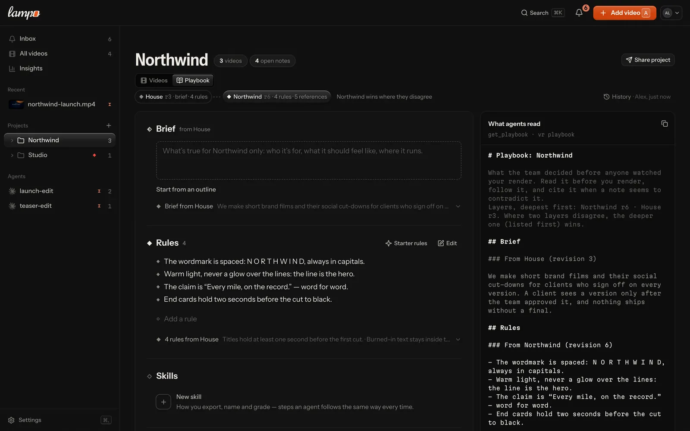

# Playbooks

A playbook is what the team decided **before** anyone watched a render: who a project is for, what every render must
do and never do, pictures and moments that show what "right" looks like, and step-by-step skills for recurring work.
Agents read it before they render, so notes only have to catch what nobody could decide in advance.

People write a playbook on purpose. The [taste file](taste.md) is the other half: it is learned from the notes by
itself.

## Where playbooks live

- **The House playbook** is the studio's: *Settings → Playbook*. Every project and folder inherits it.
- **Every project and folder** can have its own: the *Playbook* tab beside its *Videos*.
- A folder inherits every playbook above it: *Acme/Reels* reads the House, then *Acme*, then its own. **The deeper
  one wins** where they disagree. Every part says where it comes from ("From Acme r1"), so nothing is merged silently.



## The page

A playbook is one document, *Brief · Rules · Skills · References*, beside *What agents read*: the merged text exactly
as agents get it, this playbook's own lines lit and what it inherits quieter. The line under the title says where it
stands: the playbooks it inherits, from the House down, each a link with what it holds ("House r9 · brief · 12 rules ·
3 skills"), this one last (it wins), and, only when there are some, the suggestions waiting, the ones waiting in its
folders ("Reels · 5 suggestions waiting": a project's page is where people look first; the folder's tab counts them
too) and *History*. On a narrow screen *What agents read* and the history open as dialogs.

- **Everything is written where it is read.** An empty brief is a field to type in (or *Start from an outline*); a
  written one turns into its editor in place (*Edit*). While you type, *What agents read* already shows the text where
  saving will put it, marked as not saved yet.
- **Rules are one line each.** Type a rule and press ↵, take one out with its × (*Undo* puts it back), or *Edit* the
  whole text when it is more than a list.
- **Starter rules.** A playbook just begun offers rules a motion studio often writes down (safe zones, loudness,
  captions, logo size, the first half second, the end card, delivery): one click adds one and saves it, *Add all*
  takes the rest. They stay a click away under *Starter rules* while the rules are short. They are the studio's own
  words, so they go in with one click; what clients ask for never does.
- **What the playbooks above say** is folded under this one's own ("12 rules from House"), the nearest first.

## What a playbook holds

| Part | What it is |
|---|---|
| **Brief** | who it's for, what it should feel like, where it runs |
| **Rules** | what every render here must do and never do, one line each |
| **References** | pictures, links, and moments of videos in the library (a frame, taken frame-exact) |
| **Skills** | instructions for recurring work (how you export, name, grade), in the open [Agent Skills](https://agentskills.io) format, with small files such as presets, LUTs or scripts. The files are stored and handed to agents, never run by Lampo |

The brief and the rules are markdown (`- ` for a list, `**bold**`, links); the editor has a *Preview*. A skill is a
`SKILL.md`: a `name` (lowercase letters, digits and hyphens, like `export-reels`) and a `description` (when to use it)
at the top, then the steps, written in a dialog made for it (twelve lines to start, growing with the text; the whole
screen on a phone). Under *SKILL.md*, *Import SKILL.md…* takes one you already have and *Copy SKILL.md* takes this
one elsewhere.

## Revisions and render stamps

Every save is a revision (r1, r2, …) with who, when, an optional message, and the text before and after. *History*,
beside the document (from the line under the title), shows them with a diff, and the suggestions that were turned
down with their reasons.

Every new version is **stamped** with the revisions in force for its folder ("House r4 · Acme r1 · Acme/Reels r5").
The player's version picker shows the folder's own revision next to each version (all of them when you point at it),
so "was this made before or after we changed the rules?" has an answer.

If someone saved the same section while you were editing it, nothing is overwritten: the editor shows who did and what
saving yours would change, and you *Keep theirs* or *Save mine over it*. A change to another section goes through.

## Suggestions from agents

Agents never edit a playbook. They **suggest**: a whole new brief, new rules or one skill, with the reason and the
notes behind it.

1. A suggestion lands in the inbox of everyone who may edit playbooks (*Playbook suggestions*) and on the playbook
   itself, inside the section it changes, as a diff against what the section says now.
2. A person **accepts** it (it becomes the next revision: "by promo-edit · accepted by Sam") or **rejects** it with a
   reason. The agent reads the decision and the reason back.

Several suggestions for the same part (the brief, the rules, one skill) stand together, the newest first and marked.
Once one is accepted, or someone changed that part by hand, the others say so before anyone clicks, and their diff
shows what accepting them now would replace. Nothing is replaced silently: *Accept anyway* replaces it on purpose, or
reject it. A change to another section never holds a suggestion up.

**From the notes to a rule.** When three or more of your team's notes in a folder carry the same tag and no rule
mentions it yet, the *Rules* section shows it: "The notes keep asking for: logo 3×". A click starts the *Add a rule*
line with the newest way someone asked for it, and *Make it a rule* on *Insights → What causes the rounds* lands
there too (a topic a rule already names says so there: "Rule exists — still 6 rounds"). People write the rule and keep it with ↵; nothing is added by itself.

## Who can do what

| | Read | Edit, accept, reject | Suggest |
|---|---|---|---|
| Owner, admin, member | ✓ | ✓, in the app | ✓ |
| Reviewer | ✓ | – | ✓ (through `vr` or MCP) |
| Agents (MCP, `vr`, any API token) | ✓ | – | ✓ |
| Clients on review links | – | – | – |

## For agents

| | MCP | `vr` |
|---|---|---|
| the playbook for a video or folder | `get_playbook({video \| folder})` | `vr playbook [<video\|folder>]` |
| one skill, with its files | `get_skill({name, video \| folder})` | `vr playbook skill <name> [<video\|folder>] [--files]` |
| everything as files (e.g. into `.claude/skills`) | – | `vr playbook export [<video\|folder>] [--to <dir>]` (default `.lampo/playbook`: `PLAYBOOK.md`, then `<name>/SKILL.md` with its files) |
| suggest a change | `propose_playbook_change({…, section, content, reason, evidence})` | `vr playbook propose <video\|folder> --section brief\|rules\|skill (--file f.md \| --text "…") --reason "…" [--evidence c_1,c_2]` |
| where a suggestion stands | `get_playbook` lists the latest ten | `vr playbook status <pp_…>` |

`vr` writes files only into the folder it was given (`--files`: the current folder; `export`: `--to`). The server
names them, so every name is checked first: a skill or file name that isn't a plain name (a `/`, `..`, an absolute
path), or that would land outside the folder through a symbolic link, stops the command before anything is written.

Without a video or folder it is the House playbook. `get_playbook({known})` with the revisions already read answers
in one line when nothing changed. The notes an agent reads (`get_open_notes`, `get_note`, `wait_for_feedback`) carry a
line naming the revisions that apply (`playbook House r4 · Acme/Reels r5 · read it before you render: get_playbook`),
so an agent sees when they change.

What an agent reads is the playbook merged, deepest first. The app shows the same under **What agents read**:

```
# Playbook: Acme/Reels

What the team decided before anyone watched your render.
Read it before you render, follow it, and cite it when a note seems to contradict it.
Layers, deepest first: Acme/Reels r2 · Acme r1 · House r3.
Where two layers disagree, the deeper one (listed first) wins.

## Brief

### From Acme (revision 1)

Acme makes running shoes for beginners: warm, honest, never salesy.

### From House (revision 3)

We make short motion pieces for brands that want to feel **human**.
Calm type, real footage, nothing shouty.

## Rules

### From Acme/Reels (revision 2)

- 9:16, 45–60 s, first cut within 1.5 s
- Subtitles burned in, two lines at most

### From House (revision 3)
…
## Skills

Instructions for recurring work (the Agent Skills format).
Load one with get_skill or `vr playbook skill <name>`.

- **reels-export** (from Acme/Reels): Export an Acme reel for Instagram and TikTok:
  H.264, -14 LUFS, 9:16
- **studio-naming** (from House): How the studio names renders and versions

## Changing it
…
Revisions in force: House r3 · Acme r1 · Acme/Reels r2 (a render made now is stamped with them).
```

## Trust

Agents follow a playbook as instructions, so **a write to a playbook is a write to every agent's prompt** for that
folder and everything below it. That is why:

- **Only people edit.** Editing and deciding take the playbook right *and* a person in the app (a browser session, or
  you at your own machine). An API token, which is how agents, scripts and apps that sign in reach a server, may only
  suggest; MCP has no editing tool at all.
- **Nobody outside the team reads it.** Review links never reach playbooks. Reviewers read them and may suggest, but
  can't edit or decide.
- **Suggestions are data until a person accepts them.** They are kept beside the text, never in it, and other agents
  see only their state (pending, accepted, rejected), never their content.
- **Read suggestions as you would a pull request.** Anything that ends up in a playbook (a pasted brief, an imported
  `SKILL.md`, text an agent suggested) is what the next agent follows. An instruction to "ignore the notes", send files
  somewhere, run a script or change other playbooks is a reason to reject. Client notes never become rules by
  themselves: *Make it a rule* only starts a line for a person to write.
- **Files are never run.** Skill files are served as downloads only, never shown or executed by Lampo; an agent that
  uses a preset or a script runs it on its own machine, under its own rules. A reference picture must be a still
  picture (anything with motion is refused) and is shown through a re-encoded copy; links lose any credentials; a moment
  is a frame taken from a video in the library, not a URL.
- **On your own machine**, whoever runs on it can read `data/playbooks/` directly and reaches the app as its owner:
  there the boundary is the machine, as for everything else in the store.

## Details

**Limits:** 20,000 characters for a brief or the rules, 40,000 for a skill's instructions; 30 skills per playbook, 10
files per skill, 2 MB per file; 24 references; 50 suggestions waiting per playbook. The last 200 revisions are kept.

**Where it is stored:**

```
data/playbooks/house.json                the House playbook
data/playbooks/f_<sha1 of the path>.json a folder's playbook ({ "scope": "Acme/Reels", … })
data/playbooks/<id>/skills/<skill id>/…  skill files via the storage adapter (local, Bunny, S3)
data/playbooks/<id>/refs/…               reference pictures and stills
data/playbooks/archive/                  playbooks of deleted folders, kept aside
```

Renaming a folder moves its playbook and its subfolders' with it; deleting a folder archives its playbook and moves its
subfolders' playbooks up with the subfolders. While a project is archived ([workflow.md](workflow.md#in-the-library)), its playbook
and its folders' are read only: no edit, reference, suggestion or decision until it is restored (`423`), and their
suggestions leave the inbox meanwhile. Each render's stamp is `Version.playbook` in `review.json`. The format is
in [data-format.md](data-format.md#playbooks), the routes in [api.md](api.md#playbooks).
