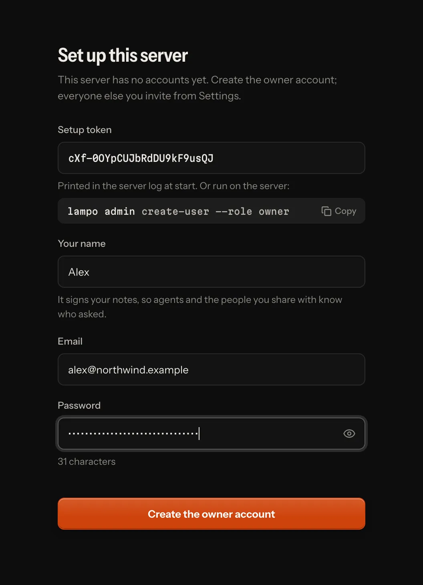
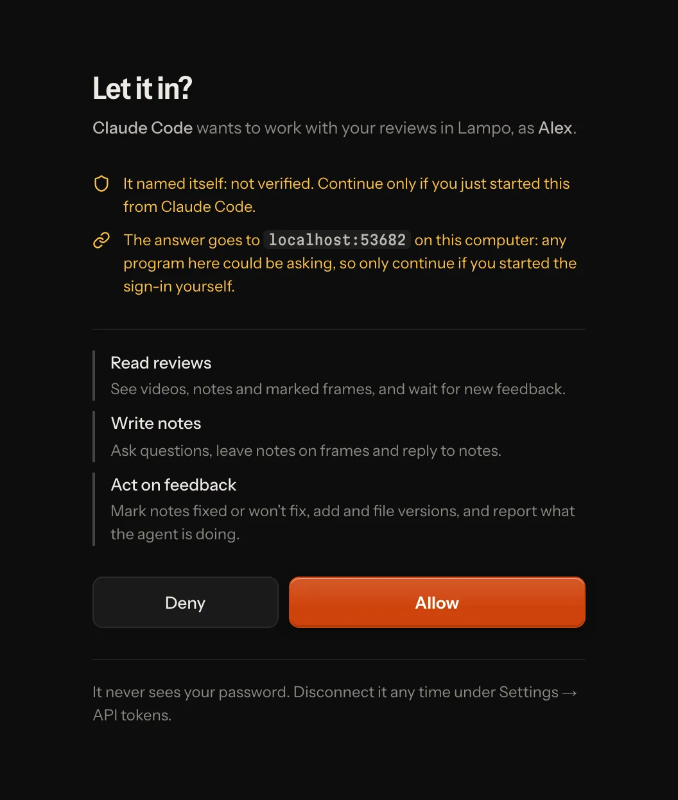

# Hosting: on your machine or a server

Lampo is one app. On your own machine it signs you in by itself and can link renders where they are on your disk. On
a server (`VR_MODE=server`) everyone signs in, renders arrive as uploads, and they can be kept in Bunny Storage or an
S3 bucket. Accounts, invites, API tokens, uploads, review links, sign-in for MCP clients and the settings work the
same in both places. A server can also hold several teams, each in a [workspace](#workspaces) of its own.

This page is about running a server. With Docker, start with [docker.md](docker.md); the first production deploy,
step by step, is [go-live.md](go-live.md); every setting is in [configuration.md](configuration.md).

## Quick start

1. Start the server with the address people will open:

   ```sh
   VR_MODE=server \
   VR_PUBLIC_URL=https://review.example.com \
   VR_HOST=127.0.0.1 \
   VR_TRUST_PROXY=loopback \
   npm start
   ```

   The last two lines are for a reverse proxy with HTTPS on the same machine, such as Caddy
   ([below](#behind-a-reverse-proxy)).

2. On its first start the log prints a one-time **setup token**. Open `https://review.example.com/?setup` and enter
   it with your email, name and password: that creates the **owner** account. On the server itself,
   `vr admin create-user --email you@example.com --name "You" --role owner` does the same.

   

3. Invite the others from **Settings → Users**, or with `vr admin invite`.

4. On each machine where an agent works (the sign-in screen has the command under *Sign in an agent*):

   ```sh
   vr login https://review.example.com        # opens your browser; keeps an API token here
   vr push render.mp4 --folder "Acme/Reels"   # upload; the same name again becomes v2, v3, …
   vr watch                                   # live feedback
   ```

   Inside a Claude Code session, `vr watch` also makes that session one you can pick in *Assign agent…* while it
   watches.

`vr login` opens your browser at the server: sign in there if you aren't, and press **Allow** on the consent screen,
which names the machine (`vr on <machine>` is the API token it gets, in the workspace you work in there) and what the
token may do. The terminal says what is happening and who you are signed in as; Ctrl-C cancels, and it gives up after
5 minutes. Over SSH it prints the address instead: open it in a browser on any device, and after Allow paste the
address that browser ends on (a page that can't load) into the terminal. Where no browser can reach (CI, scripts),
`vr login https://review.example.com --email you@example.com` asks for your password, and with an API token from
Settings, `--token -` asks for it or reads it from a pipe. Don't type the token itself on the command line: the
process list and your shell's history would keep it. `vr login` refuses a plain `http://` address on another machine
(the password, the token and every note would cross the network unencrypted) unless you add `--insecure`, for a
network that is yours alone; `http://localhost` needs nothing. `vr logout` goes back to the local store: a token
`vr login` made is revoked, one you pasted is only forgotten (revoke it in Settings → API tokens). In CI or a
container, `VR_SERVER` and `VR_TOKEN` do the same as `vr login` without a file; `VR_REMOTE=0` keeps `vr` on the local
store.

## Your machine or a server

| | On your machine (the default) | Hosted (`VR_MODE=server`) |
|---|---|---|
| Signing in | You are signed in automatically at the machine; your owner account is made on the first start. Teammates sign in with their accounts; a phone can also use the link `npm run lan` prints. | Everyone signs in. The first account is made with the one-time setup token; others come through invites or, when `VR_SIGNUP` allows it, sign up. |
| Videos come from | uploads, and renders linked where they are on this disk (a re-render to the same path becomes the next version) | uploads: the browser, `vr push`, MCP |
| Agents | Claude Code sessions on this machine show up by themselves; any MCP client or `vr` connects too | any MCP client (by signing in, or with an API token) and `vr login` |
| Renders are kept in | `versions/` on this disk | local disk, Bunny Storage, or an S3-compatible bucket |
| Extras | linking files and browsing folders, Claude Code sessions (and starting one for a request), Finder and macOS text recognition on a Mac, project timelines, INBOX.md, the tunnel for review links, the phone link | none: a hosted server never touches anyone's disk or machine |

Only the machine itself may name paths on it: a teammate or a phone uploads, it never links a file or browses your
folders. Everything else is the same in both places: frame-exact notes, screenshots, versions and diffs, Auto-check,
review links, and the files agents read.

**On your machine**, `npm start` opens the app signed in as you. To use it from your phone or another computer on
your network, start it with `npm run lan` so it listens there. Then open the link it prints on that device (it is you
from then on), or sign in with an email and a password you set in **Settings → Profile**. Invite teammates from
**Settings → Users**, as on a server; they sign in with their own accounts. The tunnel serves review links only.

A store that ran on a machine works on a server for its uploads only: linked renders point at a disk the server can't
see. To move one, linked renders and all, use `vr export` there and `vr admin import` here: [moving.md](moving.md).

## Configuration

The settings that matter most on a server. All the others, and where config.json is found:
[configuration.md](configuration.md).

| Variable | config.json | Default | What it does |
|---|---|---|---|
| `VR_MODE` | `mode` | local | `server` turns on sign-in for everyone and the restrictions in the [security model](#security-model). |
| `VR_PUBLIC_URL` | `public_url` | none (required) | The address people open: scheme and host only, such as `https://review.example.com` (a path is refused). Only this host name (and localhost) is served, writes must come from it, emailed links are built from it, and on https cookies are marked Secure. Plain `http://` is refused unless the host is this machine or `VR_ALLOW_HTTP=1`. |
| `VR_ALLOW_HTTP` | | off | `1` lets a hosted server start with a plain-http `VR_PUBLIC_URL` on another host (a closed test network); passwords and cookies then cross the network unencrypted. |
| `VR_TRUST_PROXY` | `trust_proxy` | none | Which proxies may tell the app the visitor's address and that the connection is https: their addresses or subnets, `loopback` (a proxy on this machine), `uniquelocal` (a private network, such as the compose network), `linklocal`; separated by commas. Required when `VR_PUBLIC_URL` is https: the server refuses to start without it (`false` says on purpose that no proxy forwards addresses). |
| `VR_MEDIA_ORIGIN` | `media_origin` | none | A second host name of this server for video, such as `https://media.example.com`: the player, review links, downloads and folder zips are sent there with signed URLs ([below](#a-host-of-its-own-for-video)). For an app host behind a CDN proxy that must not carry video. |
| `VR_HOST` | `host` | 0.0.0.0 | The address to listen on. Behind a proxy on the same machine: 127.0.0.1. |
| `VR_PORT` | `port` | 4747 | |
| `VR_UPLOAD_MAX` | `upload_max_bytes` | 20 GB | The largest upload accepted. |
| `VR_MIN_FREE` | `min_free_bytes` | 2 GB | Free disk to keep: below it the server reports not ready, and uploads that don't fit are refused. |
| `VR_STORAGE` | `storage` | local | Where renders are kept ([Storage](#storage)). |
| `VR_SOURCE_URL` | `source_url` | the project's repository | Where people get this instance's source code (AGPL-3.0). The default is right for an unmodified copy; a changed one points it at its own source. A server with none at all warns at start. |
| `VR_SMTP_URL`, `VR_MAIL_FROM` | `mail.smtp_url`, `mail.from` | none: the outbox | The mail relay invites, password resets and account notices go out through, and the sender people see. Without a relay, every email is written to the outbox in the cache instead ([email.md](email.md)). |
| `VR_SIGNUP` | `signup` | off | Who may sign up on their own: `off`, `invite` or `open` ([below](#accounts-and-tokens)). |
| `VR_IMPRINT_URL`, `VR_PRIVACY_URL`, `VR_TERMS_URL` | `imprint_url`, `privacy_url`, `terms_url` | none | Your imprint, privacy policy and terms, linked at the foot of the sign-in screens and of review links, and in *Settings → About* ([configuration.md → Legal pages](configuration.md#legal-pages)). `VR_SIGNUP=open` needs the terms and the privacy policy. |

Where the store is on disk: [configuration.md → Where data lives](configuration.md#where-data-lives).

A server refuses to start without `VR_PUBLIC_URL`: it would otherwise answer to any host name, take its sign-in
address for MCP clients from the request, and might not mark cookies Secure. For a quick local test,
`VR_ALLOW_NO_PUBLIC_URL=1` starts it anyway; it then reports itself not ready.

It also refuses to start on settings that would be unsafe or can't work, with one line in the log for each that says
what to change:

- a `VR_PUBLIC_URL` with a path, or without its scheme;
- plain `http://` on a host other than this machine, without `VR_ALLOW_HTTP=1`;
- an https `VR_PUBLIC_URL` without `VR_TRUST_PROXY`;
- `VR_BUNNY_CDN_URL` without `VR_BUNNY_TOKEN_KEY`;
- an unknown `VR_STORAGE`, `VR_STT` or `VR_SIGNUP`, incomplete storage settings, or a port, size or `VR_TRUST_PROXY`
  entry it can't read;
- a `VR_SMTP_URL` that isn't one, or one without `VR_MAIL_FROM`; a sender or reply-to address that isn't one; a legal
  page (`VR_IMPRINT_URL`, `VR_TERMS_URL`, `VR_PRIVACY_URL`, `VR_WITHDRAWAL_URL`, `VR_CANCEL_URL`) that isn't http(s);
- sign-up without a public URL, `VR_SIGNUP=open` anywhere but a hosted server, or `VR_SIGNUP=open` without
  `VR_TERMS_URL` and `VR_PRIVACY_URL` (strangers who sign up accept your terms and read your privacy policy first);
- a store folder it can't write;
- a damaged key file (`secret.key`, `share-secret.key`).

Forwarding headers from a peer that `VR_TRUST_PROXY` doesn't name are reported once in the log: the proxy isn't
named, or the app's port can be reached without it.

### Behind a reverse proxy

TLS belongs in the proxy. With Caddy, three lines do:

```
review.example.com {
    reverse_proxy 127.0.0.1:4747
}
```

Caddy's defaults already pass the live event stream through as it comes, accept uploads of any size and keep range
requests (frame-exact seeking) intact. Run the app as in the [quick start](#quick-start): listening on 127.0.0.1 only,
and trusting the proxy's forwarding headers with `VR_TRUST_PROXY=loopback`. With the proxy on another machine, listen
on an address it can reach and name its address or subnet in `VR_TRUST_PROXY` instead.

With nginx:

- turn `proxy_buffering` off for the live streams, `/api/events` and `/mcp`;
- set `client_max_body_size` to your upload limit (or `0`) and turn `proxy_request_buffering` off. Browsers and
  `vr push` send uploads in pieces of up to 64 MB, but a one-time upload address (`request_upload`) takes the whole
  file in one request.

### Speed over a real network

What the app already does, so the proxy doesn't have to:

- **Compression.** JSON answers of 1 KB or more go out compressed (brotli, or gzip for clients without it), and the
  web app is compressed once when it is built. The library of a 1,000-video test store is 1.4 MB of JSON and travels
  as 14 KB. Answers that can carry secrets (tokens, invites, sign-in, review links, OAuth) are never compressed.
  Leave Caddy's `encode` out: it would hold back the event stream, and it skips compressed answers anyway.
- **Asking again instead of downloading again.** Every JSON answer carries an ETag, and the browser asks each time:
  when nothing changed, it gets an empty "not modified" answer. No proxy or CDN stores API answers. Built files with a
  hash in their name are cached for a year; the page, its service worker and the manifest are checked every time, so
  a new version is picked up at once. Posters, sprites and waveforms are addressed per render and cached for good.
- **Timings.** Every JSON answer has a `Server-Timing` header (the route, turning it into JSON, compressing it, in
  milliseconds). In the browser's developer tools, Network → a request → Timing shows where a slow answer spent its
  time.
- **Keep-alive.** The app keeps idle connections open for 65 seconds, longer than Caddy and nginx keep theirs, so a
  proxy never sends a request into a connection the app is closing (a stray 502).
- **HTTP/2 and HTTP/3** come from the proxy: Caddy turns both on with its certificate (nginx: `listen 443 ssl;
  http2 on;`), and talks HTTP/1.1 with keep-alive to the app.
- **Video from the CDN.** With Bunny (or S3), the player fetches video straight from the CDN or the bucket, with signed
  links that expire ([Storage](#storage)); with a media host of its own, from that host
  ([below](#a-host-of-its-own-for-video)). Posters, sprites and waveforms still come from the app.

In the browser, the app keeps what it showed last (the library, recent reviews, the inbox) for the signed-in account,
and shows it at once on the next visit while it asks what changed. Signing out deletes it
([architecture.md → Speed](architecture.md#speed)).

### A host of its own for video

A CDN proxy in front of the app host (Cloudflare's, for example) hides the server's address, filters attacks and
serves the built files from its edge. It is also no place for video: a CDN's terms may forbid serving video through
its proxy, and its limits (a request size, a timeout) don't fit renders of several gigabytes. Give video a second host
name that points straight at the server, without the proxy, and tell the app:

```sh
VR_PUBLIC_URL=https://review.example.com    # behind the CDN proxy
VR_MEDIA_ORIGIN=https://media.example.com   # DNS only, straight to this server
```

The same TLS proxy on the server serves both names to the same app:

```
review.example.com {
    reverse_proxy 127.0.0.1:4747
}
media.example.com {
    reverse_proxy 127.0.0.1:4747
}
```

What changes:

- **Video goes to the media host.** The player's `/media/…`, a review link's renders and previews, fix-preview and
  reference clips, a question's clips and sounds, downloads and *Download all* zips answer with a redirect to a signed
  URL there, exactly as they do with Bunny or S3: the app host checks who asks, the bytes go straight from the server
  to the browser. The URL is the only credential (no cookie reaches the media host); it names no video, folder or
  workspace, and it lives 6 hours for the team and 5 minutes on a review link
  ([how long a signed URL lives](#s3-compatible-storage)). The player asks for a fresh one when one runs out.
  A *Download all* zip is put together when it is fetched, so its URL asks again there: a review link must still be
  valid, and the team member who asked must still be one (the same API token or browser session, still in the
  workspace, still allowed to download); the folder must also hold what it held when the URL was made. Otherwise the
  zip doesn't start, and asking the app host again gives a new URL to whoever may still have it.
- **One-time upload URLs** (`request_upload`, `vr` for big references and previews) point at the media host too, so a
  whole render in one request never meets the proxy's request limit. Such a request may take up to 6 hours to send
  (Node's own limit of 5 minutes is raised); a TLS proxy in front keeps its own timeouts, so give it as long. Browsers and `vr push` upload in pieces through
  the app host (48 MiB from a browser, 64 MiB from `vr push`: under the 100 MB a CDN usually takes per request). A chat
  app's sandbox must be allowed to reach the media host to upload there
  ([uploads from a chat app's sandbox](mcp.md#claude-and-chatgpt)).
- **The media host answers nothing else**: no page, no API, no sign-in; every other path is a 404 there, whoever
  asks. `/healthz` answers, for a monitor.
- **The page's Content-Security-Policy** names the media host in `media-src` and `connect-src`.

Posters, sprites, waveforms, frames, screenshots and voice notes stay on the app host (pictures and small files), and
so does a publish kit's download. The setting is refused at start when it isn't an origin of its own (a path, plain
http off this machine, or the public URL's own host). `node scripts/smoke.ts https://review.example.com --media
https://media.example.com` checks the media host too.

Behind a CDN, also: send the client's address from the CDN's own header to the app only for requests that come from
the CDN's addresses, bypass the CDN's cache for everything but `/assets/` (the app marks what may be kept), and leave
its HTML rewriting off (the page's one inline script is pinned by the CSP's hash; the page, the live stream and every
answer that carries a secret say `Cache-Control: no-transform`, which Cloudflare respects). The live stream sends a
ping every 25 seconds, well inside a proxy's idle timeout.

## Workspaces

A hosted server can hold many teams, each in its own **workspace**: its own videos, notes, review links, playbooks,
events, inbox, Insights and people. Nobody sees another workspace's work, its names, or that it exists. An account can
belong to several workspaces, with a role in each. While a server has one workspace none of this shows, and the app
on your own machine always has exactly one.

1. **Make one.** In the app: Settings → Workspace → *New workspace…* (the account menu has it too once you belong to
   two or more); whoever makes it becomes its owner. By default only whoever runs the server may ([the
   operator](#the-operators-pages)): whoever runs a workspace invites and emails people and takes turns in the server's
   job queue, so handing that out is the operator's choice. `VR_WORKSPACE_CREATE=anyone` lets everyone signed in make some: each account at most
   `VR_WORKSPACE_CREATE_LIMIT` (3; the workspace its sign-up gave it counts, the operator has no limit) and ten a day, counted on the server. On the server,
   `vr admin workspaces create --name "Acme" --owner you@example.com` makes one owned by an existing account.
2. **Bring people in.** Settings → Users shows the current workspace's members and invites; invites work as
   [below](#accounts-and-tokens). Someone who already has an account on the server joins with it: signed in, the
   invite screen asks only for their password, checked and limited like a sign-in. On the server:
   `vr admin invite --workspace <id>` or `vr admin create-user --workspace <id>`.
3. **Switch.** People switch between their workspaces in the account menu or in Settings → Workspace, where owners
   and admins also rename it. The switch belongs to the browser's sign-in, so every tab follows.

**Roles are per workspace**: someone can own one and review in another. An API token acts in the workspace it was made
in (`vr login <server> --email <address> --workspace <id>` picks it; signed in through the browser, it is the one you
work in there), and an app connected through sign-in in the one its consent screen named,
each with the person's role there. Admins manage their workspace's members and roles, and disable them there: a
disabled member has no role in that workspace (their sessions there, tokens and apps stop) until let in again, while
the account goes on everywhere else; its person still signs in, resets their password and joins other workspaces.
Someone who also works in another workspace changes their own name, email and password themselves. Another person's
address is never an admin's to change: its person changes it, confirmed from the new inbox.

**No accounts for other people's addresses.** On a hosted server whoever runs a workspace may be anyone (a sign-up's
own, or anyone's with `VR_WORKSPACE_CREATE=anyone`), so *Add a user with a temporary password* makes no account there:
it sends the address an invite into the workspace, and answers the same whatever the address, so a workspace's admins
learn nothing about who has an account on the server. Taking an invite proves no inbox either, since its maker holds
the link too: an account that gives its own password joins at once; anyone else is held until the confirm link mailed
to their address is opened, and only then joins with the invite's role. The first address confirmed takes the invite,
and the answer to taking one is the same whatever the address ([email.md](email.md#invites-on-a-hosted-server)). Once a
person has proved their address from their inbox (a confirm or reset link), no workspace admin sets their password.
Invite emails are in the server's own words; the inviter's and the workspace's names are only quoted, in a line of
their own: the workspace's once someone named it (a sign-up's workspace starts out called after its owner, a person's
name, so the invite email and page then name only the inviter), and the subject carries `VR_ORG_NAME` for the first
workspace's invites only. On your own machine, which has no workspaces, admins still add people with a temporary
password.

**Invites are bounded.** The invites of every workspace live in one file (`data/invites.json`), so one account makes
at most 60 invites an hour and revokes at most 60, and a workspace has at most 200 invites waiting or ended unused in
the last 30 days (`429` past any of them). A revoked or expired invite leaves the file 30 days after it ended (Settings
lists that long) and counts toward the 200 until then, so revoking one makes no room; accepted ones stay, since they
say who invited whom, and don't count.

**Sign-up.** With `VR_SIGNUP=open` ([email.md](email.md#sign-up-vr_signup)), everyone who signs up gets a workspace
of their own once their address is confirmed: empty, with them as its owner, named after them until they rename it.
They never see anyone else's. With `VR_SIGNUP=invite` an invited address gets its invite again, and the invite's link
puts them in its workspace.

**Links name their workspace.** A notification, a chat webhook's link and an agent's "open in the player" link carry
`w=<id>` once a server has more than one workspace: two teams can have a video of the same name. Opened while the
session works elsewhere, the app moves the session to that workspace first, then opens the link; someone who isn't in
it is told so and lands in their library.

### Details

- **Workspace #1 is the store you have.** Nothing moves: `data/`, `versions/`, `cache/` and the Bunny or S3 keys
  stay where they are. Every other workspace lives in `data/w/<id>/`, `versions/w/<id>/` and `cache/w/<id>/`, and
  under `w/<id>/` in the bucket ([data-format.md](data-format.md#workspaces)). Accounts, keys and the list of
  workspaces with their members (`data/workspaces.json`) belong to no workspace.
- **The move.** A hosted server moves its store to workspaces once, the first time it starts with them. It first
  copies `users.json`, `invites.json`, `oauth/grants.json` and `shares.json` to `data/backups/workspaces-<time>/`,
  and the log names that folder. `vr admin workspaces migrate` does the same by hand; run again, it does nothing.
  It never runs while `data/w/` holds a workspace folder, empty or not: it would write `w1` alone over the others.
  Afterwards a version of Lampo from before workspaces can't open the store without losing them.
- **A lost `workspaces.json`.** A store that moved and then lost `data/workspaces.json`, or can't read it, doesn't
  start: the log says to restore it (`video-review: … restore it from your backup`). Without the file every account
  would read as a member of the first workspace, so the memberships are never rebuilt from the accounts. A server that
  loses the file while it runs, or can't read it for a moment, stays up: it answers signed-in requests with 503, and
  `/readyz` is red until the file can be read again; then it serves as before.
- **On the server's own store**, `vr admin workspaces` lists the workspaces and their members. `vr admin list-users`
  shows every account with its role in one workspace (`--workspace <id>`) and, on a store with several, its role in
  the others. `vr admin invite` says which workspace its link is for, and `vr admin invites` and `revoke-invite` keep
  to one (`invites --all` lists every workspace's, each named). `VR_WORKSPACE=<id>` points `vr` and the stdio MCP
  server at one (default: the first, `w1`): everything they read, write and follow (`vr watch`, the MCP change feed,
  `vr admin` without `--workspace`) is that workspace's. An id the store has no workspace for is refused at the
  start, in one sentence.
- **Isolation** is enforced where the data lives, not only in the routes. Each workspace's files are a tree of their
  own; every request, job, timer and event runs in its workspace, and work that loses it is refused once a server has
  a second workspace (never handed the first one's store). In-memory caches are kept per workspace: two teams may
  upload the same file under the same name, and nothing is shared or deduplicated between them. Live updates reach
  the workspace's own streams only, and an upload, a one-time upload address or a connected app works only in its
  workspace. Another workspace's things answer 404, never 403, and each workspace has its own request budget
  ([Security model](#security-model)).
- **Background work** (scrub copies, posters, Auto-check …) runs one job at a time for the whole server. The people
  who run workspaces take turns, then their workspaces, and each turn runs that workspace's most urgent job: neither a
  backlog nor one account's many workspaces holds another team's next job back by more than one job per owner. A
  workspace may have 200 jobs waiting; past that, a request that needs one gets a 503 that says to try again in a few
  minutes. The last 20 places are kept for the scrub copies a player waits on; past those the player says the
  server is busy, and the copy is made once there is room. A job that brought the server down twice (out of memory, a
  crash) is not started again on the next starts: no crash loop from one render
  ([architecture](architecture.md#background-jobs)).
- **Webhooks** from config.json or the environment belong to the first workspace; other workspaces add theirs in
  Settings → Notifications.
- **One way in.** Every workspace is made by `createWorkspace({ name, ownerId })` in `lib/workspaces.ts`, whether
  through `vr admin`, the app or a sign-up: the place to start for a sign-up flow of your own.

### A billing provider

A self-hosted server is complete and unlimited. A hosted service that sells plans adds a module of its own, which the
server loads when `VR_CLOUD_MODULE` names its file (the one extension point, `server/extension.ts`; without it nothing
below exists). What such a module may do:

- **Limit what costs storage or a seat.** A new upload, video, member, review link or publishing connection is asked
  for first; a workspace whose plan has no room for it, or that is read-only, is refused with a `402` and the
  module's sentence ([api.md](api.md#workspaces-and-plan-limits)). Reviewing, notes, answers, approvals, downloads and the review links
  already sent keep working, and nothing is ever deleted for a plan.
- **Hear** a workspace made and a member count changed (after the fact, never in the way).
- **Answer a sign-up** in place of the server's own: it places the person exactly as the server would ([Sign-up
  above](#workspaces): their own workspace on a server open to sign-ups, an invite's workspace otherwise) and then does
  what its plans give a newcomer, such as a trial. If it fails, the confirm link stays unused.
- **Email a workspace's owners and admins** (or other roles) through the server's mailer: its own words per language,
  the server's layout and footer, a button that opens a screen of this app ([email.md](email.md#what-is-sent-and-when)).
- **Provide billing**: `/api/info` says so, Settings → Billing shows the workspace's plan, what it uses and, for owners
  and admins, the plans to choose from, paid for right on the page (the provider's payment form loads only when it
  opens), the payment methods, the details on the invoices and the invoices. Nobody is sent to the provider's own
  pages. While a trial runs, the library's sidebar ends with its line (the plan, the days left, a ruler of the trial's
  days) and a card with what the plan includes for the workspace; the account menu carries the same line. A banner
  above the library, one line until it is opened, says when a trial is in its last three days or ends today, what Free
  would mean for the workspace, a grace period and its three ways on, or that the workspace is read-only (then Add
  video is a locked button that explains why instead of an upload that fails). The first fix checked on a video of the
  workspace's own and its first review link opened each show a short, dismissible note about the plan, once per
  workspace. Nothing of it counts down in hours or blocks the work.
- **Name the origins its payment form loads from** (`contentSecurity`: https origins only, or the server doesn't
  start). The hosted app's own pages allow them in their Content-Security-Policy; review links and a person's own
  machine never do.

Its routes are mounted behind the server's guard (one may be public and get the raw body, as a payment provider's
webhook needs). Every other route declares the lowest workspace role that may call it and whether only a person signed
in may (`role`, `person` in `server/extension.ts`); the server's role table holds every caller to that, and a route that
declares nothing stops the server at start. An API token never changes what a workspace pays. A module's own `5xx`
answers like one of the server's: a sentence and a ref for the caller, the module's text in the log under that ref. They are routes of
its own (such as `/api/billing/…`): a module that names one the server answers itself is refused at start, in one
line.

#### What it counts, and what it never does

Where a billing module runs, the server counts how sign-ups become paying workspaces, for its operator alone
([below](#the-operators-pages)), at `#/operator/funnel` (`GET /api/operator/funnel?weeks=4|8|12`; anyone else gets a
404, as if there were no such page). It is first-party and small:

- **Eight steps, once per workspace, the first time each happens**: signed up, setup done (finished or skipped), the
  first video of its own (not the sample), the first review link, a link's first opening by a visitor (never the team's
  own preview), the first fix checked, active at the trial's end and the first payment. The last two are the module's to
  tell (`host.funnel(workspace, 'trial_end' | 'plan_paid', { plan, active })`); a trial's end counts when anything
  happened in the workspace in its last three days (the module's `active`, or when it leaves that out, the workspace's
  own log). The server records the rest where they happen. Each is a workspace id, the day (UTC) and the plan, in `data/funnel.json` (0600, next to `workspaces.json`).
- **The conversion moments** (a trial's popover, the first loop, the first link opened, an invite beyond the plan, the
  trial's banner, a limit's sheet): how often each was shown, used, put away or made room for, per week and place —
  never who (`POST /api/moments/event`).
- **Never**: names, email addresses, IP addresses, devices, videos, titles, notes, frames or anything a visitor types;
  no third-party trackers, no cookies for it, no fingerprinting. Nothing leaves the server.
- Step records are kept 13 months from the sign-up, then only their week's counts. A self-hosted server (no module)
  counts nothing, and a counts file that can't be read is never written over.

"Not now" on a moment is kept with the person's account for that workspace (`PUT /api/moments/:id`, up to 90 days;
`null` brings it back), so it holds on every device. The first loop and the first link opened wait a day for the one
person they are for (`GET /api/moments`), told live to their own pages only.

### The operator's pages

Whoever runs a hosted server has three pages nobody else sees, behind **Operator** in their account menu: the funnel
(above), **Workspaces** and **Accounts**.

- **Who the operator is**: the accounts `LAMPO_OPERATOR` names, by address or account id (comma-separated, an address
  only once it is confirmed). Without it, the owners of the server's first workspace (the one its setup page made), so
  a self-hosted server is never locked out of its own pages. This one rule decides everything that is the server's
  rather than a workspace's: these pages, the server's setup and its health check and test mail, the speech engine's
  internals in `/api/info`, and making workspaces without a limit. Anyone invited into the first workspace, as an owner
  or admin too, works there and runs nothing. Only in the browser, signed in as themselves: an API token,
  anyone else and the app on a person's own machine get a 404, the same for ids that exist and ids that don't. A listed
  address with no account yet is said once in the log at start.
- **Workspaces** (`#/operator/workspaces`): every workspace with its owner, members, videos, storage (of the plan, with a
  billing module), when it was created and when anything last happened in it; searched by name or owner, filtered by
  where the plan stands, ordered by last activity or by when it was made. One opened shows its facts and its members.
- **Its plan, set by hand** (with a billing module that offers it): complimentary on a plan (no limits, never billed),
  the trial run to a day, or back to normal billing, each with a reason. The module keeps the plan and a log of every
  change — who, when, what, why — and the page shows it. A workspace that pays keeps its subscription (end it first),
  and the server's own workspace and those `LAMPO_COMPLIMENTARY` names are changed there. Without a module the pages list
  the workspaces without plans.
- **Accounts** (`#/operator/accounts`): every account with its workspaces and roles, when it was made, its last sign-in
  and whether it is disabled; searched by name or email. **Disable** signs the account out everywhere and stops its API
  tokens and connected apps at once, in every workspace; its notes and memberships stay. **Enable** lets it sign in
  again. Never one's own.
- **Suspend or delete** (a workspace's page, never the server's own): **Suspend…** asks for a reason (kept on the page,
  never shown to anyone else) and makes the workspace read-only for its people: they sign in, read, watch and download,
  but every change is refused (423), its agents write nothing over MCP, its scheduled posts wait, upload links made
  before stop, and its review links answer like an ended link (410). Everyone in it is emailed, and the library says
  so. **Lift the suspension** gives all of it back, and tells them again. **Delete…** counts what goes (videos and their
  bytes, review links, members and how many of them work nowhere else, invites, tokens, apps), and needs a reason and
  the workspace's name typed as it is. Then everything it holds goes: see [Deleting](#deleting-and-exporting).
- **Never**: reading anyone's notes or videos, signing in as someone, a password hash or a token.

```sh
LAMPO_OPERATOR=you@example.com,u_0a1b2c3d4e5f   # who runs this server; unset: #1's owners
```

### Deleting and exporting

People's own data is theirs to take home and to end (GDPR Art. 15, 17, 20); the operator can do both for them.

- **Export my data** (Settings → Profile): one zip of plain JSON files and a README — the account (name, address,
  settings), its workspaces and roles, its API tokens (names and dates, never the tokens), connected apps and devices,
  and per workspace the notes it wrote with its own replies, its replies on other people's notes (with that note's id,
  never its words), its drafts, unsent recordings with their audio, verdicts, the review links it made (never their
  addresses), what it watched and what it uploaded (file metadata: the videos stay the workspace's). Notes from before
  accounts were recorded with them aren't in it. A few an hour.
- **Delete my account** (Settings → Profile, a hosted server): its password confirms it (or a sign-in in the last ten
  minutes). Refused while it is the last owner of a workspace others work in: make someone else an owner there, or
  delete that workspace, first. It leaves the workspaces others go on with; the workspaces only it works in go with it.
- **Delete workspace** (Settings → Workspace, its owners): its name typed. Its people are emailed; whoever worked
  nowhere else loses their account with it (the owner too).
- **What goes with an account**, however it goes (deleted, removed from its last workspace, a sign-up nobody confirmed):
  its record, sessions, API tokens and app connections, its picture, push devices, account links, drafts and unsent
  recordings in every workspace, what it put away in For you, and its copies in the backups the move to workspaces
  made (`data/backups/workspaces-*`). What it watched stays in the team's numbers, under no name. **Notes and replies
  it wrote stay** in their workspaces, signed with its name: they are the team's record of a review. Someone removed
  from one workspace while the account goes on loses their drafts and recordings there.
- **What goes with a workspace**: its folders (`data/w/<id>`, `versions/w/<id>`, `cache/w/<id>`) and every object
  under its storage prefix (`w/<id>/` in Bunny or S3), its review links (they name nothing any more), invites, API
  tokens and app connections, its waiting jobs, the accounts it leaves in no workspace, and its billing (a billing
  module cancels the subscription at once and forgets its state). Never the server's own workspace.
- **The erasure log** (`data/erasures.jsonl`, ids only): every deleted account and workspace. Your nightly backups keep
  what was deleted until their retention drops it (with `restic forget --keep-monthly 12`, up to a year). After you
  restore one, run `vr admin erasures` (what is back that was deleted) and `vr admin erasures --apply` (delete it
  again) — keep the newest `erasures.jsonl` aside before the restore and put it back first.
- **On the server**: `vr admin delete-account <email|id>` and `vr admin delete-workspace <id>` say what would go and
  delete nothing; `--yes` deletes it (and emails the people, through the server's mail settings). `vr admin
  export-account <email|id> --out data.zip` writes an account's export.

```sh
vr admin delete-workspace w_0a1b2c3d4e5f        # what goes: videos, links, members, accounts
vr admin delete-workspace w_0a1b2c3d4e5f --yes  # and gone
vr admin export-account mia@example.com --out mia.zip
```

## Accounts and tokens

**One workspace, one team.** Every account sees every video, note, insight and event in its workspace; roles decide
what someone may *do*, not what they may *see*. Clients therefore get **review links** (one video or a whole folder,
no account; see [sharing.md](sharing.md)), not accounts. An agency working for several clients gives each client their
own folder link. Limiting accounts to folders is on the roadmap.

**Roles.** One table decides what each role may do ([`lib/permissions.ts`](../lib/permissions.ts)). The server checks
it on every request, and the app hides what a role can't do.

| | reviewer | member | admin | owner |
|---|:-:|:-:|:-:|:-:|
| watch, read notes, the inbox, Insights, taste | ✓ | ✓ | ✓ | ✓ |
| add notes, replies and voice notes; edit or delete their **own** notes | ✓ | ✓ | ✓ | ✓ |
| check fixes (*Looks right*, *Still wrong*), reopen notes | ✓ | ✓ | ✓ | ✓ |
| approve a version or request changes | ✓ | ✓ | ✓ | ✓ |
| mark a video final, or reopen it | | ✓ | ✓ | ✓ |
| edit or delete anyone's notes; mark notes fixed or won't fix | | ✓ | ✓ | ✓ |
| upload videos and new versions; remove videos they uploaded | | ✓ | ✓ | ✓ |
| projects and folders, moving videos, assigning agents | | ✓ | ✓ | ✓ |
| make review links | | ✓ | ✓ | ✓ |
| download whole folders from the library | | ✓ | ✓ | ✓ |
| requests to agents, agent status, connecting agents, writing as `agent:…` | | ✓ | ✓ | ✓ |
| rerun Auto-check, dismiss its findings | | ✓ | ✓ | ✓ |
| edit playbooks; accept or reject what agents suggest | | ✓ | ✓ | ✓ |
| draft posts of a final video, download the publish kit ([publishing.md](publishing.md)) | | ✓ | ✓ | ✓ |
| remove any video | | | ✓ | ✓ |
| connect publishing accounts; publish, schedule, cancel or retry posts | | | ✓ | ✓ |
| turn footage search on or off for the workspace ([footage.md](footage.md)) | | | ✓ | ✓ |
| accounts, invites, everyone's API tokens | | | ✓ (not owners') | ✓ |

*Reviewers* are people on your side who give feedback: producers, colleagues, freelancers. They see everything in the
workspace like everyone else, but they don't hand work to agents (it costs time and money) or open the project to
outsiders, and they aren't shown where connected agents run (their folder and machine). Everyone manages their own
profile, password and API tokens; a reviewer's token carries a reviewer's rights. Only owners manage owners, and the
last owner can't be removed, demoted or disabled.

**Invites.** Owners and admins create a one-time link in **Settings → Users**, or with
`vr admin invite --role reviewer --email mia@example.com`. An invite has a role, optionally a name and email to fill
in, and lasts 7 days unless you choose otherwise (1 to 90; `--days`). Whoever opens it chooses a name, email and
password; on a hosted server they are in once that address is confirmed ([above](#workspaces)), on your own machine at
once. With an email address the app can email the invite (*Email the invite*, and *Send again*
in the list); otherwise it gives you a message to send. Without a mail relay an emailed invite only reaches the
outbox, so copy the link instead. `vr admin invite` only prints the link.

- The link is `<public URL>/#/invite/inv_…`. The token sits after the `#`, so it never reaches a server's or a
  proxy's logs.
- Pending invites can be copied again, sent again or revoked (`vr admin invites`, `vr admin revoke-invite <id>`). A
  used, revoked or expired link says so.
- On your own machine an invite made out to an address confirms that address, and someone who joins through an
  invite that named none is in at once and gets a link to confirm the address they typed. On a hosted server an
  invite confirms nothing: the address is confirmed from its inbox.

**Email** ([email.md](email.md)). With `VR_SMTP_URL` and `VR_MAIL_FROM` set (Brevo or any SMTP relay), the server
sends invites, password resets (*Forgot password?* on the sign-in screen: a link that works for 60 minutes; the new
password ends every other session of the account, and its API tokens and connected apps), confirmations of a new
address (the old one gets a notice) and account notices. Without them every message is written to the outbox in the
cache instead, and the server says so at start. `vr admin mail-test <to>` sends one message now and prints the
relay's answer.

**Sign-up** (`VR_SIGNUP`, [email.md](email.md#sign-up-vr_signup)): `off` (the default), `invite` (an address a pending
invite names gets the invite again; its link makes the account) or `open` (anyone, each into a workspace of their own;
a hosted server only). An open sign-up can do nothing until its address is confirmed, and can't change that address
meanwhile.

**Browser sign-ins** are signed `HttpOnly; SameSite=Lax` cookies, over https named `__Host-vr_session` (this host
only, `Secure`, the whole site: a sibling subdomain can't set or overwrite it; a browser holding the older `vr_session`
is moved to it on its next request, still signed in). They last at most 30 days and end after 14 days
without use (`VR_SESSION_DAYS`, `VR_SESSION_IDLE_DAYS`). Signing out ends that session on the server too, so a copy of
its cookie stops working; changing the password, disabling the account or *sign out everywhere* ends all of them.
*Sign out everywhere* and any new password (in Profile, set by an admin, or from a reset link) also end the account's
notifications on every device (its push subscriptions); a new password also ends its apps connected through sign-in,
and a reset its API tokens. A browser told its session is gone (a `401`, or a status that names nobody) deletes the
data it kept for the next visit. Any sign-out also clears what the screens remembered in the browser's storage (open
folders, the last video, zoom per video); the theme and language chosen on the device stay.

**API tokens** (`vr_…`) are for `vr`, MCP clients and scripts. They are created in Settings → API tokens or by
`vr login`, shown once, listed with their last use, and can be revoked or made to expire (`vr login --expires 90d`).
Send them as `Authorization: Bearer vr_…`. Whatever the role, a token can't make or change credentials, roles, members,
invites, tokens, connected apps, webhooks, workspaces or review links, subscribe a device to notifications, connect
publishing accounts or publish, schedule, cancel or retry a post, end a person's first run (`PUT /api/onboarding`),
read the server's health check or send its test mail, or put away a person's conversion moments ([api.md](api.md)):
that takes a person signed in in the app. Sign-off is a person's too: a token never approves, requests changes,
carries an approval over, marks a video final or reopens it.

**Agents** may sign their writes `agent:<name>` (with `--by`, or automatically from the Claude Code session), so
their notes and replies read as an agent's; everything else is written as the token's user. Reviewers can't: their
notes never pass for an agent's.

**Review links** (`/g/<token>`) work as on your machine: one video or a folder, no account, only what the link covers.
Visitors see videos under ids the link gives them, never under their internal names.

Accounts and API tokens live in `data/users.json`, invites in `data/invites.json`, the key that signs cookies in
`data/secret.key`, emailed one-time links (hashed) in `data/account-links.json` and emails waiting to go out (sealed)
in `data/mail/`, all readable only by the app's user. Back them up with the rest of `data/`.

## Uploads

Uploads use the [tus](https://tus.io) protocol at `/api/uploads`, so a dropped connection resumes instead of starting
over; `vr push` also resumes an interrupted upload when run again. Each upload names a file and either a folder
("Acme/Reels") or the video it is a new version of.

When the last byte arrives, the server checks the file and registers it:

- It must be a QuickTime/MP4 or Matroska/WebM file with frames (`.mp4`, `.mov`, `.m4v`, `.webm`, `.mkv`), within
  the [limits](configuration.md#uploads-and-disk).
- The first upload of a name in a folder creates the video.
- The next upload of the same name (or to the same video) becomes **V2, V3, …**, and open notes are carried forward
  to be checked again, exactly like a re-render on disk.
- The same bytes again change nothing.

The finishing request answers with `{slug, v, created, duplicate, video}`. A render that takes longer than 45 seconds
to register (a big file going into remote storage) answers `{pending: true, id}` instead, and the result appears at
`GET /api/upload-results/<id>` for an hour. Unfinished uploads are deleted after a day.

An upload under way holds its room from its start: the disk's reserve (`VR_MIN_FREE`) counts the bytes every
unfinished upload still has to send, and a workspace's plan counts their whole sizes as stored already, so two uploads
can't each take the room that was left for one. The rest of an upload must still fit on the disk each time more of it
arrives (else `507`), and one account may have 50 uploads under way at once (`429` past that: let some finish, or
cancel them).

Only an upload that moves holds room on the disk: one that no byte reached for ten minutes holds none, and when it goes
on, its rest must fit beside the uploads that moved meanwhile. What one account's or one workspace's uploads hold
counts against anyone else's upload up to half the room, so nobody keeps the others out by starting uploads and
sending little or nothing; whoever holds more than that gives way when the disk gets short (`507` on its next `PATCH`).

Agents that reach the server only over MCP can ask for a one-time upload address instead (`request_upload`) and send
the file with one `curl -T`.

## Storage

Renders, and their playback copies, go through one storage layer. Posters, waveforms, analysis and diffs are always
kept in the local cache, by render: a cached one never fetches the render again. When one is missing, the render is
downloaded once into the working copies. After a restart, missing posters are made again in the background, one
render at a time. Bunny and S3 are tested against mock servers so far: check a first real setup as
[go-live.md → Known gaps](go-live.md#known-gaps) describes.

<!-- picture: storage-flow — with Bunny or S3: uploads go through the server into the bucket; the browser plays video straight from the CDN with signed links; the server keeps a capped working copy for ffmpeg -->

### Local disk (the default)

`versions/` and `cache/` next to `data/`, as on your own machine. Put them on a disk you back up: `versions/` can't be
rebuilt ([docker.md → Backups](docker.md#backups)).

### Bunny Storage + CDN

Renders are uploaded to a Bunny **storage zone** and played through its **pull zone** with signed links that expire
after 6 hours (Bunny's token authentication). Video bytes never pass through your server, and the range requests of
frame-exact seeking go straight to the CDN. The server keeps a size-capped working copy for ffmpeg (exact frames,
waveforms, Auto-check, diffs) and fetches renders back when it needs them. *Download all* reads the zone piece by
piece instead, without filling the working copies.

1. **Storage zone.** Bunny dashboard → Storage → Add storage zone. Pick the region closest to your server (the working
   copies come from there). Under *FTP & API Access*, copy the zone's **password** (not your account's API key).
2. **Pull zone.** Add a pull zone with the origin type *Storage Zone* and your zone. Note its host name
   (`acme-review.b-cdn.net`, or add your own host name with SSL).
3. **Token authentication.** Pull zone → Security → *Token Authentication*: turn it on and copy the **token
   authentication key**. Leave *Token IP Validation* off: viewers switch networks while they review.
4. **Configure the server:**

   ```sh
   VR_STORAGE=bunny
   VR_BUNNY_ZONE=acme-review   # storage zone name
   VR_BUNNY_ACCESS_KEY=…       # storage zone password
   VR_BUNNY_REGION=de          # de (Frankfurt), uk, ny, la, sg, se, br, jh, syd
   VR_BUNNY_CDN_URL=https://acme-review.b-cdn.net
   VR_BUNNY_TOKEN_KEY=…        # pull zone token authentication key
   VR_BUNNY_PREFIX=review      # optional: a folder inside the zone
   VR_WORK_CACHE=20GB          # optional: local working copies (default 20 GB)
   ```

Without `VR_BUNNY_CDN_URL` the server streams video from its working copies instead. `VR_BUNNY_CDN_URL` needs
`VR_BUNNY_TOKEN_KEY`: a server with a CDN address and no token key refuses to start, because unsigned CDN links would
let anyone who has one watch the render. Don't use Bunny *Stream* (Bunny's video product): it re-encodes renders into
streaming copies with keyframes far apart, which loses quality and makes frame-exact scrubbing slow.

### S3-compatible storage

Cloudflare R2, Hetzner Object Storage, MinIO, Backblaze B2 and Bunny S3 speak the same API. Lampo is tested against a
mock S3, not against each of these.

```sh
VR_STORAGE=s3
VR_S3_ENDPOINT=https://<account>.r2.cloudflarestorage.com
VR_S3_REGION=auto     # the provider's region name
VR_S3_BUCKET=review
VR_S3_ACCESS_KEY_ID=…
VR_S3_SECRET_ACCESS_KEY=…
VR_S3_PREFIX=review   # optional: a folder inside the bucket
VR_S3_PRESIGN=true    # the default: browsers get signed links; false streams through the server
```

Signed links expire after 6 hours. Files above 64 MB are uploaded in parts, and path-style addresses are used, which
every S3-compatible store accepts.

**How long a signed URL lives.** The team's player gets URLs that live 6 hours. A review link's visitor gets URLs that
live 5 minutes (renders, preview copies, reference clips, downloads): such a URL carries no check of the link, so it is
what still plays after a link is revoked, expires or gets a password, and what a visitor could pass on. The bytes still
come straight from the CDN, the bucket or the [media host](#a-host-of-its-own-for-video); the server checks the link
again on every redirect, and the player asks for a fresh URL when an old one stops working, picking up on the frame it
showed. A download keeps running past its 5 minutes (the store checks a URL when a download starts); resuming a broken
one later starts again through the link.

## Apps that sign in (OAuth)

MCP clients that sign in instead of taking an API token (ChatGPT and Claude connectors, or Cursor and Codex when you
choose sign-in) connect with one click. The server is its own OAuth 2.1 authorization server for its MCP endpoint, as
the MCP authorization specification (2026-07-28) describes. There is nothing to configure beyond a public URL on
**https**: clients refuse sign-in over plain http, and ChatGPT and Claude.ai must reach the server from the internet.

What happens when you add `https://review.example.com/mcp` to such a client:

1. The client calls `/mcp` and gets 401, with a pointer to `/.well-known/oauth-protected-resource/mcp`, which tells
   it where to sign in.
2. It identifies itself with a **Client ID Metadata Document** (its client id is an https address of a JSON document
   it hosts; the server fetches and checks it), or registers itself (`/oauth/register`; deprecated in MCP but still
   used by some clients).
3. Your browser opens the server's **consent screen**, after you sign in if needed. It shows who asks (a name verified
   by its metadata's host, or marked as self-named), where the answer goes (with a warning when that is a program on
   your own computer) and what the app may do. You allow or deny.
4. The app exchanges a one-time code (with PKCE) for a short-lived access token for `/mcp` and a refresh token.



**Scopes** cap what a connected app may do, and the account's role still applies on top: an app never gets more than
the person who allowed it, so a reviewer's app can't mark notes fixed, whatever it asked for.

| Scope | The app may |
|---|---|
| `review:read` | list videos, read notes with their marked frames, wait for new feedback, show the review card |
| `review:comment` | the above, plus ask questions, leave notes on frames, and reply |
| `review:act` | the above, plus mark notes fixed or won't fix, add and file renders, report what the agent is doing |
| `post:draft` | list videos and read notes, plus draft posts of final videos for YouTube, Instagram and Facebook and download the publish kit (a person publishes them) |

Apps never check fixes, approve, mark final, edit other people's notes, remove videos, make review links, download
folders, edit playbooks, publish or administer the server. A call outside the granted scopes gets 403 with an
`insufficient_scope` challenge, so the client can ask for more.

**Connected apps** are listed under Settings → API tokens (admins also see everyone's) and can be disconnected there;
their tokens stop working at once. Removing an account disconnects its apps.

Connecting, per client (the address is always `https://<your server>/mcp`; details in [mcp.md](mcp.md)):

- **ChatGPT** (developer mode) and **Claude** (web and desktop): add a custom connector with that address; they find
  the sign-in themselves.
- **Cursor:** an entry with only `"url"` (no `headers`) makes Cursor offer to connect and sign in.
- **Codex:** `url = "https://<your server>/mcp"` in `config.toml` without `bearer_token_env_var`, then
  `codex mcp login lampo` (the name of its `[mcp_servers.lampo]` entry).
- API tokens keep working for every client that sends a header.

Registered clients are kept in `data/oauth/clients.json` and connections with their hashed tokens in
`data/oauth/grants.json` (both readable only by the app's user). Pending consent requests (10 minutes) and one-time
codes (60 seconds; `vr login`'s 2 minutes) are kept in memory only.

## Agents against a hosted server

Agents can use MCP straight against the server: `https://<server>/mcp` with `Authorization: Bearer <token>`, nothing
to install on their machine ([mcp.md](mcp.md); Settings → Connect an agent shows ready configs). After `vr login`,
every `vr` command and the stdio MCP server (`bin/vr-mcp`) talk to the server too:

- Reading (`ls`, `open`, `show`, `prompt`, `inbox`, `qa`, `diff`, `taste`) downloads screenshots into
  `~/.cache/video-review/<host>/` and prints those paths, so an agent opens them like local files.
- Writing (`add`, `fix`, `reply`, `wontfix`, `move`, `assign`, `status`) goes through the API.
- `vr push` and MCP `track_video` upload renders; agents on `/mcp` without `vr` use `request_upload` and one
  `curl -T`. `vr sync` only means something for files on a local store.
- `vr watch` follows the server's event stream (`GET /api/events`, whose `event` messages carry the whole event).
  Run inside a Claude Code session, it also says it's there every 30 seconds, so that session shows in
  *Assign agent…* while it watches.

## Security model

- **Deny by default.** Everything needs a signed-in user (a cookie or a token) except a short list: the app's pages
  and static files, `/healthz`, `/readyz`, `/robots.txt`, `/api/info`, signing in, setup and invites, what an emailed
  link or a signed-out person asks (signing up, confirming an address, sending the confirmation again, *Forgot
  password?*, a reset: each answers alike for every address), one-time upload addresses, review links (each limited
  to its video or folder), and `/mcp`, `/oauth/*` and `/.well-known/*`, which check credentials themselves
  (`isPublicPath` in `server/guard.ts`). A new route is never public by accident.
- **Workspaces.** Each team's files are a tree of their own, every request, job and event runs in its workspace, and
  another workspace's things answer 404 ([Workspaces](#workspaces)).
- **Paths are taken as written.** Routes match exactly, capital letters included. A doubled slash, a dot segment or a
  trailing slash is a 404 before anything else is checked, and the API's paths stay private however they are
  capitalised. The role table runs for every signed-in request, and a write route missing from it is refused to
  everyone. `test/unit/route-walk.test.ts` tries every route in every spelling.
- **Signing in.** Failed attempts are limited per address (20 in 15 minutes), per account and address (8), and per
  account from anywhere (30). The last limit never applies to a browser that signed in to that account before (a
  signed `vr_device` cookie, one year), so guessing wrong on purpose can't lock a person out; `vr login` from a new
  machine waits it out. Such a browser has a budget of its own instead (10 failures in 15 minutes for its cookie,
  whatever address a copy of it comes from, and 60 for all the account's known browsers together), and its failures
  count against the account too. Successful sign-ins are limited too, to 30 an hour per account and per address.
  Wrong invite tokens are limited per address (30 in 15 minutes). Every limit kept per address counts an IPv6 address
  as its /64 (one connection holds that many). All limits share one limiter (`lib/rateLimit.ts`), whose memory stays
  bounded.
- **Request budgets.** Each workspace's signed-in requests share 20,000 a minute. `/mcp` takes requests of up to
  1 MiB, 600 a minute per account and 6,000 per workspace, and caps open waits and listens per connection and per
  person ([mcp.md](mcp.md#security-hosted)).
- **Sessions and tokens.** Signing out ends that session on the server. A session ends after `VR_SESSION_IDLE_DAYS`
  (14) without use and after `VR_SESSION_DAYS` (30) in any case. API tokens can be made to expire (1 day to 10
  years). Forwarding headers count only from the proxies named in `VR_TRUST_PROXY`. Account names are normalised and
  can't imitate an agent (`agent:` in any script) or another account (look-alike letters).
- **Outgoing requests** to addresses someone chose (webhooks, OAuth client metadata, a device's push service) reach
  public addresses only, pinned to the address that was checked, without following redirects (`lib/netguard.ts`). A
  push goes only to the four browser makers' push services, and only while their name resolves to public addresses.
  `VR_WEBHOOK_ALLOW_PRIVATE=1` lets the first workspace's webhooks (the operator's own team) reach private addresses;
  every other workspace's stay on public ones.
- **CSRF.** Writes signed in with a cookie must come from the app's own address (the `Origin` header, or
  `Sec-Fetch-Site: same-origin`); signing in and setup from other pages are refused. Browsers never send tokens by
  themselves.
- **DNS rebinding.** With a public URL set, other host names get 421; only `/healthz`, `/readyz` and `/robots.txt`
  answer on any.
- **The server never shows its disk.** No file browser, no tracking by path, no reading project files next to renders.
  `/data/<video>/<file>` serves only screenshots and voice notes of existing reviews, and video ids that look like
  paths are refused before anything touches the disk. `/api/info` shows no paths (where the speech model is and what
  the speech engine said when it failed only to the server's operator, signed in in the browser, or the machine's
  owner at the machine), and events (the live stream, `vr watch`, MCP, webhooks, the inbox)
  carry screenshot addresses, never server paths.
- **Hostile media.** ffmpeg and ffprobe only read local files and pipes (`-protocol_whitelist file,pipe` on every
  call). On a server they only read the formats uploads may use (MP4/QuickTime, Matroska/WebM, Ogg, WAV, and PNG,
  JPEG, WebP and GIF pictures), so a playlist dressed up as a video is refused before it is read as one. Files that
  always come from outside (references on notes, voice notes, profile pictures, fix-preview clips) are held to that
  list in every mode, on your machine too. Every run has a time limit (`VR_MEDIA_TIMEOUT`), and uploads whose headers
  claim more than `VR_MAX_SIDE` pixels, `VR_MAX_DURATION` seconds or 240 frames per second, less than 32 pixels on a
  side, or a shape thinner than `VR_MAX_ASPECT` (8:1 either way) are refused before any work starts. Analyses (the
  diff, Auto-check, shots, footage search) look at small pictures of a fixed width and at most four times as tall, so
  no shape of render makes them big. What someone waits for outside the job queue (a frame for an agent or a finding,
  a note's screenshots, a contact sheet, a reference, a voice note, a fix preview's clip) runs at most four ffmpeg at
  once across the server, two threads each; the rest wait their turn, and past 100 waiting (or 30 seconds) the answer
  is `503` with `Retry-After`. With several workspaces each takes at most two of those places and ten of the waiting
  ones, and a free place goes to the workspace with the fewest running, so one team's flood of requests never keeps
  another team waiting. A note whose screenshots find no place is saved without them, and they follow from the job
  queue: a note is never refused for its pictures. Frames nobody asked for before count per account (200 in ten
  minutes; `429` with `Retry-After` past that), over the API and MCP's `get_frame` alike; a frame made once is served
  to everyone from then on. Uploads must be a real video container, voice recordings a real audio container,
  fix previews a single picture or a clip of at most 10 seconds.
- **Downloads.** File names inside *Download all* zips are plain relative names that work on every system: no
  separators, dot segments, device names, control or direction characters, and at most 200 characters.
- **Headers.** A strict Content-Security-Policy (video also from the configured CDN, bucket or media host; no inline
  script but the theme's, by hash), `X-Content-Type-Options: nosniff`, `X-Frame-Options: DENY`, `Referrer-Policy`,
  `Cross-Origin-Opener-Policy` (`same-origin`; `unsafe-none` only on the way to an app's consent screen, so an app
  signing in in a popup keeps its opener) and `Permissions-Policy` (the microphone for the app itself only), HSTS when
  the public URL is https, and `X-Robots-Tag: noindex, nofollow`: nothing an instance serves is for search engines
  (`/robots.txt` lets crawlers fetch pages, so they see it). Your machine sends the same set, and so do the health
  checks, `/robots.txt` and the 404 of a path spelled another way. The pages load nothing from anywhere else: fonts are
  part of the build, and there is no analytics or telemetry.
- **Errors.** A 5xx answer says only "something went wrong on the server (ref …)"; the details go to the log under
  that reference. A 4xx or an MCP tool error that comes from ffmpeg's output or names a path is answered the same way
  ("that file could not be read or converted (ref …)"), and so is whatever the object store (its keys, the bucket's
  name, its error) or the speech engine (a traceback, a host, a model's path) said when it failed; an object store's
  403 answers 500. Review-link visitors of the app on your own machine get the same answers: only you, at the machine
  itself, read errors as they are.
- **Secrets at rest.** Passwords as scrypt hashes; API, invite and review-link tokens as SHA-256 (invite and review
  links also sealed with a key derived from the store's secret, so the owner can copy them again); `users.json` and
  the keys readable only by the app's user. A leaked `shares.json` on its own opens no link, but a whole copy of
  `data/` (keys included) does: encrypt backups.
- **Input.** Every request body and query string is read through a schema that keeps only the keys it declares,
  without deep merges, so `__proto__` or `constructor` keys never reach an object's prototype
  (`test/unit/prototype-pollution.test.ts`).
- **OAuth for MCP clients.** PKCE with S256 only. Redirect addresses must match exactly (a native app's loopback port
  may vary, RFC 8252), and nothing goes to an app's redirect address before the person has decided on the consent
  screen: anyone may register a client, so every problem before that (an unknown client, an unregistered address, PKCE,
  the response type, the resource, the scope) shows on Lampo's own page, which is told a fixed code and no text from
  the request. One-time codes live 60 seconds; a failed or repeated exchange uses them up, and a repeat revokes what
  the code produced. Access tokens last one hour and are accepted only at `<public URL>/mcp`. Refresh tokens last 60
  days and change on every use; a replayed one revokes the whole connection. Every authorization answer names its
  issuer (RFC 9207). Consent is given only by a person in a browser, signed in (or, on your own machine, at the machine
  itself), never with an API token. Client ID Metadata Documents are fetched over https only, from public addresses
  only (pinned to the checked address, so DNS rebinding can't swap in an internal one), without redirects, at most
  16 KB and 5 seconds, and cached. Registration is rate-limited. The OAuth endpoints answer browsers from any origin
  (CORS without credentials) because they never use cookies.
- **`vr login` in the browser** is a client of its own (`client_id=vr`, never a registration). Its answer goes only to
  a loopback port of the computer the browser runs on (`http://127.0.0.1:<port>/` or `http://[::1]:<port>/`, nothing
  else), with PKCE S256 and a `state` vr checks. The consent screen names the machine (as it calls itself, one line)
  and the token's name. Its one-time code lives 2 minutes and is redeemed only at `POST /api/auth/token`, with its
  verifier and the same redirect address, for the same API token `vr login --email` makes (never at `/oauth/token`,
  never an app's connection); a repeat revokes that token, and 30 attempts per 15 minutes from one address are
  allowed. The token travels only in that answer to vr, never in an address.

Found a problem? See [SECURITY.md](../SECURITY.md).
