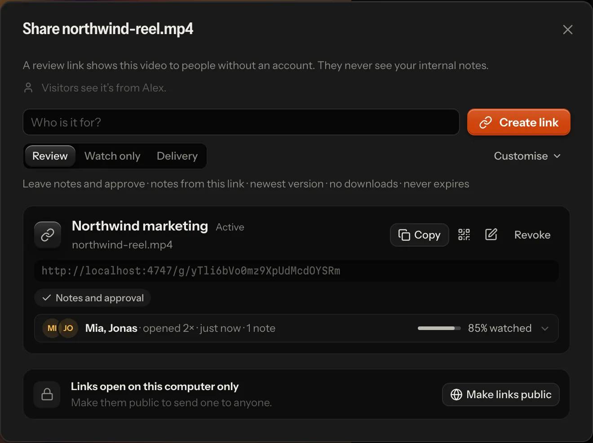
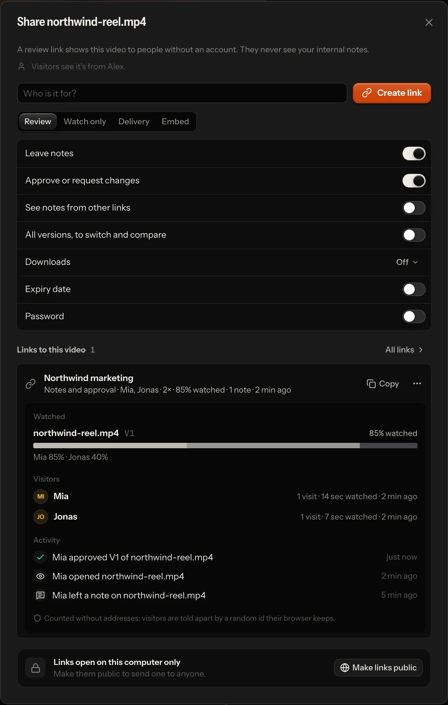
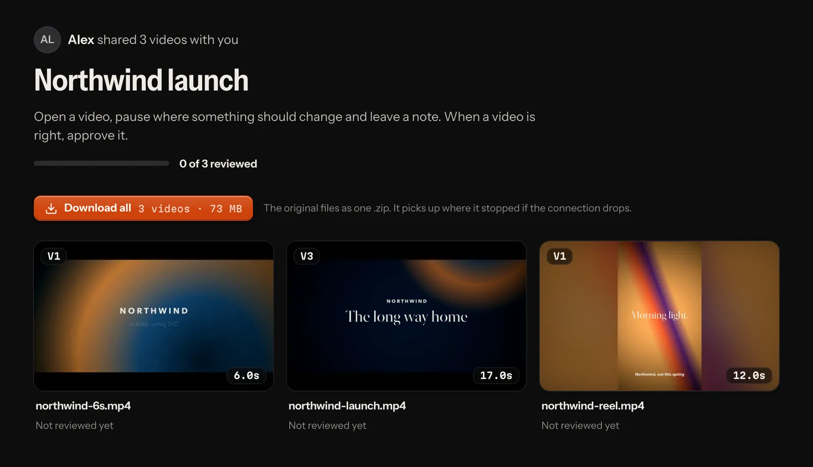

# Review links and webhooks

A review link lets someone review without an account: a client, a producer, a colleague on their phone. They watch
frame-exact, pin notes to frames, draw on the picture, reply, check fixes and approve. They never see your team's notes
or your agents' questions.

What they do arrives like any other feedback: in your inbox, on the timeline, with your agents (as notes by
`guest:<name>`) and, if you set them up, in Slack or Discord through [webhooks](#webhooks).

## Making a link

1. Open the share dialog:
   - **one video:** *Share* in the player's top bar (on a phone: ⋯ → *Share…*), or *Share…* in a video's menu in the
     library;
   - **a project or a folder:** *Share project…* or *Share folder…* in its ⋯ menu in the sidebar, or the same button
     at the top of its page.
2. Say who it is for ("Mia at Northwind"). That is the link's name.
3. Pick the kind of link:

   | Kind | Visitors can |
   |---|---|
   | *Review* (the default) | watch the newest version, leave notes, approve or request changes |
   | *Watch only* | watch the newest version, nothing else |
   | *Delivery* | watch the newest version and download the original file |
   | *Embed* (one video) | watch the newest version in a player on your own site: you get the code to paste ([below](#embedding-a-video)) |

   Under the kinds, every setting is a row with its name and its switch (the kinds set them); any of them
   changes the link ([below](#what-a-link-allows)).
4. *Create link*. It is copied, ready to paste.

The links already made for the video (or folder) are listed under it, one line each: the name, what visitors may
do and what came of it (who opened it, how far they watched). The line opens the link's activity; *Copy* copies it,
and its ⋯ menu changes or revokes it. *All links* leads to Settings → Review links, every link of the workspace in
the same lines.



A link to a project or folder opens a **review room**: every video filed in it and in its folders. It is looked up on
every visit, so videos you add later show up by themselves. Renaming or moving the folder takes its links along.

A link is for that video or that folder, not for its name. Deleting the folder ends its links ([below](#details)),
and so does deleting a video without notes; a video with notes is archived and keeps them. A video added again under
the same name, or a project made again with the same name, is another one: an old link never shows it.

### Where links open

On a hosted server, a link opens for anyone who has it.

On your own machine, links open on this computer only, until you change that. The share dialog says where they open
and offers the one action that changes it:

- **Make links public** starts a temporary Cloudflare tunnel (no Cloudflare account needed, but `cloudflared` must be
  installed). Only review links answer through it: your library, other videos and the API stay on this computer.
  *Stop public access* ends it, and so does quitting the app.
- Started with `npm run lan`, the app also opens links for people on your network.

## What a link allows

The share dialog shows every setting under the kinds, one row each; *Change link* in a link's ⋯ menu opens the link
as its own page with the same rows (an *Embed* link keeps its kind: [below](#embedding-a-video)):

| Setting | Choices |
|---|---|
| Leave notes | a switch; off: the link only plays (watch only) |
| Approve or request changes | a switch, with notes on |
| See notes from other links | a switch, with notes on: off shows only what came in through this link |
| All versions, to switch and compare | a switch; off: the newest version only (older ones are refused, their stills in frame references and the screenshots of notes made on them too, and there is no compare) |
| Downloads | *Off* · *Preview* · *Original* (see [Downloads](#downloads)) |
| Expiry date | a switch (a week out to start with); its button opens 1, 7 or 30 days and a calendar for any day |
| Password | a switch; on, a password is made up in its field (*Generate* makes another, or type your own, at least 4 characters); anyone with the link needs it |

**Which notes visitors see.** Never your team's or your agents' notes, only client notes:

- *Notes from this link* (the default): only what came in through this link, the client's decision included. Give
  each client their own link and they never see each other's notes, names or decisions: each decides for themselves.
- *Notes from all links*: every visitor's notes on the video, from any link, and the latest decision given through a
  link, whoever gave it. Useful when one team on the other side shares a thread.

Visitors also see the replies to those notes, word for word: yours and your team's by name, and an agent's status
changes (fixed, won't change) as *Editor* (*Schnitt* in German). An agent's questions stay inside the team. Whoever writes on a client's note
is told so: the reply field and check mode's reason say "Mia can see this on the review link", and agents read
`CLIENT: they read your replies and fix note as written` on the note.

**Expiry.** A link stops at the end of the chosen day, in your time zone. Visitors then see since when it expired and
whom to ask for a new one.

**Password.** Visitors type it once per browser (it is remembered for 30 days). Changing the password signs every
browser out of the link.

**Revoking** a link stops it at once, also where it is open right now. Notes that came in through it stay.

**An archived project's links** ([workflow.md](workflow.md#in-the-library)) play watch only while it is archived:
visitors watch, and download what the link offers, but leave no note, reply, check or decision. Nothing of the link
itself changes: restored, it takes notes and decisions again as it did. No new link is made into an archived project;
an Embed link keeps playing.

**Every link that is still out there** is listed in *Settings → Review links*, newest first, with *Copy link* and
*Revoke*. That includes a link whose video or folder went some other way (a hand-edited store, an older version of the
app): it says so, opens nothing, and can be revoked there. The API is `GET /api/shares`. An agent with an API token
sees the links there without their tokens: it can tell which links exist, but not open one as a client.

## Who opened it

Each link in the share dialog has one line of what came of it: who came, how often, when, how many notes and downloads,
and how far the furthest visitor got through a video. Open that line for the details:

- **Watched**, per video: how much of the newest version was watched, a strip of which parts played (darker where more
  visitors watched), and who watched how much.
- **Visitors**: each one with their visits, time watched and when they were last there.
- **Activity**, newest first: opened the link or a video, left a note or an idea, replied, confirmed or reopened a fix,
  approved or asked for changes, downloaded.



The same shows elsewhere. Once someone has opened the newest version through a link, the library card says "Mia ·
85%" next to an eye, and the player shows it beside where the video stands, with who and which link in its tooltip.
*Insights* lists under *Review links* who watched in the period (through which link, which version, how far, the
stretch they went back to), the links nobody has opened yet, and the videos out for review with *Send a reminder*
beside them.

A link that exists says nothing about its visitors. A video counts as *Out for review* only once someone outside the
team opened its newest version through a link ([workflow.md](workflow.md)). The app never calls them "the client": it
says the link's name, the person's name or "via review link".

## What a link records

| Recorded | Not recorded |
|---|---|
| that someone opened the link or one of its videos, and when (once per visitor per half hour) | IP addresses. An address is held in memory only, to count a visit once and to set limits (password guesses, notes, reports, new visitors) |
| the name a visitor typed, if they typed one | tracking cookies, fingerprints, the browser, the device, the location |
| which hundredths of a version played, how often, and for how long | where exactly they paused, scrubbed or looked, and anything outside the review page |
| notes, replies, fix checks, approvals and downloads (they are feedback anyway) | |

- **Telling visitors apart.** The review page makes a random id once and keeps it in the browser. The server stores
  only a key derived from that id, the link and a secret of its own, so the same browser has a different key on every
  link. Visitors who don't type a name show as "A visitor".
- **Every visitor alike.** The page records the same for everyone, whatever the browser's Do Not Track or Global
  Privacy Control setting says. If your clients should know what a link records, tell them where you send it.
- **Your team's own visits never count.** Someone signed in, or you at your own machine, checking a link is not a
  visitor.
- **Where it is kept:** with the link, in `data/shares.json`, and only so much per link ([below](#details)). Revoking
  a link keeps its record. The share dialog shows it summed up, never the raw records.

## For the visitor

A link without a password opens straight into the review: one video, or a folder's review room. A link with a password
first shows who shared it (your name, and your team's name), the link's name, one sentence and the password field,
beside Lampo's own brand film (a few seconds of its demo footage in slow motion, the same on every server; a still on
phones); nothing of the video shows before the password, nor the folder's name. No link names a folder above what it shares
(folder names are often client and project names): a video link none, a folder link its own name and where each video
sits below it. An expired link says since when and whom to ask; a revoked or mistyped one says it isn't available. A
link the server can't check at that moment (a `503` or `429`: a store file being repaired, a full queue) asks the
visitor to come back and opens by itself once it can, when the server's `Retry-After` says. No client page shows the
server's address.

The team's name is `org_name`, when it is set. On a hosted server with several workspaces, a link of any workspace but
the first shows that workspace's own name instead, and none while a sign-up's workspace still has the name it started
with, its owner's.

Visitors see your name as you set it in *Settings → Profile*. On your own machine the app starts with your computer's
account name, which visitors never see: until you choose a name, links don't say who shared them. The share dialog
tells you which is the case (*Add your name*).

On a video, visitors can:

- play and pause (Space), step frame by frame (←/→, ⇧ for ten), change the speed, and see every note on the timeline;
- write a note on the paused frame (C), draw on the picture with *Box*, *Arrow* or *Freehand*, or drag across the
  timeline (or press I and O) for a stretch; mark it a *Change* or an *Idea*; attach a picture, a clip or a link.
  Their name is asked when it is first needed — in the composer as their first note goes, or in a small dialog when
  they approve or reply first — and remembered in that browser; where it is asked, the page says who sees their notes:
  the team, and anyone with this link or another link to the video that shows the notes from all links;
- reply under any note they see;
- check fixes: a fixed note asks "Fixed in V3. Does it look right now?" *Looks right* checks it; *Still wrong*, with
  what is still wrong, reopens it;
- switch to an older version or download one, when the link allows it;
- compare two versions, when the link shows every version (below);
- *Approve* or *Request changes* on the newest version, when the link allows it. This decision is kept apart from
  your team's, which visitors never see. An approval moves the video to *Approved via link*
  ([workflow.md](workflow.md)). If a newer version arrived while they watched, they are asked to look at it first. A
  thank-you says who has been told and, in a review room, offers the next video.

The notes look as they do in the app: a row each (the timecode, *Change* or *Idea* as a keyframe glyph, the first
line, the version it was written on, its replies, where it stands when that is news), under the name of whoever wrote
them; the selected note, and every fix waiting for the visitor's check, opens into its card (who and when, the
timecode, the kind, the version, *Fixed · V3*, the words and the marked frame, the thread, the decision, *Reply…*).
Under an empty list's composer, one line says how a note is written.

**Compare.** On a link that shows every version, a video with two or more has *Compare* beside the version switcher
(on a phone in ⋯; B on a keyboard). The version on screen is A — what notes, drawings and the decision are about — and
another one is B, the reference: by default the newest older version the visitor wrote notes on through the link, else
the one before A. Either side is picked in the compare bar over the picture; ⇄ swaps them on the same frame, × or Esc
closes it. *Side by side* shows both pictures (on a phone two landscape pictures stand one above the other); *Wipe* lays
B over A, cut where the handle stands. Each picture says which it is ("A V3", "B V1 · reference"). Playing, stepping
and scrubbing move both to the same frame. A watch-only, delivery or read-only link that shows every version compares
too; a newest-only link never does, and its visitors receive no other version's media. B's media comes only once
*Compare* is opened, through `GET /api/g/:token/review/:id/compare?v=` (only links that show every version answer it,
with the version's frame facts and the link's own media URL for it; nothing is recorded as a visit).

A review room shows who shared how many videos, how far the review has come ("1 of 3 reviewed"), and each video with
its open notes, fixes to check and the visitor's decision. Everything works on phones and tablets; on a phone the
video page is laid out like an app's screen: one bar that stays at the top (the title, *Approve*, the rest behind ⋯),
the picture across the width with the drawing tools under it, one row of playback controls, then the notes. A link
that takes no notes shows the notes it has to show read only, without a place to write; one with none to show has no
notes panel at all, and the video gets the room. Under the video's name stands the link's own name (when it was given
one; else the team's name, else who shared it) and the version. The room and the video page end with a quiet
*Powered by Lampo* and, beside it, *Source*: where the app's source is (`source_url`, AGPL-3.0 §13: visitors use the
instance over the network too). Under them, the operator's *Imprint* and *Privacy* when the server names them
(`VR_IMPRINT_URL`, `VR_PRIVACY_URL`). The badge is on for every plan; where a billing provider runs, a paid workspace's
owners and admins may hide it in *Settings → Review links* (*Hide the Lampo badge*): the source offer and the legal
pages stay. A plan that lapses shows the badge again by itself.



## Embedding a video

An *Embed* link puts one video on your own site — a page's hero film, a wall of work — in Lampo's own frame-exact
player, the way a site embeds a YouTube video. Pick *Embed* in a video's share dialog, name the link ("Website hero")
and *Create link*: the code is copied, and the link's line opens with it in view. *Copy* on that line copies it again;
its ⋯ menu has *Copy the player’s address* for a site that embeds from an address (below).

```html
<iframe src="https://app.example.com/e/1rT9cQ…"
  title="launch-film.mp4"
  style="display:block;width:100%;aspect-ratio:16/9;border:0"
  allow="autoplay; fullscreen; picture-in-picture" allowfullscreen
  loading="lazy"></iframe>
```

The frame is as wide as the place you paste it and keeps the video's shape (its `aspect-ratio`). The player plays the
newest version: play and pause, the timecode with frames as the app shows it, a frame back and on, sound, full screen,
and on its timeline the video's chapters and, when the version has been heard, captions. Keys as in the app's player:
Space plays and pauses, J K L play backwards, stop and forwards (J or L again: faster), ← → step a frame (⇧ ten), Home
and End go to the first and last frame, M mutes, F goes full screen, C turns captions on and off. A small Lampo mark
sits at the bar's end; where a workspace hides the badge ([For the visitor](#for-the-visitor)), the player hides it too.

- **Chapters** are the render's own chapter markers, as Premiere, Resolve or Final Cut export them: a keyframe glyph
  on the timeline for each, its name in the bar while it plays and under the pointer. A render without markers has
  none.
- **Captions** are what the version's transcript heard (the player draws them above its bar). The player never starts
  hearing a version: one that hasn't been heard has no captions button.
- **Options** go in the player's address: `?autoplay=1` starts it by itself, muted (browsers only let a silent video
  start on its own), `muted=1` starts it without sound, `loop=1` plays it on a loop, `controls=0` shows the picture
  alone (a page's background film: a click or Space still pauses it), `lang=de` speaks German. A hero film:
  `https://app.example.com/e/1rT9cQ…?autoplay=1&loop=1&controls=0`.
- **It shows the video and nothing else**: no notes, no names, no other versions, no downloads. Its title is the
  video's file name, as a *Watch only* visitor reads it.
- **A link is an embed from the start, or never.** Its address sits in the pages it is on, for anyone to read, so
  *Embed* is offered only when a link is made: an existing link doesn't become one, and an embed doesn't become
  another kind of link (*Change link* changes its name and expiry). For another kind, make a new link.
- **Revoking** the link stops every page it is on at once (the frame then says "This video isn't available"), and so
  does its expiry. An embed has no password: it plays for anyone who sees the page it is on.
- **What it records** is what a *Watch only* link records ([What a link records](#what-a-link-records)), counted when
  someone plays it, not when the page around it loads, and never with a name: its visits are anonymous. The player
  sets no cookie and keeps nothing in the browser. An embed never makes a video *Out for review*: it asks nobody for
  a decision.
- **It is dark on every page**, like any player: the page around it keeps its own colours.

**oEmbed.** Sites and tools that embed from an address (WordPress, Notion and others) find the player through
[oEmbed](https://oembed.com): both the player's address and the link's watch page name it in their head, and
`GET /oembed?url=<address>&format=json` answers with the player's `<iframe>`, its size (the video's own, at most 1280
pixels a side, or scaled down to `maxwidth` and `maxheight` when given), the video's title and its poster, which other
sites may show as a picture. On your own machine it answers at the tunnel's address too, the one the pages name. Any
other link or address is a 404; a format other than JSON, such as XML, is a 501.

## Downloads

A link's *Downloads* setting decides what visitors can take home:

- *Preview*: a copy made for playing, H.264 with every frame at its own time. It is also what the link's player plays,
  never the render's own file.
- *Original*: the render's own file (and the preview too).

On a video, the *Download* menu offers the version on screen. **Folder links add "Download all"** at the top of the
room: every video in the folder and its subfolders as one `.zip`, the newest version of each, with the size shown
before anyone taps it.

- The zip keeps the folder structure below the shared folder (`Reels/Cutdowns/cut_v3.mp4`), with file names that work
  on every system.
- It starts at once. A download that breaks off picks up where it stopped (once the server has prepared the files,
  which it does while visitors look at the room).
- On iPhone and iPad the zip lands in *Files › Downloads*.
- Every download shows in the link's activity ([What a link records](#what-a-link-records)). A whole folder downloaded
  is also one event for webhooks and phone notifications: "Mia downloaded all 6 videos of Acme/Reels (3.4 GB,
  originals)".

Your team downloads folders from the library: *Download project* or *Download folder* in its ⋯ menu gives the original
files. One video downloads from its own ⋯ menu, in the player and on its card in the library: *Download V3* gives the
version on screen (on a card, the newest) as it was rendered, named `spot V3.mp4`, and *Download another version* lists
the others. A version in a codec browsers can't play downloads as itself, not as the copy the player plays. On a hosted
server both take the download right (members and up; reviewers watch and leave notes, they don't take files home).

## Security

- **The link is the key.** Its token is 24 random characters, and the server checks every rule above on every request.
  A folder link can't reach a video outside its folder, and screenshots are served only for the notes the link shows.
  `data/shares.json` stores each link under a hash of its token, never the token itself.
- **The original file plays only on links that offer it as a download.** Every other link plays the preview copy, made
  the first time someone opens the video ("Getting the video ready…" for a few seconds), so the player can't be used to
  save the original either.
- **Visitors never see your file paths.** In local mode a video's internal name is its path on your disk (your user
  name, client and project folders); links name videos by ids of their own, different on every link.
- **Passwords** are stored as scrypt hashes, and guesses are limited per visitor, per address and per link, so
  strangers with the address can neither guess it quickly nor lock the client out.
- **Writes must come from the review page itself**, and what visitors write is limited per visitor and per link, by
  the minute and by the day ([below](#details)).
- Through the local tunnel only review links answer (and oEmbed, which speaks of embeds alone). On a hosted server
  they are the only thing reachable without signing in.
- **Only an embed's player may sit in another site's frame.** `/e/<token>` answers with `frame-ancestors *` and no
  `X-Frame-Options`; every other page and answer of the app, review pages included, refuses to be framed. Likewise
  only an embed's poster (its oEmbed thumbnail) may be shown as a picture on another site's page.

## Webhooks

Webhooks tell Slack, Discord or any other service when clients give feedback, so it doesn't wait for someone to open
the app.

### Setting one up

Owners and admins add them in **Settings → Notifications**:

1. *Webhook URL*: Slack's or Discord's incoming-webhook address, or your own endpoint.
2. *Name* (optional), for example "#client-feedback".
3. *Signing secret* (optional, for JSON receivers that check [signatures](#signatures)).
4. *Format*: *Slack* · *Discord* · *JSON*.
5. *Send*: *Client activity* (notes, replies, fix checks, approvals and downloads through review links) or *Everything*
   (every review event: new versions, your own notes, agents' fixes, requests to agents…).
6. *Add webhook*, then *Send test* to see one arrive.

Each webhook shows its last delivery (or why it failed). The URL is never shown again in full: for Slack and Discord it
contains the hook's own secret.

You can also set hooks in `config.json` or the environment. They are listed in Settings, read-only:

```json
{
  "webhooks": [
    {
      "url": "https://hooks.slack.com/services/…",
      "format": "slack",
      "label": "#client-feedback"
    },
    {
      "url": "https://example.com/hooks/review",
      "format": "json",
      "secret": "…",
      "events": ["all"]
    }
  ]
}
```

One hook from the environment: `VR_WEBHOOK_URL`, `VR_WEBHOOK_FORMAT` (`json` · `slack` · `discord`),
`VR_WEBHOOK_SECRET`, `VR_WEBHOOK_EVENTS` (comma-separated). In the file or the environment, `events` can also name
event types, for example `["approval"]` or `["request"]` (an agent was asked to work: see
[agents.md](agents.md#on-a-hosted-server-start-agents-from-a-webhook)). While the app runs, hooks fire for events from
every writer (the app, `vr`, MCP), because they follow `data/events.jsonl`.

### What arrives

- **Slack:** `{"text": "Mia (client) left a note on spot.mp4 v2 at 00:03:00: “Logo später” <https://…|Open>"}`
- **Discord:** `{"content": "…\nhttps://…", "username": "video-review", "allowed_mentions": {"parse": []}}`
- **JSON:** `{"event": <the event as in events.jsonl>, "text": "…", "url": "https://…/#/v/<slug>?c=<id>"}`.
  Screenshot paths become full URLs on the app's public URL (on your own machine without one, `localhost`), never
  paths on its disk; opening them needs a signed-in session, or the machine itself.

Every delivery is a POST with `Content-Type: application/json` and the headers `X-VR-Event: <type>` and
`X-VR-Delivery: <uuid>` (the same across retries). It waits 5 seconds for an answer. Server errors, 429 and network
failures are retried three times (after 1, 4 and 16 seconds); other refusals aren't. Failures are logged and shown in
Settings, never passed on to the person whose note caused them.

**On a hosted server, webhooks only go to public addresses.** A URL on a private, loopback, link-local or reserved
address (the server's own network, `localhost`, a cloud's metadata service) is refused when it is saved, and every
delivery checks the address again and connects to exactly the address it checked. Redirects are never followed. If your
chat server lives on your own network, opt in with `webhooks_allow_private: true` or `VR_WEBHOOK_ALLOW_PRIVATE=1`.
That holds for the first workspace's webhooks (the operator's own team); every other workspace's stay on public
addresses, whoever runs it. On your own machine webhooks go anywhere.

### Signatures

With a secret, each delivery carries `X-VR-Signature: t=<unix seconds>,v1=<hex HMAC-SHA256(secret, "<t>.<body>")>`.
Check it like this (Node):

```js
import crypto from 'node:crypto';
function verify(secret, body, header) {
  const [, t, sig] = /^t=(\d+),v1=([a-f0-9]{64})$/.exec(header) || [];
  // replayed or malformed
  if (!t || Math.abs(Date.now() / 1000 - Number(t)) > 300) return false;
  const want = crypto.createHmac('sha256', secret).update(`${t}.${body}`).digest();
  return crypto.timingSafeEqual(want, Buffer.from(sig, 'hex'));
}
```

A webhook sends review content (note text, names, links) to another service, so only admins manage them.

## Details

**Links.** A new link's name defaults to "Review link" (links made before 2026-10: "Client" for a video, "Review" for a
folder). A default is never shown to visitors as the link's name: only a name someone gave it. Links from before these settings
existed keep their behaviour: one video, notes and approval, their own notes, the newest version, no downloads.
Deleting a folder ends its links, and a subfolder's link when that subfolder moves up into a folder that was already
there (it would show that folder's videos too); the links on its other subfolders move up with them. In `shares.json`
each link is keyed by the SHA-256 of its token and keeps the token only sealed (AES-256-GCM, with a key derived from
`data/share-secret.key`), so the owner can copy it again. The format is in
[data-format.md](data-format.md#foldersjson-and-sharesjson).

**Older links.** Links made with a version of the app from before links knew their video or folder are bound to it at
the first start of a newer one. A video link older than the video now under its name ends then instead: the video it
was made for was removed and the file added again before the upgrade. A folder has no time it was made, so a folder
deleted and made again under the same name before the upgrade can't be told apart from the one its link was made for,
and is bound.

**What a link keeps** (`stats` on the link): the visitors (`stats.visitors`, keyed by visitor key), per video the
views, the newest version seen and what each visitor watched (`stats.videos.<slug>.watch`), and the latest events
(`stats.activity`). The share dialog lists the 8 most recent visitors and the 12 newest events. Anyone with the link
can make up visitor ids, so a link keeps at most the 200 most recent visitors, 500 videos, 50 watch records per video
and 500 across its videos, and the latest 200 events: a link at its limits is a few hundred KB. One address brings at
most 20 new visitor ids to a link in an hour (an office behind one address is a few people; a visitor the link
already knows is never refused). What visitors do is written to `shares.json` in one go, two seconds after the first
change waiting (at once when 200 wait, with any change to a link, and when the app stops): a progress report never
rewrites the file, and the owner sees it at once all the same.

**Watching reports.** The visitor's player reports every 15 seconds while it plays, when it pauses and when the page
closes, to `POST /api/g/<token>/progress`: `{visitor, slug, v, seen, plays?, secs, name?}`, where `seen` is 100 bits
(which hundredths played) as 25 hex digits and `plays` how often each hundredth played (`lib/watch.ts`). Reports are
validated, come from the page itself, and a visitor can send at most 12 a minute. The team's own watching is kept apart,
beside the video ([data-format.md](data-format.md#watching-who-watched-how-often-how-long)); the player's viewers chip
shows both together, Insights only the clients.

**Passwords.** A correct password sets an HttpOnly, SameSite=Lax cookie for that link only (Secure on https), valid
for 30 days. Guesses: 5 per visitor (link and address) and 20 per address in 10 minutes, 100 per link in an hour.
Checking a guess runs in a thread pool, so guesses never stall the server.

**Limits.** Notes, replies and references: 30 tries a minute per visitor (the link and the visitor's address; an IPv6
address counts as its /64), 500 a day per visitor, and 2,000 a day per link whoever the visitors are. Only writes that
landed count for the day (a reference's one-time upload URL when its file arrives), so refused or invalid requests and
unused URLs spend nobody's share; a visitor holds at most 50 such URLs open at once, a link's visitors 500 together. A
video takes at most 2,000 client notes through each of its links (one link at its limit closes no other), and none while
the server's disk is down to its reserve (`VR_MIN_FREE`; the page is told to try again later). Approvals and requests
for changes: 20 a minute and 50 a day per visitor (they count in the day's writes too); visits: 60 a minute per link and
address. Through the local tunnel every visitor arrives from this machine, so there a visitor's address is the one
Cloudflare names (`CF-Connecting-IP`); a hosted server goes by `VR_TRUST_PROXY`. A preview copy that is still being made
answers `425` with `Retry-After`, and the page looks again every few seconds.

**Archives.** Video is compressed already, so the zip stores the files as they are: it starts at once and its exact
size is known up front. Archives over 4 GB use ZIP64 (only where a size or an offset needs it); tested with macOS
`ditto`, Info-ZIP `unzip`, libarchive (`bsdtar`) and Python's `zipfile`. File names lose separators, control
characters and Windows device names and are Unicode-normalised; two videos with the same name get " (2)". Resuming
needs every file's checksum: the server works them out in the background (cached, lowest priority) while visitors look
at the room, and from then on the archive has an ETag and answers range requests; before that it streams whole. With
Bunny or S3 storage the files stream from there in ranges, so a folder may be larger than the server's working copies.
Only videos filed in the folder today are included (archived or moved-away videos are left out). Two archives at a time
per visitor, six per link. A resumed download or a retry within half an hour isn't counted again.

**Uploads through a link.** A picture or clip a visitor attaches to a note goes up through a one-time upload URL (the
URL is the credential; nobody is signed in through it). Those URLs answer through the local tunnel too.
