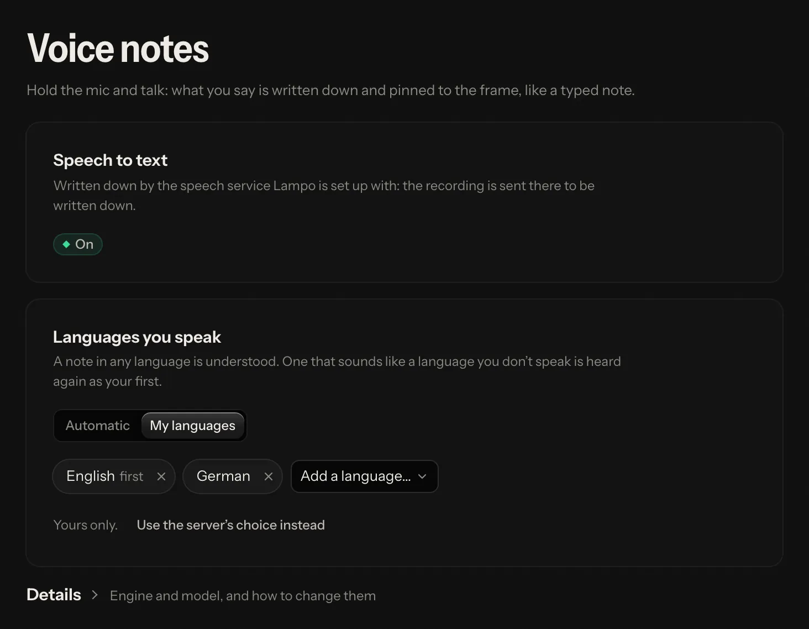
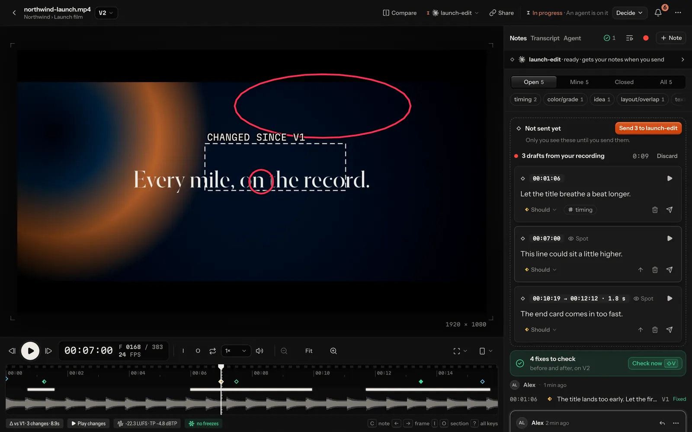
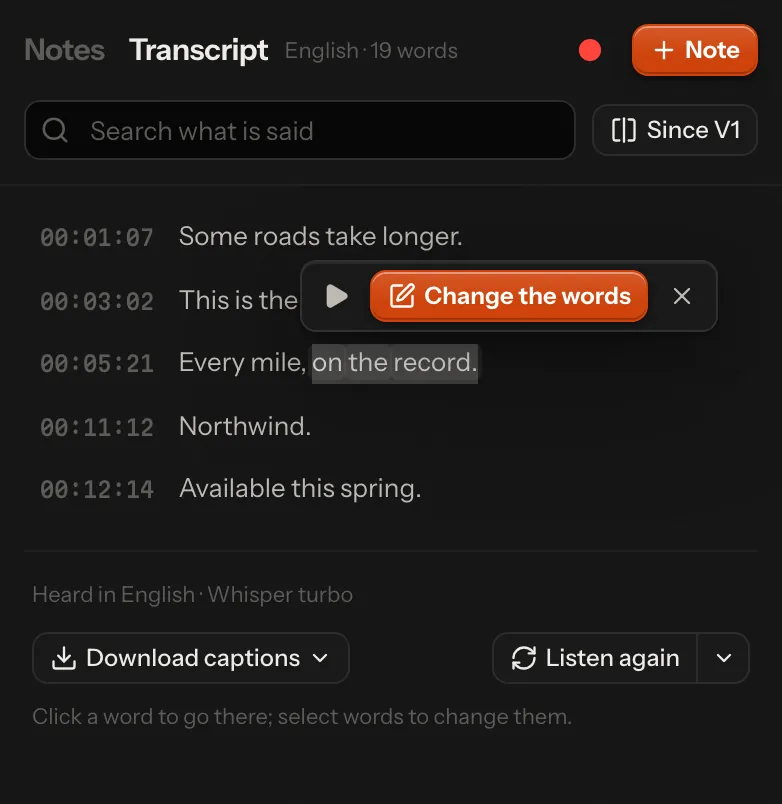

# Speech-to-text

Lampo listens in three places, all with the same speech engine:

- **Voice notes.** Hold **T** while the video plays (or use the mic in the note composer; on a phone, press and hold
  the mic), talk, let go. The note is pinned to the frame where you started (a range if the video kept playing), what
  you said is written into it, and it is tagged by what you said. The audio stays with the note.
- **Recorded feedback.** Press **⇧R** (or the red *Record* dot beside *+ Note*) and talk while you watch: play, pause,
  scrub, point at the picture and draw. Every thing you say becomes a draft note on the frame that was on screen when
  you said it ([below](#recorded-feedback)).
- **Transcripts.** The player's *Transcript* tab shows what is said in each version, line by line, on its frames
  ([below](#transcripts)).

**By default everything runs on the server that runs the app**: your own machine, or your hosted server. Recordings
never leave it. The model downloads once, from Hugging Face.

## Voice notes: the languages you speak

Everyone sets their own in **Settings → Voice notes**:

- **Automatic**: every note is heard in whatever language it is spoken in.
- **My languages**: a list, your first language first. A note in any language is still understood, but one that
  sounds like a language you don't speak is heard again as your first.

Until you choose, the server's list applies (`languages` below). Your choice is kept on your account and also applies
to your recorded feedback. The same page says whether voice notes are written down at all, and where: on the computer
Lampo runs on, on the server the workspace is on, or by the speech service it is set up with. Whoever runs the app
(the person at their own computer, or a hosted server's operator) also gets *Details*: the engine, the model, the
device, and for an admin where to change them. A workspace on a hosted server can't change the engine.



## Recorded feedback

1. Press **⇧R** in the player. A bar over the picture shows that it records, the time and the microphone's level, with
   the drawing tools (*Point*, *Box*, *Arrow*, *Freehand*), pause, discard and *Done*.
2. Watch and talk. Play, pause, scrub, rest the pointer where you mean, click, draw.
3. *Done* (or ⇧R again). Lampo hears what you said and lays it on what happened on screen.
4. The drafts appear under *Not sent yet* at the top of the notes panel, with any notes you saved: one per thing you
   said, on the frame that was on screen (a range when the video played meanwhile), with a ring where the pointer
   rested or clicked and the shapes you drew. Edit their text, listen to each one's stretch, join one with the one
   before, delete one, set its severity, or *Discard* the whole recording.
5. *Send all* sends them, with your other notes not sent yet, as one batch. They become ordinary notes, each with its
   own clip of your voice.



Only you see the drafts until you send them. They are kept on the server until you send or discard them, so a reload
loses nothing. A recording is at most ten minutes. It needs the microphone (an https page, or the app on this computer)
and speech-to-text: without it, the button says so and opens Settings → Voice notes. The frame of each draft comes from
the player's own log of what was on screen, on the recording's clock, never from guessing by the time.

## Transcripts

The *Transcript* tab beside *Notes* in the player shows each version's voice-over and dialogue, heard once per version
and kept with it. The word being said lights up while the video plays; a click on a word goes to the exact frame it
starts on; search keeps the lines that say something.

- **Change the words:** select words (or take the current line), and *Change the words* writes a note about exactly
  the frames they are heard on: what was heard, and what it should say.
- **Since V2** compares a version's words with the one before, struck and added.
- **Download captions** as SRT or WebVTT.
- **Listen again** hears the version once more, in another language if you pick one.



A transcript detects its own language (the language lists for voice notes play no part), or uses the one picked with
*Listen again*. With speech-to-text off, the tab says so and how to turn it on. Agents read transcripts with
`vr transcript` or the MCP tool `get_transcript`, and a note that changes the words as one line
([agents.md](agents.md#changing-the-words-the-transcript)).

## Engine and models

The engine is [transcribe.cpp](https://github.com/handy-computer/transcribe.cpp) (MIT), installed with `npm install`:
no Python, no compiler. It comes prebuilt for macOS (Apple silicon on the graphics chip, Intel on the processor), Linux
on x64 and arm64, and Windows on x64 (on the processor, or Vulkan where a graphics driver has it). On a platform without
a prebuilt engine, voice notes are kept as audio only.

| Model | Size | Used when | Licence |
|---|---:|---|---|
| **Whisper large-v3 turbo** | 886 MB | `auto` with a graphics chip: Apple silicon, CUDA, a discrete Vulkan card | MIT (OpenAI) |
| **Parakeet TDT 0.6B v3** | 740 MB | `auto` without one: servers, Docker, most VPS | CC-BY-4.0 (NVIDIA) |
| Qwen3-ASR 1.7B | 2.2 GB | only when chosen | Apache-2.0 |

Why these two ([bench/stt/RESULTS.md](../bench/stt/RESULTS.md)): on real German speech the candidates were within two
points of each other. Whisper turbo copes best with noise, English and notes that mix German and English (0.5 s per
note on an M1 Max); Parakeet v3 is the only one fast enough on a plain processor (0.35 s per note on four cores, where
Whisper needs 7–10 s).

The model downloads once, with the first voice note (or at start, with `prefetch`), into `<cache>/models/`, checked
for size and SHA-256. The first note waits up to 20 seconds for it; if it isn't ready by then, that note is saved as
audio only while the download goes on. For an offline install, put the `.gguf` file there yourself, or point `model`
at any path.

The engine runs in a worker process of its own that keeps one model loaded:

- the first voice note after a start loads it (under a second once the file is on disk; the very first start on a Mac
  compiles its graphics kernels once, about 20 s);
- it unloads after `idle_unload_minutes` (30 by default) and gives the memory back (1–3 GB, depending on the model);
- a crash takes down only the worker, which restarts with the next note; three crashes in ten minutes pause it for
  five.

## Rules that matter more than the model

1. **The language is detected, not forced.** A fixed language makes engines invent text on silence and garbles notes
   in the other language (Whisper forced to German: 62–67 % word errors on English notes). A list of languages only
   adds a second pass in the first of them when a note was heard as something else (see
   [above](#voice-notes-the-languages-you-speak)).
2. **Silence is an empty note.** A level check runs before any model hears the audio.
3. **Vocabulary is opt-in** (Whisper only). Terms like "Caption, B-Roll, Bauchbinde" help English words in German
   notes, but a prompt occasionally derails a clip, so a result in the wrong script or with far too few words is heard
   again without it.
4. **Invented lines are dropped.** Over music, Whisper sometimes writes a subtitle credit it learned from the web
   ("Svensktextning.nu", "Untertitel im Auftrag des ZDF") or a sound tag ("[Musik]"). Those never reach a note or a
   transcript ([details](#a-renders-transcript-invented-lines-and-lost-windows)).

## Configuration

The engine is the server's configuration: `config.json` under `stt`, or `VR_STT_*` variables, then a restart.

```json
{
  "stt": {
    "backend": "local",
    "model": "auto",
    "languages": ["de", "en"],
    "vocabulary": ["Caption", "B-Roll", "Bauchbinde"],
    "threads": 0,
    "idle_unload_minutes": 30,
    "prefetch": false,
    "models_dir": null
  }
}
```

| Setting | Environment | Default | |
|---|---|---|---|
| `backend` | `VR_STT` | `local` | `local`, `http` ([your own server](#bring-your-own-server)) or `off` |
| `model` | `VR_STT_MODEL` | `auto` | `auto`, `whisper-turbo`, `parakeet-v3`, `qwen3-asr-1.7b`, or a path to a `.gguf` file |
| `languages` | `VR_STT_LANGUAGES` | `[]` (any) | e.g. `de,en`: the languages people speak unless they choose their own; the first is the fallback |
| `vocabulary` | `VR_STT_VOCABULARY` | `[]` | terms for Whisper (comma-separated in the environment) |
| `threads` | `VR_STT_THREADS` | `0` (up to 4) | processor threads for the engine |
| `idle_unload_minutes` | `VR_STT_IDLE_MINUTES` | 30 | |
| `prefetch` | `VR_STT_PREFETCH` | `false` (`1` in the Docker image) | download the model at start instead of with the first note |
| `models_dir` | `VR_STT_MODELS_DIR` | `<cache>/models` | |
| `http.url` | `VR_STT_URL` | none | the speech server for `backend: "http"` |
| `http.api_key` | `VR_STT_API_KEY` | none | sent as a bearer token |
| `http.model` | `VR_STT_HTTP_MODEL` | `whisper-1` | the model name the server expects |
| `http.response_format` | | `json` | `verbose_json` when the server reports the detected language there |

Upgrading from the old Python/mlx-whisper version: `whisper_python` and `whisper_model` are ignored now, and
`whisper_language: "de"` becomes `languages: ["de", "en"]` by itself. The old `.venv` can be deleted.

## Bring your own server

Any server with OpenAI's `/v1/audio/transcriptions` works: whisper.cpp's server, vLLM (for example Qwen3-ASR on a
graphics card), speaches, CrispASR, or a hosted API. The audio is sent as 16 kHz mono WAV.

```json
{
  "stt": {
    "backend": "http",
    "http": {
      "url": "http://gpu-box:8080",
      "api_key": "…",
      "model": "whisper-1"
    }
  }
}
```

or `VR_STT=http VR_STT_URL=… VR_STT_API_KEY=… VR_STT_HTTP_MODEL=…`. Set `"response_format": "verbose_json"` when the
server returns the detected language there, so the language rule above can apply (transcripts always ask for it, to
get word timings). Note that the audio then leaves your server.

## A render's transcript: invented lines and lost windows

Whisper hears a file in 30-second windows. Over music it sometimes writes a line it learned from the web's captions: a
subtitle credit ("Svensktextning.nu", "Untertitel im Auftrag des ZDF, 2020", "… by the Amara.org community"), a "thanks
for watching", a sound tag ("[Musik]"). Worse, a window that *opens* on music can collapse into such a line, or a word
or two, stretched over the whole window: the speech in it is lost, and the next line starts at 30.00. Whether a hard
window collapses is partly luck (Whisper's fallback samples at random, so the same clip collapses on one run and not
the next), so Lampo repairs what it hears instead of hoping for a better first pass (`lib/stt/hallucinations.ts`,
`lib/stt/collapse.ts`):

1. **Known invented lines never reach a transcript or a voice note.** Credits and sound tags go wherever they stand
   alone (a segment, a sentence, a "Svensktextning.nu" token), matched loosely (case, accents, punctuation). The list
   holds the known strings only, never a general "subtitles by …" pattern: a reviewer saying "Untertitel von der
   Agentur fehlen noch" means it. A render's "thanks for watching" goes only when it is stretched far beyond its words
   (people do say it); a voice note keeps it.
2. **A render's transcript is checked for lost stretches**: at least 5 s where Whisper heard fewer than half a word a
   second (a gap, a line stretched over its window, a stray word next to a gap). Silence is never checked.
3. **With a second listener** (Parakeet v3, when its model is already in the models folder; it is never downloaded
   for this), each such stretch is heard by Parakeet first. Nothing there: music, left alone. Speech Whisper lost:
   Whisper hears the stretch again from half a second before Parakeet's first word (a window that opens on speech
   doesn't collapse); if that still comes back far too short, Parakeet's own words fill the stretch.
4. **Whisper alone** (no Parakeet on disk, or it heard nothing under a credit) hears the stretch again with its first
   line free to start anywhere in the window. After a credit or a stray word it also tries starts 4, 8, … s into the
   window and keeps the earliest that is plainly speech (enough words, at a speaking pace, the same language).

The transcript says what happened: `repairs: [{t0, t1, engine}]` lists each stretch heard again and whose words fill
it, and `timing` is `line` whenever any word's time is spread over a line (Parakeet's words in a Whisper transcript are
exact, the rest are not; the transcript's foot shows an ⓘ then). Transcripts heard before this (`transcript_version` 1)
are heard again the next time someone opens them. Parakeet is loaded only to check a stretch and lets its memory go a
minute after its last use, so the two models (≈ 1.3 + 1.0 GB) sit side by side only while a render is being checked.
On the synthetic music-intro set ([bench/stt/RESULTS.md](../bench/stt/RESULTS.md)) a collapsed render takes 1–2 s
longer to hear and gets its first window back; the rest hear as before. An OpenAI-compatible server gets the filter,
not the repair (that needs the local worker); recorded feedback gets the filter too.

## Credits

Whisper by OpenAI (MIT) · Parakeet by NVIDIA (CC-BY-4.0) · Qwen3-ASR by the Qwen team (Apache-2.0) · GGUF conversions
and transcribe.cpp by handy-computer (MIT). See [NOTICE.md](../NOTICE.md).
