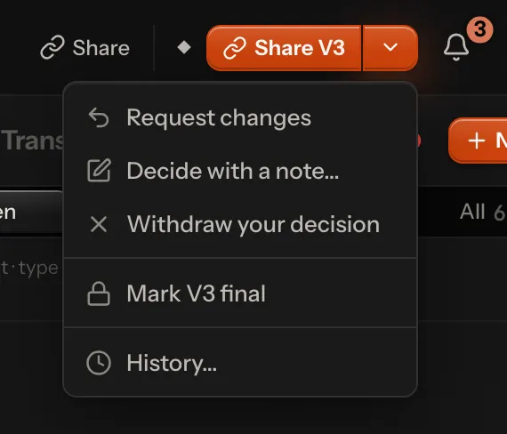

# Where a video stands

Every video is in exactly one **stage**, from *To review* through the fixes and the approvals to *Final*. Every place
shows the same one: the library's cards, list and board, the player, the inbox, and what agents read. Nobody sets a
stage by hand: Lampo works it out from the video's versions, notes and decisions every time, so it can't drift out of
date.

## The stages

| Stage | What it means | The next step |
|---|---|---|
| *To review* | the newest version has no decision and no open work | *Review V3*: watch it, then approve it or leave notes |
| *Changes requested* | required notes are open, or someone requested changes on the newest version, and no agent is on it | *Assign an agent*, or *Waiting for fixes from …* when one is assigned |
| *In progress* | the same, while an agent works on it | *An agent is on it* |
| *Check 2 fixes* | nothing is open, but fixes wait for your check | *Check 2 fixes*: before and after side by side, *Looks right* or *Still wrong* |
| *Approved V3* | the team approved the newest version | *Send out for review* (a review link), or mark it final. Once a link covers it: *Waiting for the link to be opened* |
| *Out for review* | approved, and someone outside the team opened the newest version through a review link | *Waiting for their decision* |
| *Approved V3 via link* | someone approved the newest version through a review link | *Mark final* (after a [partial render](#partial-renders): *Render it in full for final*) |
| *Final V3* | marked final: this is the version that ships | nothing; *Reopen* if it must change after all |

**Required notes** are open *must*, *should* and *nice* notes. Ideas, questions and info notes never hold a video
back, and notes you saved but haven't sent don't count until you send them. An agent "works on it" while its assigned
agent is running, or while a status an agent set hasn't run out.

## In the library

The library's lane chips (*All · To review · Being fixed · Approved · Final*), its board layout (key 4) and *Display →
Group by → Stage* sort the stages into four lanes:

| Lane | Stages |
|---|---|
| To review | *To review*, *Check fixes* |
| Being fixed | *Changes requested*, *In progress* |
| Approved | *Approved*, *Out for review*, *Approved via link* |
| Final | *Final* |

When the next step is yours, a board card shows it as a button ("Check 2 fixes", "Send out for review"). Otherwise its
line says what the video waits for: who is working on it and what that agent is doing right now, or how far the person
with the review link got ("Link not opened", "Mia · 85%"). Your to-do list is the *Inbox*, first in the sidebar: it
agrees with the *To review* lane and adds agents' questions and notes from review links
([mobile.md](mobile.md#the-inbox)). Whoever reviews through a link is never "the client" in the app: it says the link's
name, "via review link" or the person's name, since a link is for anyone — a colleague, a producer, a client.


**Archiving a project.** A project that is done can be put away: *Archive project* in its ⋯ menu (owners and admins),
with Undo. It leaves the sidebar, All videos, the board, Recent, the Inbox and Insights' lists of what waits now, and
⌘K lists it apart, under *Archived*. The sidebar's *Archived* row (with how many) opens a page of the archived
projects; each opens as before, and so do its videos, with *Archived · Restore* where the project's *Share* or the
player's next step stands. Everything in it is read only until it is restored: you can watch, read and download, but
nothing new goes in (no version, note, reply, decision, playbook change, post, move into it or review link). Owners
and admins can still move a video out. *Restore* (on its page, in the player or on the Archived page) brings it back
as it was. Its review links play watch only meanwhile and take notes and decisions again once it is restored; its
embeds keep playing. Agents are refused any write into it with one sentence
([agents.md](agents.md#where-a-video-stands)).

**What an agent is doing** shows on the card itself, in the same words as the player: "fixing 3 of 6", "rendering V4 ·
42 %" with a thin edge along the poster's foot, "needs you" with *Answer*, a failure in its own words. The sidebar's
*Agents* say where each one stands, and *Being fixed* counts the agents at work
([agents.md](agents.md#your-work-as-the-person-sees-it-runs)).

## In the player

The player's top bar shows where the video stands and **one button for your next step**: *Approve V3*, *Check 2
fixes*, *Share V3* (a review link), *Mark V3 final*, *Carry the approval over to V4* or *Reopen to review
V4*. Everything else is behind the chevron beside it, which reads *Decide* when there is no next step:

- *Request changes*, *Approve V3 anyway* (while required notes are open), *Decide with a note…*;
- *Withdraw your decision*;
- *Mark V3 final*, once the version is approved (on a part: *Final needs a full version: V8 is a part*);
- *History…*: every decision and every final, with who, when, the version and the note.

Pointing at the stage shows the steps a video walks through: Review → Fixes → Approved → Shared → Final. *Shared* is
there only when a review link takes part: one covers the video, or someone has decided through one.



## Approvals and final

**The team and the review link decide apart.** The team (anyone signed in who may approve) and the visitors of a
review link that allows approving each *Approve* or *Request changes* on a version. The team can withdraw its
decision; a visitor changes theirs by giving the other one. The history marks a decision given through a link *Link*. Every decision is kept in the video's history with who,
when, the version and an optional note. Nothing is overwritten.

**Decisions belong to a version.** A new version is to be reviewed again, and the older approval shows beside it:

| Shown as | When |
|---|---|
| "V2 approved · V3 new" | an older version was approved and the newest isn't yet |
| "V3 is identical to approved V2" | the version diff finds the newest version identical to the approved one: the next step is *Carry the approval over to V3* |
| "Final V2 · V3 arrived since" | a version newer than the final one arrived |

Beside the stage, the status badge says it short: "V2 approved", "V3 new".

**Carrying an approval over.** A re-render that changes nothing (a re-export, a new container) doesn't need another
review. *Carry the approval over* appears only when the version diff finds no picture change, no sound change and no
retime between the approved version and the newest one. The server checks again before it records the approval, as the
team's, noting where it came from.

**Final** says: this is the version that ships. *Mark V3 final* names the required notes still open, if any, and asks
first. Final is kept apart from the decisions, with its own history of marking and reopening, so the approvals stay as
they were. A newer version doesn't move a final video; *Reopen* does, and the video then gets its stage from its
decisions and notes again.

## After Final: publishing

A final video's next step is *Publish…*: one post per platform (YouTube, Instagram, Facebook) for the final version,
drafted by people or agents and published by a person who may (owners and admins), or the publish kit to post by hand.
Publishing doesn't change the stage: it stays *Final* and carries the posts as `published` (posted, scheduled, failed,
with the link). Reopening the final, or a newer version, pauses the posts Lampo still has to send; a schedule YouTube
holds stays live (YouTube makes the upload public at its time), so reopening asks first and says so — take it back in
YouTube Studio. See [publishing.md](publishing.md).

## Moving cards on the board

On the board you can move a card to another lane, and the move *is* the decision that puts the video there: the
same step as in the player, by the team, on the newest version.

| Move to | What it does | Asks first |
|---|---|---|
| Approved | approves the newest version (*Approve V9*) | while must-fix notes are open: "Approve “spot.mp4” anyway? 2 must-fix notes are still open on V9." |
| Being fixed | requests changes on it | when no required note is open, a sentence for the agent (on the board, on the card itself); it becomes the change request's note |
| To review | withdraws the team's approval or change request | – |
| Final | marks it final (only from Approved, as in the player; never while a fix exists only on a fix preview) | always: "Mark “spot.mp4” V9 final?" |
| out of Final | reopens it first, then approves, requests changes or withdraws, as above | always: "Reopen “spot.mp4”?" |

There are three ways to move a card:

1. **Drag it.** On a touch screen, press and hold, then drag. The lanes it can't go to dim; the one under it lights up
   and shows where the card will stand (in the board's own order: there is no manual order), and a label under the
   card says what dropping does ("Drop to approve V9"). The board scrolls near its edges, a lane near its top and
   bottom, and Escape puts the card back.
2. **Use the keys.** ⌥← or ⌥→ on a focused card moves it to the nearest lane it may go to on that side.
3. **Use its menu.** *Move to* in a video's menu (⋯ or right-click, in every layout of the library) lists the lanes it
   may go to. On phones, where the lanes stack, this is the way.

**Undo.** A move shows at once, and goes to the server only when its toast is gone: after a few seconds, or when you
close the toast, open the video or close the tab. *Undo* puts the card back, and nothing reaches an agent. A second
move of the same card in that time travels with the first, so a card dragged to the wrong lane and back sends nothing.

**Which lanes take a card.** Only those where the move would really put the video. A decision given through a review
link beats the team's (its approval or change request stays), open required notes keep a video in Being fixed (withdrawing
nothing can't move it to To review), and each step needs the role's right: reviewers can approve and request changes,
but don't see Final as a lane to move to and can't move a card out of it.

## Partial renders

Rendering the whole video for one fix is slow, so you may let an agent render only the shots a note is about: in the
note's where-menu (the timecode at the top of the note), *Quick check: render only this part (00:04–00:07)*, or the
same row in the agent menu for the frame on screen. It is never the default.

- The part becomes the next version like any other: "V8 · part (00:04–00:07)" in the version picker, "V8 (part) to
  review" in the stage. It plays as the whole video with that stretch patched in; the timeline marks the stretch, and
  if the motion doesn't match at a seam, the picker says where and what to do. You check notes on it as on any version.
- **A part can't be final.** The chevron says *Final needs a full version: V8 is a part*, and where *Mark final*
  would come next, the next step is *Render it in full for final*. The server refuses it too.
- When the full render arrives, the parts that were approved (or had a fix checked on them) are compared with its same
  frames: "The full version matches what you approved in V8", or the notes go back to *Check fixes* with where it
  differs.

## Who can do what

| | Approve, request changes | Carry over | Mark final, reopen |
|---|---|---|---|
| Owner, admin, member | yes | yes | yes |
| Reviewer | yes | yes | no |
| Anyone on a review link that allows approving | the newest version, through the link | no | no |
| Agents (`lampo`, MCP, any API token) | no | no | no |

On your own machine you are the owner and can do everything. On a hosted server these are the *approve* and
*finalize* rights of the role table ([`lib/permissions.ts`](../lib/permissions.ts)).

Two more rights of that table touch where a video stands:

- **Downloading a version**: *Download V3* in a video's ⋯ menu saves that version as it was rendered, named
  `spot V3.mp4` (in the player, the version on screen; on its card in the library, the newest); *Download another
  version* lists the others. Owners, admins and members may, as for whole folders; reviewers watch and leave notes.
  Visitors download only what their review link allows ([sharing.md](sharing.md)).
- **Archiving a project** and restoring it: owners and admins, in the app. Taking a video out of an archived one is
  theirs too; no API token or connected app does it (on your own machine, `lampo move` and the machine's own agent may,
  as the owner).

## How the stage is decided

The first rule that matches wins:

1. **Final.** A video marked final stays final until someone reopens it, even when a newer version arrives. Its next
   step is then *Reopen to review V4*.
2. **A decision on the newest version.** One given through a review link beats the team's:
   - approved through a link: *Approved via link*;
   - the team approved: *Out for review* once someone outside the team opened the newest version through a review link
     that is still active, else *Approved* (see "Shared is not seen" below);
   - someone requested changes: *In progress* while an agent works on it, else *Changes requested*.
3. **No decision on the newest version:**
   - required notes open: *In progress* or *Changes requested*, as above;
   - fixes waiting: *Check fixes*;
   - fixes checked only on a fix preview, not rendered yet: *In progress* or *Changes requested* ("2 fixes checked on
     a preview · V4 to render");
   - otherwise: *To review*.

**Shared is not seen.** A review link that exists says nothing about its visitors. A link counts, per video, when a
visitor opened the video and which version they had in front of them (once per visitor per half hour). Your team
opening its own link to check it doesn't count. So a video reads *Out for review* only when someone outside the team
opened its newest version, and a new version sends it back to *Approved* ("V4 not seen yet") until they open that one
too. Meanwhile the stage says what the link knows: "shared via "Client link" · not opened yet", or "opened by Mia
2 h ago".

**Fixes checked on a preview.** An agent working in a project (After Effects, Premiere, Resolve…) can attach a still
or a short clip of a fix before it renders
([agents.md](agents.md#fixing-in-the-project-without-rendering-after-effects-premiere-resolve-)). You can check the fix
on that preview (*Looks right (preview)* in check mode). It then counts as done for you, but the fix exists only in the
project, so:

- the video goes back to the agent until a version with the fix is rendered;
- no version can be marked final before that ("2 fixes checked on a preview, not rendered yet");
- the next version is compared with each preview automatically: a match confirms the fix, a mismatch sends the note
  back to *Check fixes* with the reason.

## What agents see

Agents read the stage and respect final, but they never approve or mark final. To them the stages are `to_review`,
`changes`, `in_progress`, `check_fixes`, `team_approved`, `with_client`, `client_approved` and `final` (the lane *To
review* is `needs_you`), and the next step reads in their own words: *Hand it to an agent* where you see *Assign an
agent*, *Waiting for the client's verdict* where you see *Waiting for their decision*, *Send to the client* where you
see *Send out for review*.

- `lampo ls` ends every line with `stage:<stage>`; `--json` adds `stage` and `stage_detail`.
- `lampo open` shows `stage: FINAL — Final V3 · marked by alex (fix nothing until it is reopened)` under its header;
  `lampo open --json` carries the whole stage.
- MCP `list_videos` ends each video with `· stage <stage> (<detail>)`; `get_open_notes` and `get_note` put
  `stage <stage> · <detail>` into their header.
- **A final video is locked for agents.** `lampo fix`, `lampo wontfix` and the MCP tools `mark_fixed` and `wont_fix` are
  refused: "film.mp4 is final (v3, by alex): nothing to fix until the reviewer reopens it". A new note is still saved,
  with a warning that it waits until someone reopens the video.
- `lampo watch` and `INBOX.md` print decisions with the party:

  ```
  APPROVED v3 (client: Mia)
  CHANGES REQUESTED v3 (team): …
  approval withdrawn v3 (team)
  APPROVED v4 (team): carried over from v3, identical render
  FINAL v4: …
  REOPENED v4 (was final): …
  ```

## Where it lives

- The stage is worked out by [`lib/stage.ts`](../lib/stage.ts); [`test/unit/stage.test.ts`](../test/unit/stage.test.ts)
  goes through every rule as a table of cases.
- In `review.json`: `approvals` (the decision history), `final` and `finals`, next to the older `approval` field, which
  is still written for older readers. See [data-format.md](data-format.md#sign-off).
- Over HTTP: `GET /api/status`, `PUT` / `DELETE /api/review/:slug/final`, `POST /api/review/:slug/approval/carry`;
  every video summary carries its `stage`. See [api.md](api.md#status-and-sign-off).
- The board also opens at `#/status`. Which lane takes a card is worked out with `lib/stage.ts` on what the library
  knows ([`web/src/library/moves.ts`](../web/src/library/moves.ts)), and a move sends the player's own requests: no
  route of its own.
- Partial renders: the note's or request's `part`, `Version.part` ([data-format.md](data-format.md#partial-renders)),
  and how agents send one ([agents.md](agents.md#partial-renders-only-when-a-note-says-part-render-ok)).
